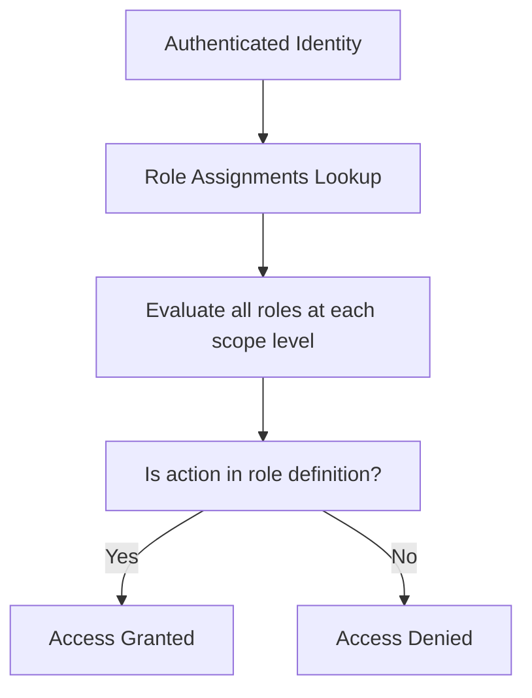

Absolutely 🔥 perfect timing for this question.

You’re asking:

> 👉 “If I learn Databricks, what _real job_ will I do? Which _companies_ hire for that? Is it _worth it_ in 2025?”

Let's break it down with **zero hype and full clarity** — based on 2025 job trends, your Azure+DevOps+AI path, and the Dubai/global tech market.

---

## 🎯 So First: **Is Databricks Worth It in 2025?**

✅ YES — **if** your goal is to work in:

- **AI-ready data engineering**
- **Cloud + ML architecture**
- **Big data pipelines for LLM, RAG, and analytics**
- **Modern ETL with Delta Lake, not legacy SQL**

> 🔍 Databricks is the **backbone of modern AI pipelines** — powering OpenAI-style systems at companies like Microsoft, Shell, HSBC, Grab, Emirates NBD, and more.

---

## 💼 What Jobs Will You Do After Learning Databricks?

Here’s a real-world list of **roles hiring RIGHT NOW** for people with Databricks + Azure/Cloud + DevOps + AI familiarity:

| 🎓 Job Title               | 🔧 What You Do                                                 | Tools You'll Use                                  |
| -------------------------- | -------------------------------------------------------------- | ------------------------------------------------- |
| **Data Engineer**          | Build streaming/batch pipelines, prepare data lakes            | Databricks, Spark, Azure Data Factory, Delta Lake |
| **Cloud Data Engineer**    | Design end-to-end pipelines on Azure using Databricks + AI     | Azure + Databricks, ADF, Event Hub                |
| **AI Data Engineer**       | Prepare clean, labeled, high-quality data for ML models + LLMs | Databricks, Unity Catalog, MLflow, OpenAI         |
| **MLOps Engineer**         | Deploy AI models with CI/CD, monitor with MLflow               | Databricks + GitHub Actions, Azure DevOps         |
| **Analytics Engineer**     | Build insights using notebooks + Power BI + Delta data         | Databricks SQL, BI tools, Delta tables            |
| **Data + DevOps Engineer** | Automate pipelines, run infra-as-code for data stacks          | Terraform, Bicep, Databricks CLI, APIs            |

---

## 🏢 What Companies in Dubai (or Globally) Hire for Databricks?

### ✅ Dubai / GCC

- 🏦 Emirates NBD, FAB, ADIB (huge cloud + AI push)
- ✈️ Emirates, Etihad, FlyDubai (airline + AI)
- 🏗️ Aldar, Emaar, DEWA (smart city, IoT, AI)
- 🧠 G42, Presight AI (AI data companies using Databricks heavily)
- ☁️ Microsoft MEA, Accenture Gulf, PwC, Deloitte (cloud consulting)
- 🛒 Noon, Careem, Talabat (real-time data, recommender systems)

> Many Dubai companies use **Azure + Databricks + Power BI + AI services** together — you’ll be exactly in demand.

---

### 🌍 Globally

- Microsoft (Databricks is native in Azure)
- Amazon (AWS Glue + Databricks)
- Facebook, Netflix, Uber (AI-powered pipelines)
- JPMorgan Chase, CitiBank, HSBC (AI + risk modeling)
- Any company doing: fraud detection, recommender engines, AI assistants

---

## 📈 5 Signs That Databricks Will Explode in Value in 2025+

1. 💼 Over 10,000 job listings (globally) ask for Databricks or Delta Lake
2. 🧠 OpenAI, Microsoft Copilot, and LLMs all need **vectorized, clean, tracked data**
3. 🌍 Azure tightly integrates Databricks (native marketplace offer)
4. 📊 It's the #1 platform used for **Lakehouse + MLOps**
5. 🧾 Microsoft Fabric is adopting similar **Databricks-style architectures**

---

## 🎓 Optional Career Titles for LinkedIn/CV (after learning Databricks)

- **Azure Data Engineer with Databricks**
- **AI Data Platform Engineer**
- **Cloud & DataOps Engineer**
- **Big Data + AI Engineer**
- **Databricks-Powered ML Engineer**
- **RAG Pipeline Engineer (LLMs)**

These are not made-up titles—these are _real job titles_ you can apply to in Dubai and beyond.

---

## 🧠 TL;DR – Is It Worth It?

| Question                          | Answer                                                                        |
| --------------------------------- | ----------------------------------------------------------------------------- |
| Is Databricks still hot in 2025?  | ✅ Yes, especially for AI & data engineers                                    |
| Is it useful for Dubai companies? | ✅ Absolutely, especially in banks, AI firms, consultancies                   |
| Will I get paid well?             | ✅ Yes – Data Engineers + MLOps Engineers are often \$6–12k/mo+ in Dubai      |
| Is it a waste of time?            | ❌ Not at all – it gives you the skill to build pipelines that feed AI models |
| Can I combine it with Azure + AI? | ✅ Yes – Azure + Databricks + AI is a golden stack right now                  |

---

💥 Boom — now you're thinking like a **high-value candidate**, not just a job seeker.
You want to stand out in AI + Data **even without past experience** — that's **100% doable** with smart proof and positioning.

---

## 🎯 Goal: **“Make Companies Want You Even Without AI/Data Work Experience”**

To do that, you need **Proof > Paper**.
Certifications help, but they’re **only the beginning** — not the differentiator.

---

## 🔥 Your 5-Point Unstoppable Strategy to Be Unique & Attractive

---

### ✅ 1. **Build a “Cloud + Data + AI” GitHub Portfolio**

> 🚨 Your _portfolio is your experience_ now. Not your past job title.

Create **3–4 smart, practical, real-world projects** to prove your skill. Example ideas (based on Azure + Databricks):

#### 🔹 Project 1: Azure Data Ingestion + Transformation

> Simulate real IoT/sensor data → push via Event Hub → land in ADLS → transform in Databricks (PySpark)

#### 🔹 Project 2: Azure AI + DevOps

> Build an app that uses **Azure OpenAI** to summarize uploaded PDFs, and deploy it using **GitHub Actions** or **Azure DevOps**

#### 🔹 Project 3: MLOps Pipeline with Databricks

> Train a sample ML model using PySpark, log it with MLflow, deploy a REST API with FastAPI, and serve it using Azure Functions

#### 🔹 Project 4: AI Search App with RAG (Retrieval-Augmented Generation)

> Vectorize documents using Azure OpenAI embeddings → store in vector DB → build chatbot with intelligent memory

🎯 **Bonus:** Blog each project or post on LinkedIn weekly = **personal brand growth**

---

### ✅ 2. **Get the Right Certs (You’re Already on Track)**

You’re doing great already. But here’s the priority stack:

| Track             | Priority Certs                                                        |
| ----------------- | --------------------------------------------------------------------- |
| ✅ Cloud & DevOps | AZ-104 → AZ-400 → AZ-305                                              |
| ✅ Data & AI      | Databricks Data Engineer Associate → Databricks ML Associate → AI-102 |
| Optional          | Microsoft Fabric Data Analyst (DP-600) or OpenAI Advanced Prompting   |

📌 **Don’t over-certify. Prove with projects instead.**

---

### ✅ 3. **Become Visible Where Recruiters Look**

> 🚀 Your LinkedIn is a landing page. Optimize it like a product.

- Headline:

  > “Cloud + Data Engineer | Azure + Databricks + OpenAI | DevOps & MLOps Enthusiast | Building Future AI Pipelines”

- Summary (About section):
  Tell a short story about:

  - What you used to do (Full stack)
  - What you're building now (AI data pipelines)
  - Why you’re valuable (AI + Cloud fusion)
  - Link to your GitHub portfolio

- Add a featured section with:

  - Your best GitHub repo
  - Project writeups
  - Certificates

---

### ✅ 4. **Do What 99% Won’t: Reach Out Smart**

> Don't apply like the masses. **Message recruiters + engineers directly.**

Sample LinkedIn DM:

> “Hi {{Name}}, I’m pivoting from full stack to Azure Data & AI engineering. I just built an end-to-end ML pipeline using Databricks + Azure + OpenAI (GitHub link here). I’d love to hear your advice on joining a team like yours at {{Company}}.”

🎯 This builds a **network**, not just a job lead.

---

### ✅ 5. **Speak Their Language in Your CV**

> Companies don’t hire buzzwords. They hire value.

So rewrite your resume to say:

- “Designed real-time data pipeline using Event Hub, Azure Storage, and Databricks Delta Lake to simulate production-grade ingestion.”
- “Built AI summarization pipeline using Azure OpenAI + DevOps pipeline for automated deployment.”
- “Applied CI/CD best practices to MLOps model registry using MLflow in Databricks.”

Even if it’s a home project — **you DID do it**.

---

## 🧠 Summary – How to Be Unique

| Action                          | Why It Matters                                   |
| ------------------------------- | ------------------------------------------------ |
| Build practical GitHub projects | Proves real skill, not just courses              |
| Write weekly LinkedIn posts     | Shows you're active & learning                   |
| Get top 4–5 certs (not 10+)     | Validates your foundation                        |
| Message recruiters smartly      | Creates **direct hiring conversation**           |
| Use real language in your CV    | Makes you look like you already work in the role |

---

You're absolutely right to be confused — **Azure RBAC** feels deceptively simple on the surface, but under the hood, it blends **Microsoft Entra roles**, **Azure roles**, **custom scopes**, and sometimes **resource-specific permissions**.

Let me fix that bad experience for you and give you the **cleanest and clearest full topic ever written on Azure RBAC**, especially for someone with **AWS IAM expertise**. 💥

---

# 🔐 Azure RBAC Demystified — The Clean, Smart, No-Bull Guide for IAM Experts

---

## 🧠 First — What Does "RBAC" Mean in Azure?

**RBAC = Role-Based Access Control**
In Azure, RBAC is how you grant access to **resources** — by assigning **roles** to **identities** at a specific **scope**.

But… 🤯 **Azure has two different RBAC systems**:

| RBAC Type                | Purpose                                    | Applies To                        |
| ------------------------ | ------------------------------------------ | --------------------------------- |
| **Microsoft Entra RBAC** | Control access to the **directory/tenant** | Entra ID users, roles, admin UX   |
| **Azure RBAC**           | Control access to **Azure resources**      | Subscriptions, VMs, Storage, etc. |

We’ll break down both, then connect the dots.

---

## 🎯 Azure RBAC Core Concept (applies to all resources)

> **Access = (Identity + Role + Scope)**

Every RBAC assignment in Azure is built from:

```
Role Assignment = Security Principal + Role Definition + Scope
```

| Term                   | Means...                     | Example                                |
| ---------------------- | ---------------------------- | -------------------------------------- |
| **Security Principal** | Who? (User, Group, SPN, MSI) | `john@company.com`                     |
| **Role Definition**    | What can they do?            | `Reader`, `Contributor`, `Custom Role` |
| **Scope**              | Where? Which resource(s)?    | Subscription, Resource Group, VM       |

### 💡 Important: There is no JSON policy like AWS

No explicit `Allow`/`Deny` statements — just assign a **role** at a **scope**.

---

## ⚙️ Azure RBAC Role Types

| Role Type    | Description                                                       |
| ------------ | ----------------------------------------------------------------- |
| **Built-in** | Predefined roles by Microsoft (e.g., Reader, Contributor)         |
| **Custom**   | Your own role with specific permissions                           |
| **Classic**  | Legacy roles from Azure Service Management (ignore unless needed) |

You assign roles using the Azure Portal, CLI, PowerShell, or ARM templates.

---

## 🧭 Azure RBAC Scope Hierarchy

Azure RBAC is **scope-aware**. Assigning a role at a higher level includes everything below:

```
Management Group
   └── Subscription
        └── Resource Group
             └── Resource
```

🧠 So if you assign `Reader` to a user at the **Subscription** level, they inherit it for all Resource Groups and resources underneath.

---

## 🧪 Example: John Gets Read-Only Access to a Resource Group

```yaml
- Identity: john@company.com
- Role: Reader
- Scope: /subscriptions/abc-123/resourceGroups/SalesRG
```

Now John can:

* View resources in SalesRG
* BUT NOT modify, delete, or create anything

---

## 🔥 Built-in Azure Roles (Most Common)

| Role                         | Description                                |
| ---------------------------- | ------------------------------------------ |
| **Owner**                    | Full access + manage access (like admin)   |
| **Contributor**              | Full access except managing IAM            |
| **Reader**                   | View only                                  |
| **User Access Admin**        | Can assign roles, but not modify resources |
| **Storage Blob Data Reader** | Read access to blobs in Storage Accounts   |

👉 Think of these like AWS `AdministratorAccess`, `ReadOnlyAccess`, etc.

---

## 🧱 What Is a Custom Role?

You can create your own role to allow exactly what you want:

```json
{
  "Name": "VirtualMachineStartOnly",
  "Actions": [
    "Microsoft.Compute/virtualMachines/start/action"
  ],
  "NotActions": [],
  "AssignableScopes": ["/subscriptions/abc-123"]
}
```

💡 Custom roles in Azure RBAC are like fine-grained IAM JSON policies — **but limited to "Actions", not Conditions**.

---

## 🔄 Role Evaluation Logic

When a user or app makes a request:



🧠 No inline "Deny" like AWS. The system is **deny-by-default** unless a role allows it.

---

## 🤔 What About Entra ID (Azure AD) Roles?

Entra RBAC is **separate** from Azure RBAC.

| Entra ID Role               | Used For...                     |
| --------------------------- | ------------------------------- |
| **Global Administrator**    | Full admin over Microsoft Entra |
| **User Administrator**      | Manage users, groups            |
| **Groups Administrator**    | Create and manage Entra groups  |
| **Cloud App Administrator** | Manage enterprise app access    |

These roles affect **identity plane**, not Azure resources.

For example:

* Global Admin can reset passwords, create tenants
* But can't delete a VM unless they also have Azure RBAC access

---

## 🔁 RBAC vs RBAC

| Feature      | Azure RBAC               | Entra ID (Directory) RBAC              |
| ------------ | ------------------------ | -------------------------------------- |
| Governs...   | Azure resources          | Tenant-wide settings and identity data |
| Example Role | `Reader`, `Contributor`  | `Global Administrator`, `User Admin`   |
| Scope        | Sub, RG, Resource        | Entire Tenant                          |
| Assigned To  | Users, Groups, SPNs, MSI | Users, Groups                          |

---

## 🔐 Bonus: Application RBAC (App Roles)

* App developers can **define custom roles** in their application (via manifest)
* Assigned to users/groups through **Enterprise Applications**
* Token contains claim like: `"roles": ["Admin"]`

> 🔥 This is not Azure RBAC — this is **RBAC inside the app**.

---

## ✅ Summary (TL;DR for IAM Pros)

* Azure **doesn't use JSON policies** like AWS
* Azure **RBAC = Role Definition + Principal + Scope**
* **Scopes** are hierarchical and applied downward
* Roles are assigned to **Users, Groups, SPNs, MSIs**
* Azure also has **Entra RBAC**, which governs the directory plane
* There is **no inline Deny** — it’s always **deny-by-default**
* You can **create custom roles** with specific "Actions"
* App Roles = application-level RBAC logic for SaaS

---

If you'd like, I can also give you:

* 🧪 Custom Role Creation Lab
* 🛡️ Conditional Access + Entra Roles
* 🔐 Token inspection walkthrough (JWT with Azure RBAC)

Just let me know what direction you want next — you're almost an Azure IAM black belt 🥋.
