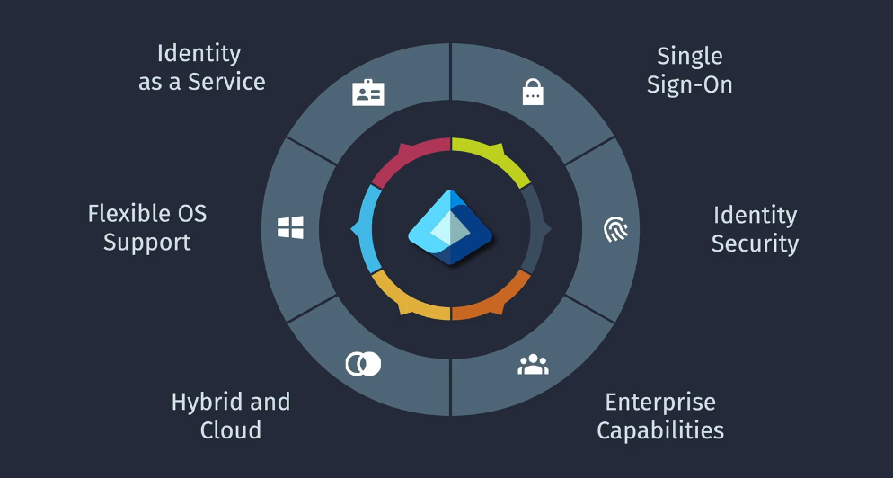
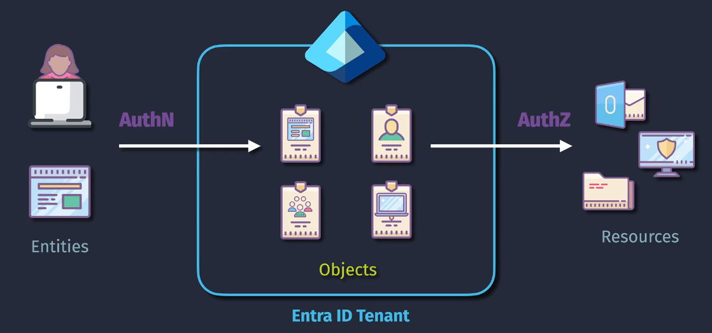
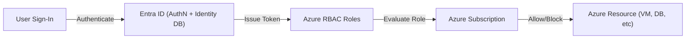
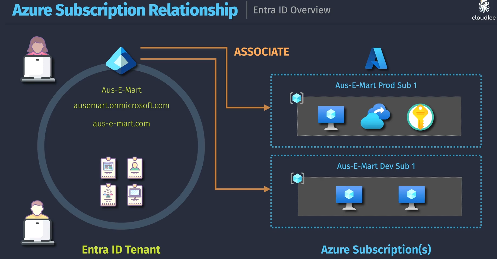
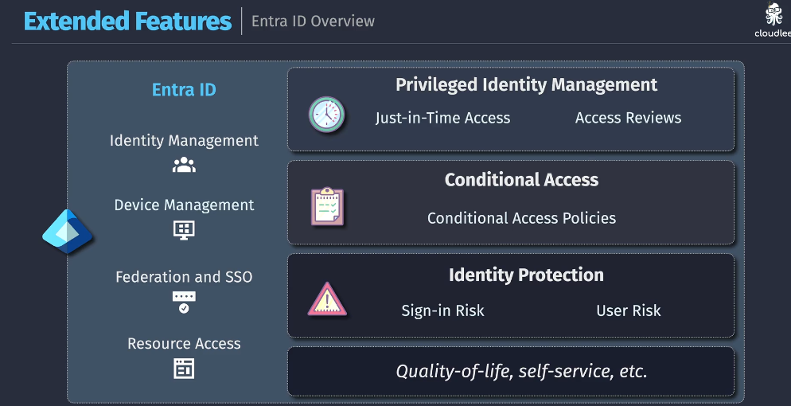

# 🔐 Microsoft Entra ID Overview

## 📌 What Is Microsoft Entra ID?

**Microsoft Entra ID** (formerly **Azure Active Directory**) is **Microsoft's Identity as a Service (IDaaS)** platform that provides centralized identity and access management across Azure, Microsoft 365, and thousands of third-party SaaS apps. It supports **OAuth2**, **OIDC**, **SAML**, **SCIM**, **LDAP**, and more.

🧾 **Official Definition**:

> Microsoft Entra ID is a cloud-based identity and access management (IAM) service that helps your employees sign in and access resources such as Microsoft 365, Azure services, and third-party apps.

---

<div align="center">
  
</div>

---

## 🧱 Architecture & Components

<div align="center">
  
</div>

### ✅ Key Building Blocks

| Component                  | Description                                                     |
| -------------------------- | --------------------------------------------------------------- |
| **Entities**               | Users, groups, apps, devices                                    |
| **AuthN (Authentication)** | Verifies the user's identity (via username/password, MFA, etc.) |
| **AuthZ (Authorization)**  | Grants access to resources based on RBAC or policies            |
| **Objects**                | Identities and access-related entities stored in the directory  |
| **Tenant**                 | Dedicated directory per organization                            |

---

## 🔐 Identity as a Service (IDaaS) – SSO, Federation, OAuth2

Microsoft Entra ID acts as a central **OAuth2 Authorization Server** and **OpenID Connect provider**. You can register **first-party or third-party apps**, protect them with **scopes**, and allow delegated access using **Access Tokens** and **ID Tokens**.

---



---

> 💡 Think of it like a secure passport office issuing tokens to verified users.

---

<div style="text-align:center;">
    
</div>

---

## 🛠️ Features Overview

<div style="text-align:center;">
    
</div>

---

| Category                        | Feature                            | Description                         |
| ------------------------------- | ---------------------------------- | ----------------------------------- |
| 🔐 **Authentication**           | MFA, Passwordless, OAuth2, OIDC    | Modern protocols + biometrics       |
| 🚪 **Single Sign-On (SSO)**     | 1000s of SaaS apps                 | Seamless logins across apps         |
| 🛡️ **Conditional Access**       | Risk-based policies                | Block risky sign-ins or enforce MFA |
| 🎩 **Privileged Identity Mgmt** | Just-in-Time roles, Access reviews | Least privilege & role elevation    |
| 🧬 **Identity Protection**      | Risk scoring, Sign-in anomalies    | Detect compromised accounts         |
| 🧑‍🤝‍🧑 **External Identities**      | B2B collaboration, B2C portals     | Invite partners & customers         |
| 🔄 **Lifecycle Management**     | SCIM, group-based access           | Automate user provisioning          |
| 📱 **Device Mgmt**              | Hybrid join, Intune integration    | Enforce policies by device trust    |

---

## 📦 Entra + Azure Subscription = IAM for Azure Resources

Let’s be clear:

- **Azure Entra ID controls WHO** can access Azure.
- **Azure RBAC controls WHAT** they can do in a subscription.

> 📌 RBAC is applied at **Management Group > Subscription > Resource Group > Resource** — but **only for identities stored in Entra ID**.

---

## 🔄 Real Example: Azure + Entra in Action

```plaintext
User: Sarah (sarah@contoso.com)
→ Authenticates via Entra ID using MFA
→ Assigned Contributor role in Azure Dev Subscription
→ Can create resources in that subscription
→ Blocked by Conditional Access if logging in from unknown country
```

---

## ☁️ Entra vs AWS IAM (Quick Comparison)

| Feature            | Microsoft Entra ID                                        | AWS IAM                          |
| ------------------ | --------------------------------------------------------- | -------------------------------- |
| Primary Role       | Identity-as-a-Service for Microsoft cloud & external apps | IAM for AWS services only        |
| Federation         | Supports SAML, OAuth2, OpenID Connect                     | SAML only (OIDC support limited) |
| External Users     | Full guest user collaboration (B2B, B2C)                  | Not natively supported           |
| Conditional Access | Built-in risk-based policies                              | Requires external tooling        |
| Role Delegation    | Privileged Identity Management (PIM)                      | Basic role delegation            |
| App Integration    | 1000s of SaaS apps with SSO                               | Very limited                     |

So think of **Entra ID** as a full-featured **Okta + AWS IAM + Azure IAM**, rolled into one unified engine.

---

## 🧠 Summary & Key Takeaways

- ✅ **Microsoft Entra ID = Identity as a Service**
- ✅ Built-in support for OAuth2, OIDC, SAML, SCIM
- ✅ Controls Azure access via identity, not directly via subscription
- ✅ Similar to **AWS IAM + Okta** but more integrated
- ✅ Supports **SSO, MFA, conditional policies, guest users**, and **token issuance**
