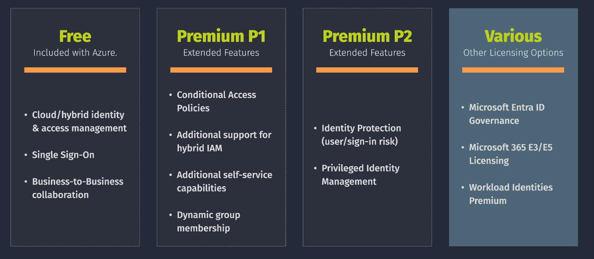

# Entra ID Licenses

Entra ID offers various licensing plans to cater to different organizational needs. These licenses provide different levels of features related to identity and access management, security, and compliance.

  

---

| Feature                                                | Microsoft Entra ID Free - Security defaults (enabled for all users) | Microsoft Entra ID Free - Global Administrators only    | Office 365 | Microsoft Entra ID P1 | Microsoft Entra ID P2 |
| ------------------------------------------------------ | ------------------------------------------------------------------- | ------------------------------------------------------- | ---------- | --------------------- | --------------------- |
| Protect Microsoft Entra tenant admin accounts with MFA | ✅                                                                  | ✅ (Microsoft Entra Global Administrator accounts only) | ✅         | ✅                    | ✅                    |
| Mobile app as a second factor                          | ✅                                                                  | ✅                                                      | ✅         | ✅                    | ✅                    |
| Phone call as a second factor                          |                                                                     |                                                         | ✅         | ✅                    | ✅                    |
| SMS as a second factor                                 |                                                                     | ✅                                                      | ✅         | ✅                    | ✅                    |
| Admin control over verification methods                |                                                                     | ✅                                                      | ✅         | ✅                    | ✅                    |
| Fraud alert                                            |                                                                     |                                                         |            | ✅                    | ✅                    |
| MFA Reports                                            |                                                                     |                                                         |            | ✅                    | ✅                    |
| Custom greetings for phone calls                       |                                                                     |                                                         |            | ✅                    | ✅                    |
| Custom caller ID for phone calls                       |                                                                     |                                                         |            | ✅                    | ✅                    |
| Trusted IPs                                            |                                                                     |                                                         |            | ✅                    | ✅                    |
| Remember MFA for trusted devices                       |                                                                     | ✅                                                      | ✅         | ✅                    | ✅                    |
| MFA for on-premises applications                       |                                                                     |                                                         |            | ✅                    | ✅                    |
| Conditional Access                                     |                                                                     |                                                         |            | ✅                    | ✅                    |
| Risk-based Conditional Access                          |                                                                     |                                                         |            |                       | ✅                    |
| Self-service password reset (SSPR)                     | ✅                                                                  | ✅                                                      | ✅         | ✅                    | ✅                    |
| SSPR with writeback                                    |                                                                     |                                                         |            | ✅                    | ✅                    |

This table summarizes the various features available across different tiers of Microsoft Entra ID (formerly Azure Active Directory) and Office 365. If you need further assistance or additional details, feel free to ask!

For detailed and the most current information, it's always best to refer directly to the [Microsoft Entra ID Licensing Documentation](https://learn.microsoft.com/en-us/entra/fundamentals/licensing).
