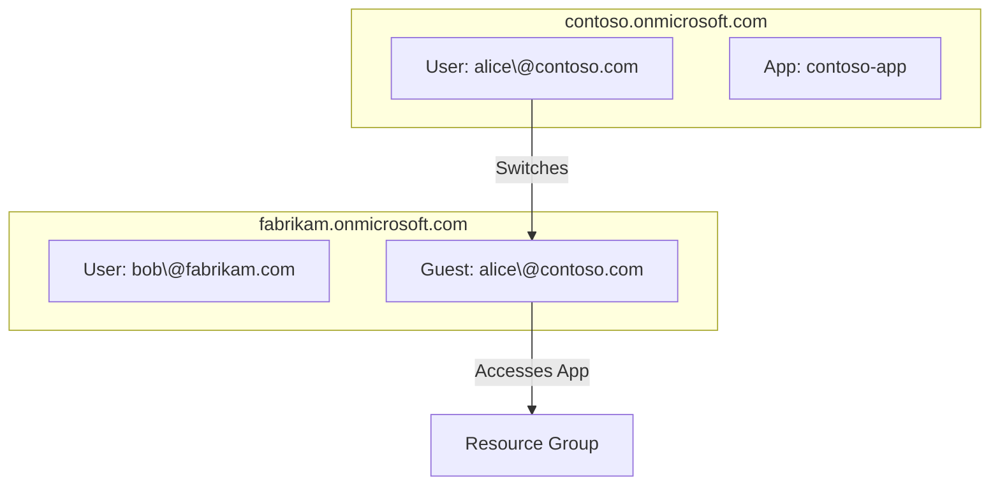

# 🏢 Azure Multi-Tenant Architecture

## 🧠 What is a Tenant in Azure?

A **Tenant** in Azure (also called a **Microsoft Entra ID Tenant**) is an **isolated identity and directory boundary**—it holds users, groups, apps, devices, policies, and domain names. It's your **organization’s identity container**.

- When you sign up for Azure or Microsoft 365, **you get one tenant by default**.
- This tenant is linked to a special domain like:
  🧾 `contoso.onmicrosoft.com`

---

## 🧰 What is Multi-Tenant in Azure?

> **Multi-Tenant** in Azure means a **single user account (identity)** can access and manage **multiple isolated Entra ID tenants** using one login (Microsoft account or Work/School account).

- 🔀 You can **switch between tenants** in the Azure/Entra portal.
- 👥 Your email identity (e.g. `admin@consultingfirm.com`) can:

  - Be **Global Admin in Tenant A**
  - Be **Guest in Tenant B**
  - Be **User Admin in Tenant C**

This is great for:

- Consultants working with multiple clients
- Companies managing multiple subsidiaries
- Test labs (dev/test/prod separation)
- Service providers managing clients via **Azure Lighthouse**

---

## 🛠️ How to Create a New Tenant

You can create a new tenant from two places:

### Option 1 – From [**Entra Portal**](https://entra.microsoft.com)

1. Go to: `https://entra.microsoft.com`
2. Click top-right account icon → **Switch Tenant** → **Create a tenant**
3. Choose **Azure Active Directory**
4. Fill in:

   - Organization name
   - Initial domain name (e.g., `cooldevlab.onmicrosoft.com`)
   - Region

5. Done! A new **completely isolated identity system** is created.

### Option 2 – From [**Azure Portal**](https://portal.azure.com)

- Same steps as above, just start from:
  `Azure Active Directory > Manage tenants > Create`

---

## 🧾 What’s This Strange Default User After Tenant Creation?

When you create a new tenant, Azure Entra automatically:

- 🎭 **Creates a default user** (usually **you**) as:

  - `admin@yourcustomname.onmicrosoft.com`

- 🧙 This user becomes the **Global Administrator** of the new tenant.

Even if you used `john.doe@gmail.com` or `you@company.com` to create the tenant, Azure **wraps that identity** in a local "Entra user object" within the new tenant.

### 🔍 Why?

Because the new tenant is isolated, and it needs at least **one internal user** to:

- Manage identities
- Add domains
- Create subscriptions
- Assign roles

📌 Example:

```plaintext
You sign in as: you@gmail.com
You create a new tenant: testlab.onmicrosoft.com
Now you're: you_gmail.com#EXT#@testlab.onmicrosoft.com (internally)
```

So don’t worry—it’s not a bug, it’s Azure’s way of preserving isolation and access.

---

## 🧬 Understanding the Identity Relationship (Visual)



---

## 💬 Why Use Multiple Tenants?

| Use Case              | Description                                                   |
| --------------------- | ------------------------------------------------------------- |
| 🔒 Isolation          | Separate identities, apps, and policies (e.g., HR vs Finance) |
| 🧪 Testing            | Spin up dev/test tenants without affecting production         |
| 🧑‍💼 Consulting      | Manage multiple clients from the same login                   |
| 🌐 Subsidiaries       | Each region or subsidiary has its own tenant                  |
| 🧠 Skills Development | Create lab tenants for learning Entra ID, PIM, SSO, B2B etc.  |

---

## 🔐 Cross-Tenant Access & Guest Users

Multi-tenant = multiple organizations, but **users can collaborate** across them using:

### 🔄 **B2B (Business-to-Business) Collaboration**

- Invite users from **Tenant A** to **Tenant B**
- They show up as **Guest** users (e.g., `john_contoso.com#EXT#@fabrikam.onmicrosoft.com`)
- You can assign roles (Reader, Contributor, etc.)

---

## 💡 Custom Domains in Multi-Tenant Setup

You can add a custom domain like:

```plaintext
awesomecorp.com
```

…to your new tenant instead of sticking with:

```plaintext
awesomecorp.onmicrosoft.com
```

### Steps:

1. Go to: `Entra Portal > Custom domain names`
2. Add your domain
3. Verify using DNS TXT record
4. Make it primary if needed

This helps:

- Improve brand identity
- Allow user sign-ins using corporate email
- Integrate with third-party identity systems (SSO)

---

## ☁️ Azure vs AWS – Tenant Model Comparison

| Feature                  | Azure                                | AWS                                                         |
| ------------------------ | ------------------------------------ | ----------------------------------------------------------- |
| Tenant Concept           | ✔️ Entra ID Tenant = Org boundary    | ❌ No native tenant. AWS Account = boundary                 |
| One identity across orgs | ✅ Yes (multi-tenant login possible) | ❌ No (cross-account = role switch)                         |
| B2B Guest Collaboration  | ✅ Native via Entra ID               | 🟡 Possible but harder with IAM roles                       |
| Central Directory        | ✔️ Entra ID                          | ❌ No built-in directory (unless using IAM Identity Center) |
| Create new tenant        | ✔️ Easy (portal click)               | ❌ New AWS Account required                                 |

---

## 🧠 Pro Tips

- You can’t share **subscriptions** between tenants!
- If you create a subscription inside Tenant A, it belongs **only to Tenant A**.
- Use **Azure Lighthouse** to manage subscriptions across tenants securely.
- Use **PIM (Privileged Identity Management)** if you need temporary admin roles in other tenants.

---

## 🧾 Summary

| 🔍 Concept        | 💡 Explanation                                                       |
| ----------------- | -------------------------------------------------------------------- |
| **Tenant**        | An isolated identity and directory boundary (Entra ID)               |
| **Multi-Tenant**  | One account (user) can access many tenants with different roles      |
| **Create Tenant** | Done via Azure or Entra portal, gives you an isolated identity space |
| **Default User**  | A new internal admin user is created automatically for you           |
| **B2B Access**    | Use Azure AD B2B to allow external users to collaborate              |
| **Portals**       | Use `entra.microsoft.com` for identity management across tenants     |
