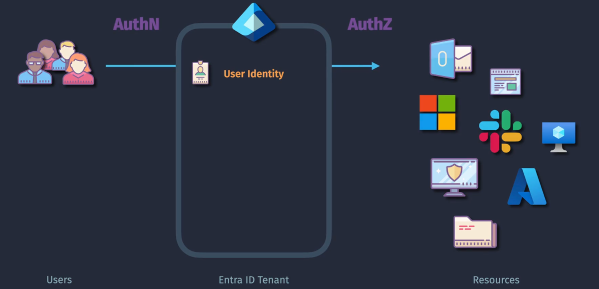
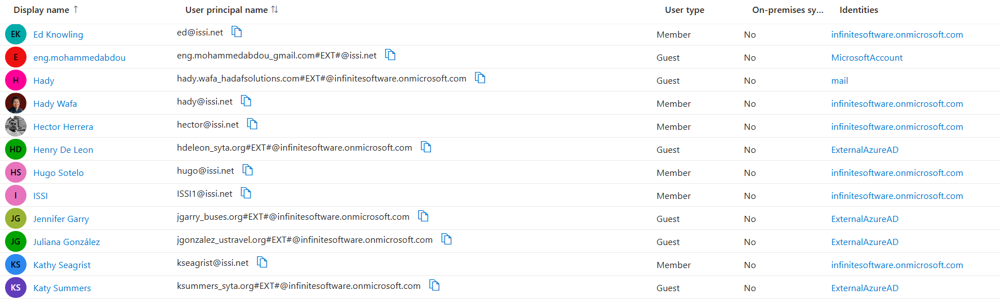

# 🧑‍💼 Microsoft Entra ID – User Identities Explained

  

  

---

## 🌍 Identity Types in Entra ID

Microsoft Entra ID supports multiple types of user identities to support both **internal teams** and **external collaborators**, whether they’re employees, partners, freelancers, or Gmail users who never want to make a Microsoft account.

---

  

---

### 1. 🔐 **Member Users - `<TENANT_NAME>`**

These are your **homegrown heroes**—your employees or service accounts created **within your tenant**.

- **Identifiers**:

  - `brigit@issi.net` (custom domain)
  - `alex@infinitesoftware.onmicrosoft.com` (default domain)

- **Created via**: Azure Portal, Microsoft 365, Entra Admin, Azure AD Connect sync
- **Full Control**: You assign roles, licenses, and access

✅ **Use Cases**:

- Employees accessing Teams, Office 365, internal apps
- DevOps team managing Azure resources

---

### 2. 🌐 **Guests Users - `ExternalAzureAD`**

These folks already have **a Microsoft Entra ID elsewhere** (maybe they work at `buses.org`)—but you want them to collaborate inside your tenant securely.

- **UPN Format**:

  - `brome_buses.org#EXT#@infinitesoftware.onmicrosoft.com`

- **Login With**:

  - Their **original account** → `brome@buses.org`

🧠 This is called **B2B Collaboration** (Azure AD B2B).

✅ **Use Cases**:

- Consultant from another company accessing your SharePoint
- Guest speaker added to your Teams meeting with document access

---

### 3. 📧 **Guests Users - `MicrosoftAccount`**

These are **personal Microsoft accounts** (like Outlook or Hotmail) used for guest access.

- **UPN Format**:

  - `brigit.hassan_gmail.com#EXT#@issi.net`

- **Login With**:

  - Their Microsoft personal account (e.g. `brigit.hassan@gmail.com`)

🧠 Microsoft automatically converts non-Microsoft emails into MSAs when users register.

✅ **Use Cases**:

- Freelancer using Hotmail for quick access
- Blogger joining your web app feedback group

---

### 4. ✉️ **Guests Users - `Mail`**

No Microsoft account? No problem. Entra ID now lets you invite **any email user**, and they log in using a **one-time passcode (OTP)**.

- **UPN Format**:

  - `hadywafa97_gmail.com#EXT#@yourtenant.onmicrosoft.com`

- **Login With**:

  - `hadywafa97@gmail.com` + OTP emailed each time

🧠 Perfect for **lightweight collaboration** without account creation.

✅ **Use Cases**:

- External vendors using Gmail/Yahoo
- Volunteers or event partners with temporary access

---

## 🔄 Comparison Summary

| Identity Type        | Login From              | Example UPN                                            | Account Required | Best For                               |
| -------------------- | ----------------------- | ------------------------------------------------------ | ---------------- | -------------------------------------- |
| Internal User        | Entra ID (tenant-owned) | `brigit@issi.net`                                      | Yes              | Employees, service accounts            |
| Azure AD Guest (B2B) | Another Entra ID tenant | `brome_buses.org#EXT#@yourtenant.onmicrosoft.com`      | Yes              | Partners from other orgs               |
| Microsoft Account    | Personal MSA            | `brigit.hassan_gmail.com#EXT#@issi.net`                | Yes              | Freelancers with MSA                   |
| Just Email (OTP)     | Any email (Gmail, etc.) | `hadywafa97_gmail.com#EXT#@yourtenant.onmicrosoft.com` | No               | External users without Microsoft login |

---

## 🧑‍🔧 User Lifecycle Management in Entra ID

Managing users in Entra ID isn’t just about creating them — you also need to **update**, **retire**, and **secure** them. Here’s how:

---

### ➕ **Create Users**

1. **Manually (Admins)**:

   - Via Entra Portal or M365 Admin Center

2. **Bulk Import**:

   - Upload a CSV or script with PowerShell

3. **Auto-Provisioning**:

   - Sync from HR systems (SAP, Workday) or on-prem AD with **Azure AD Connect**

---

### ✏️ **Update Users**

- Update job title, department, contact info
- Modify role assignments (e.g., Reader → Contributor)
- Change authentication methods (enable MFA, FIDO2, etc.)
- Add/remove group memberships (e.g., `HR-Team`)

---

### 🗑️ **Delete Users**

- **Soft Delete**:

  - Moved to recycle bin for 30 days (you can restore them!)

- **Hard Delete**:

  - After 30 days, user is purged permanently

- **Best Practices**:

  - Reassign owned resources
  - Reclaim and reuse licenses

---

## 🧠 Pro Tips & Best Practices

| 💡Tip                              | Why It Matters                                  |
| ---------------------------------- | ----------------------------------------------- |
| Use **custom domains** for clarity | Avoid confusing default `.onmicrosoft.com` UPNs |
| Review guest users regularly       | Avoid stale accounts with lingering access      |
| Prefer **passwordless + MFA**      | Improves security & user experience             |
| Use **groups for RBAC**            | Easier to manage than per-user role assignments |

---

## 📌 Final Thoughts

Microsoft Entra ID supports **all types of humans and machines**—from internal employees to Gmail-using freelancers. Understanding their identity type helps you:

- Apply the right **roles**
- Enforce proper **security**
- Enable smooth **collaboration** (without overprovisioning)

> 🔐 Whether it’s an employee with full admin rights or a guest just peeking into a shared Excel file—Entra ID’s got them covered.
