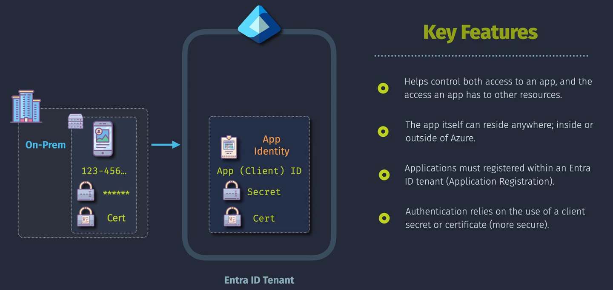
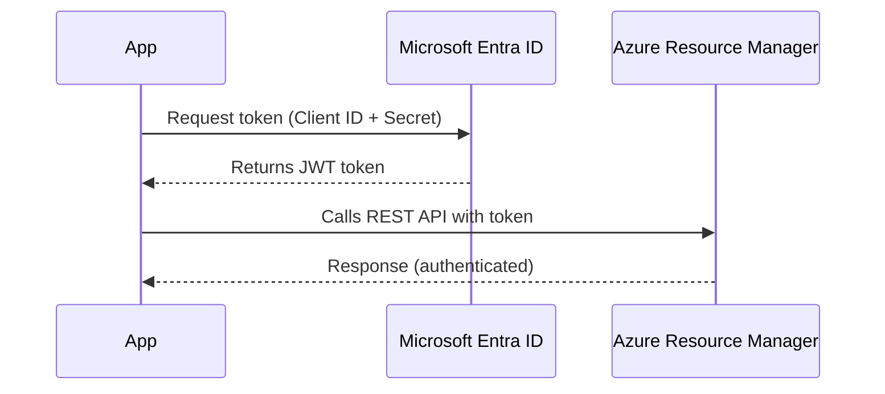

# 🔐 Application Identity in Microsoft Entra ID

> _Because your apps deserve secure, first-class citizenship too._

---

<div align="center">
  
</div>

---

## 📖 What Is an Application Identity?

An **Application Identity** in Microsoft Entra ID allows apps (not users!) to authenticate securely and access Azure resources, APIs, or external services — **without a user signing in**.

Think of it like giving your app a **passport** and **security badge** to operate in your tenant. 👮‍♂️

---

## 🧩 Core Components of App Identity

| Component                  | Description                                                                |
| -------------------------- | -------------------------------------------------------------------------- |
| **App Registration**       | The blueprint of your app. Defines credentials, API permissions, redirects |
| **Enterprise Application** | The "live" instance of the app in your tenant (Service Principal)          |
| **Service Principal**      | The actual identity used to authenticate and authorize the app             |

🧠 TL;DR:

- **App Registration** = the design 💡
- **Enterprise App** = the deployed identity 🔧
- **Service Principal** = the authenticating actor 🕵️

---

<div align="center">
  
</div>

---

## 🚀 Real Example: CI/CD Pipeline Logging into Azure

Let’s say you have a GitHub Action or Azure DevOps pipeline that needs to deploy a Bicep or Terraform template to Azure.

You **don’t want to hardcode a username/password** 😨

So you:

1. Create an **App Registration**
2. Assign it permissions (e.g., `Contributor` on a subscription)
3. Use the **Client ID + Secret** (or Cert) to get a token
4. Pipeline uses that token to call Azure REST APIs securely

Boom 💥 – no humans involved.

---

## 🔁 OAuth2 Flow: App Identity Using Client Credentials

When we talk about **application identity** (via **App Registration** + **Service Principal**), it usually maps to the **OAuth2 client credentials grant type**, which looks like this:

> The app (not a user) authenticates to Azure Entra ID using its **Client ID** + **Secret/Certificate** to obtain an **access token**.

---

<div align="center">



</div>

---

This is called the **Client Credentials Grant**.

- No user signs in
- Token represents the app
- Token can be scoped to resources (like `https://management.azure.com/`)

---

## 🧠 How to Create an Application Identity

Here’s a quick walkthrough to create and use one.

### 1️⃣ Register Your App

- Go to [Azure Portal → Microsoft Entra ID → App registrations](https://portal.azure.com/)
- Click **New Registration**
- Set:

  - Name: `my-ci-deployer`
  - Redirect URI (optional): use if doing OAuth2 with a user

### 2️⃣ Generate Credentials

- From the app registration:

  - Go to **Certificates & Secrets**
  - Add a **client secret** or upload a **certificate**

⚠️ Secrets expire! Rotate them or use certificates for longer security cycles.

### 3️⃣ Assign Permissions (RBAC)

- Go to your **Subscription → Access Control (IAM)**
- Add role assignment:

  - Role: `Contributor`
  - Assign access to: `my-ci-deployer` (Service Principal)

✅ Now your app can deploy resources in Azure!

---

## 🧪 Code Example: Use in Azure CLI

```bash
az login --service-principal \
  --username <CLIENT_ID> \
  --password <CLIENT_SECRET> \
  --tenant <TENANT_ID>
```

---

## 🔐 Why App Identity Is Powerful

| Feature                      | Benefit                                                   |
| ---------------------------- | --------------------------------------------------------- |
| **No User Login Required**   | Secure, scalable CI/CD or background processing           |
| **Least Privilege**          | You decide what the app can do — nothing more             |
| **Multi-Tenant Ready**       | Apps can be accessed from multiple organizations securely |
| **Supports OAuth2 / OpenID** | Integrate with any standards-based identity framework     |

---

## 📚 When to Use Application Identity

| Scenario                             | Identity Type                           |
| ------------------------------------ | --------------------------------------- |
| Deploying Azure Resources from CI/CD | App Registration + SP                   |
| Automating cloud cleanup scripts     | App Identity                            |
| Integrating with Graph API           | App Identity (delegated or client cred) |
| Running on-prem apps with Azure auth | App Identity                            |

---

## 🔁 Azure vs AWS Comparison

| Concept             | Microsoft Entra ID          | AWS Equivalent                          |
| ------------------- | --------------------------- | --------------------------------------- |
| App Registration    | App Client with credentials | IAM Identity Provider + Role assumption |
| Enterprise App (SP) | Live identity of the app    | IAM Role                                |
| Managed Identity    | Azure-native identity       | EC2 IAM Role / Lambda Execution Role    |

---

## 🛡️ Bonus: App Identity + Conditional Access

Want your app to only access Azure during business hours?
Yep — you can do that with **Conditional Access policies**.

Want to enforce **MFA for users**, but exempt apps?
Easy — apps are recognized **separately** from users.

---

## 🧠 Final Tips

- Use **Certificates over Secrets** where possible (more secure)
- Use **Least Privilege RBAC** — don’t give the app too many rights
- Use **App Roles** if your app needs fine-grained authorization
- Avoid assigning **Directory roles** (like Global Admin) unless absolutely required

---

## 📎 Summary Table

| Component            | Description                        | Common Use                      |
| -------------------- | ---------------------------------- | ------------------------------- |
| App Registration     | Blueprint + credentials            | Define identity and permissions |
| Enterprise App       | Service Principal in tenant        | Enforces policies + access      |
| Client Credentials   | OAuth2 grant for app-only login    | CI/CD pipelines, backend apps   |
| RBAC Role Assignment | Give app access to Azure resources | Secure automation               |
