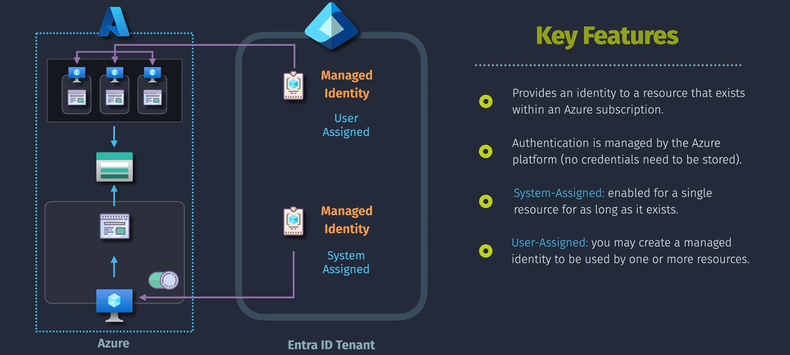
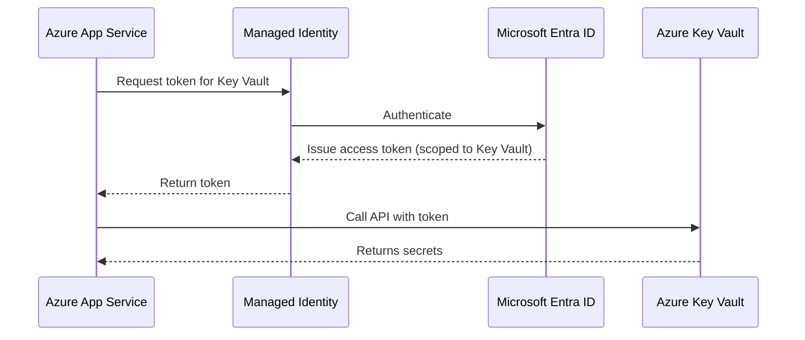

# 🧙‍♂️ Azure Managed Identities — Your Passwordless Sidekick

> “Why store secrets in code when Azure can manage them for you?” — A happy, secure developer somewhere.

---

<div align="center">
  
</div>

---

## 🌟 What Are Managed Identities?

**Managed Identities** are system-generated identities in Microsoft Entra ID that let your **Azure resources authenticate to other Azure services** — _without storing secrets, keys, or tokens in code_.

They’re like **invisible user accounts for your app**, but managed entirely by Azure.

---

### 📜 Official Definition

> “A **Managed Identity** is an automatically managed identity in Microsoft Entra ID that can authenticate to any service supporting Microsoft Entra authentication without needing credentials in your code.”

---

## 🤹‍♀️ Types of Managed Identities

| Type                | Scope                              | Lifecycle        | Example Use Case                          |
| ------------------- | ---------------------------------- | ---------------- | ----------------------------------------- |
| **System-assigned** | Tied to _one_ Azure resource       | Same as resource | Azure VM reads from Key Vault             |
| **User-assigned**   | Created as a _standalone_ identity | Independent      | One identity shared across many Functions |

---

## 🎯 Use Cases

- Azure Function accessing Azure SQL, Blob, Key Vault
- Azure VM pulling config from App Configuration
- Azure Container Apps fetching secrets securely
- Azure Logic Apps calling protected APIs

---

## 🧪 Real-World Example

> Let's say your app hosted in **Azure App Service** needs to pull secrets from **Azure Key Vault**.

With managed identity:

- No client ID
- No client secret
- No password rotation
- No leaks in GitHub 😬

---

## 🧬 Flow Diagram (Mermaid Style)



---

## 🧑‍💻 Example Code (C# — Key Vault Access)

```csharp
var credential = new DefaultAzureCredential(); // Automatically uses Managed Identity
var client = new SecretClient(new Uri("https://my-keyvault.vault.azure.net/"), credential);
KeyVaultSecret secret = await client.GetSecretAsync("ConnectionString");
Console.WriteLine(secret.Value);
```

✅ No credentials
✅ Works on VMs, Functions, App Services, AKS, Logic Apps
✅ Secure-by-default

---

## 🏗️ How to Enable It?

### 🔹 For System-Assigned MI

1. Go to your Azure resource (e.g., VM or Function)
2. Navigate to **Identity → System Assigned**
3. Set status to **On**
4. Azure creates a managed identity behind the scenes

### 🔹 For User-Assigned MI

1. Go to **Microsoft Entra ID → Managed Identities**
2. Click **New user-assigned identity**
3. Assign it to **multiple resources**

---

## 🔑 Assigning Permissions

> Managed Identities work by getting **Microsoft Entra tokens**, so they need permissions!

You assign roles using **Azure RBAC** (not App RBAC):

```bash
# Give your MI access to Key Vault as Reader
az role assignment create \
  --assignee "<managed-identity-id>" \
  --role "Key Vault Secrets User" \
  --scope "/subscriptions/<sub>/resourceGroups/<rg>/providers/Microsoft.KeyVault/vaults/<kv>"
```

---

## 🛂 Token Under the Hood

When a resource with a managed identity requests a token:

- It hits the **Instance Metadata Service (IMDS)** endpoint:

  ```ini
  GET http://169.254.169.254/metadata/identity/oauth2/token
  ```

- Azure Entra issues a token for the **target resource**, like:

  - Key Vault → `https://vault.azure.net`
  - Azure Resource Manager → `https://management.azure.com`

---

## 🧠 Important Notes

| Feature                    | System-assigned          | User-assigned            |
| -------------------------- | ------------------------ | ------------------------ |
| Tied to a single resource  | ✅ Yes                   | ❌ No                    |
| Reusable across services   | ❌ No                    | ✅ Yes                   |
| Survives resource deletion | ❌ No                    | ✅ Yes                   |
| Works with Kubernetes      | ✅ AKS workload identity | ✅ AKS workload identity |
| Assign roles (RBAC)        | ✅ via Azure RBAC        | ✅ via Azure RBAC        |

---

## 🧁 AWS Comparison

| Feature            | Azure Managed Identity      | AWS Equivalent              |
| ------------------ | --------------------------- | --------------------------- |
| System-assigned MI | Instance Profile (EC2 Role) | IAM Role attached to EC2    |
| User-assigned MI   | Reusable IAM Role           | IAM Role reused in multiple |
| IMDS token service | Yes (169.254.169.254)       | Yes (same IP)               |
| Key rotation       | Automatic                   | Automatic via IAM           |

---

## 🧠 Final Takeaways

- Use **Managed Identity** whenever Azure resources need to access each other securely.
- Forget about storing secrets in code. Use **DefaultAzureCredential** and let Azure do the rest.
- Prefer **User-assigned** MI for reusable identities across resources.
- No more `client_id` / `client_secret` headaches.
- Use Azure RBAC to **grant fine-grained access** to each resource.
