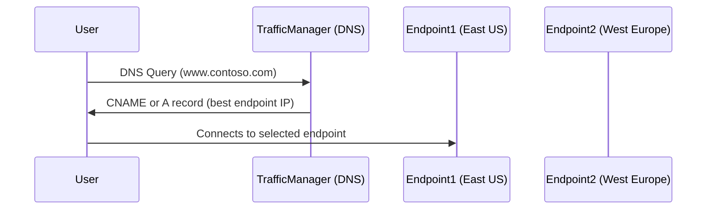

# 🌐 Azure Traffic Manager (ATM)

## 🧠 What Is Azure Traffic Manager?

> **Official Definition**:
> Azure Traffic Manager is a **DNS-based traffic load balancer** that distributes incoming client requests across multiple Azure (or external) endpoints globally, based on **routing methods** like latency, priority, or geographic location.

- Traffic Manager is **not** a reverse proxy — it just responds with the **IP address of the best endpoint**, and the user connects directly.
- It doesn’t handle traffic **after DNS resolution**.

---

## 🗺️ Visual: How Azure Traffic Manager Works



---

## 🧪 Key Use Cases

| Use Case                        | Description                                                                       |
| ------------------------------- | --------------------------------------------------------------------------------- |
| 🌍 **Global High Availability** | Route users to **healthy** regional endpoints (VMs, web apps, external websites). |
| 🚀 **Performance Optimization** | Route users to the **lowest latency** endpoint.                                   |
| 🏢 **Geo-Specific Content**     | Route based on user's geographic location.                                        |
| ⚙️ **Blue-Green Deployment**    | Use **priority routing** to failover between versions.                            |
| 🧪 **Test in Production**       | Use **weighted routing** to split traffic for `A/B testing`.                      |

---

## 🧭 Routing Methods (Policies)

| Method             | What It Does                                                             | Ideal For                                        |
| ------------------ | ------------------------------------------------------------------------ | ------------------------------------------------ |
| ⚡ **Performance** | Routes to closest/fastest endpoint by **network latency**.               | Performance-hungry apps                          |
| 🔢 **Priority**    | Routes all traffic to primary. Fails over to backups if primary is down. | HA & DR setups                                   |
| ⚖️ **Weighted**    | Distributes traffic based on assigned **weights**.                       | Gradual rollout, A/B testing                     |
| 🌍 **Geographic**  | Routes users from specific countries/regions to specific endpoints.      | Legal/data residency compliance                  |
| 🌀 **Multivalue**  | Returns multiple healthy endpoints in DNS response (with TTL).           | Multi-IP apps, client retries                    |
| 💔 **Subnet**      | Routes based on client **IP subnet ranges**.                             | Enterprise-specific logic or migration scenarios |

---

## 📦 What Can Traffic Manager Route To?

| Endpoint Type           | Example                                             |
| ----------------------- | --------------------------------------------------- |
| 🟦 Azure App Services   | Web apps in different regions                       |
| ☁️ Azure Cloud Services | Classic or modern                                   |
| 🖥️ Azure VMs            | VM in a load balancer                               |
| 🌐 External endpoints   | On-prem servers, other clouds                       |
| 🧪 Nested Profiles      | Chain Traffic Manager profiles for advanced routing |

---

## 🛠️ Config Example: Weighted A/B Test

Imagine you have:

- WebApp v1 in East US
- WebApp v2 in West US (new version)

You want:

- 90% traffic to v1
- 10% traffic to v2 for testing

```json
{
  "routingMethod": "Weighted",
  "endpoints": [
    {
      "name": "EastUS-v1",
      "target": "app1.azurewebsites.net",
      "weight": 90
    },
    {
      "name": "WestUS-v2",
      "target": "app2.azurewebsites.net",
      "weight": 10
    }
  ]
}
```

🔄 You can change weights over time to slowly shift traffic to v2.

---

## 🚨 Health Probes (Heartbeat Monitor)

> Traffic Manager continuously checks the **health of each endpoint**, If one endpoint fails, it automatically routes users to the next best available one (based on the routing method)

- Protocols: HTTP, HTTPS, TCP
- Frequency: Every 30 seconds (default)
- Custom probe path: `/healthcheck` or similar
- If the probe fails: endpoint is **removed** from routing until it's healthy again.

Example check:

```json
{
  "Protocol": "HTTPS",
  "Port": 443,
  "Path": "/health"
}
```

---

## 🔒 Is Traffic Manager Secure?

- ✅ Doesn’t serve traffic directly — avoids being a chokepoint
- ❌ Doesn’t encrypt traffic — it's DNS-level
- 🔐 Use it **with Azure Front Door** or **Application Gateway** if you need:

  - SSL offloading
  - Web Application Firewall (WAF)
  - Layer 7 routing

---

## ⚖️ Traffic Manager vs Other Azure Load Balancers

| Service                 | Level     | Purpose                                  |
| ----------------------- | --------- | ---------------------------------------- |
| **Traffic Manager**     | DNS-based | Global routing across regions            |
| **Front Door**          | Layer 7   | Global HTTP(S) routing with acceleration |
| **Application Gateway** | Layer 7   | App-level (regional) routing, WAF        |
| **Load Balancer**       | Layer 4   | Internal or external TCP/UDP balancing   |

---

## 🧠 Pro Tips

- ⏱️ Keep TTL low (default: 30s–300s) for faster failover.
- 🧪 Use **nested profiles** to mix routing methods (e.g., Geographic → Weighted).
- 🧠 Use **custom health endpoints** (`/ping`, `/status`) to avoid false positives.
- 📊 Monitor using Azure Monitor logs and Traffic Manager metrics.
- 💰 Billing is based on:

  - Number of DNS queries
  - Health checks performed

---

## 🔄 CLI & Portal

```bash
az network traffic-manager profile create \
  --name myprofile \
  --resource-group myrg \
  --routing-method Performance \
  --unique-dns-name contosoglobal \
  --ttl 30 \
  --monitor-path "/health"
```

---

## 💬 Domain Integration

You can use:

- `myapp.trafficmanager.net` (default DNS)
- Or set up a **custom domain** like `app.contoso.com` with a CNAME to Traffic Manager

---

## 📌 Real-Life Scenarios

### 🌍 Global Website

Use **Performance Routing** to serve users from the closest region

### 🔁 Disaster Recovery / Failover

Use **Priority Routing** to fail over from primary to backup region

### 🧪 A/B Testing

Use **Weighted Routing** to send 30% of users to new version and monitor impact

### 🌐 GDPR Compliance

Use **Geographic Routing** to keep EU user traffic within the EU

---

## 🧠 Summary

| Feature          | Value                                   |
| ---------------- | --------------------------------------- |
| 💡 Type          | DNS-based load balancer                 |
| 🎯 Routing Logic | Performance, Weighted, Geographic, etc. |
| ✅ Good For      | Global HA, testing, low-latency routing |
| 🚫 Not For       | SSL offloading, direct traffic proxy    |
| 🤝 Combine With  | Azure Front Door / App Gateway          |
| 🔧 Configuration | Azure Portal, CLI, Bicep, ARM           |

---

## 🧩 Real-World Example

Let’s say you run a global e-commerce site 🌍:

- Users from **Europe** go to West Europe App Service
- Users from **US** go to East US
- **Asia-Pacific** traffic goes to Japan
- During a big launch, you want to **slowly release** new version (A/B)

🔧 Use:

- **Geographic routing** to separate traffic by region
- **Weighted routing** in one region to test new version
- Health probes to auto-failover if one region crashes
