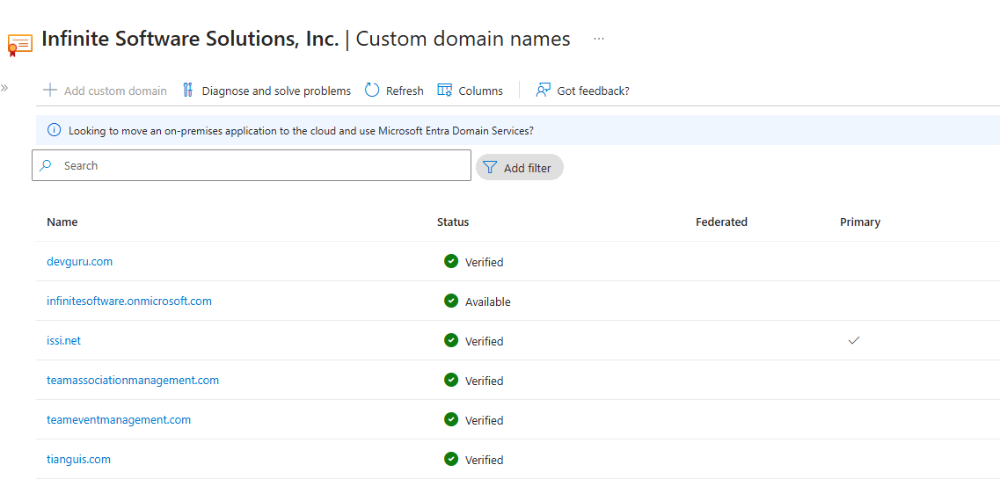

# 🌐 Custom Domains in Entra ID (Azure AD)

> Because nobody wants to stay stuck with `contoso.onmicrosoft.com`

---

## 📌 What’s the Point?

By default, when you create an Azure tenant, it gives you a domain like:

```ini
YourTenantName.onmicrosoft.com
```

That’s fine for testing, but not for real businesses. You want your users to log in with:

```ini
user@yourcompany.com
```

That’s where **custom domain names** come in. You map your **real, branded domain** to Entra ID so it can manage authentication for your users, apps, and services.

---

## 🧭 Where to Configure?

You can manage domains from:

- [✅ portal.azure.com → Microsoft Entra ID → Custom domain names](https://portal.azure.com)
- [✅ entra.microsoft.com → Identity → Domains](https://entra.microsoft.com)
- ✅ Microsoft 365 admin portal (admin.microsoft.com) — if you're using Microsoft 365 too

---

## 🛠️ How to Add a Custom Domain

### 🧱 Step 1: Own the Domain

You must already own a domain like `fabrikam.com`, managed through a registrar like GoDaddy, Namecheap, or Cloudflare.

---

### 🔧 Step 2: Add Domain in Entra ID

1. Go to [portal.azure.com](https://portal.azure.com)
2. Navigate to **Microsoft Entra ID**
3. Select **Custom domain names**
4. Click **+ Add custom domain**
5. Type `yourcompany.com`
6. Click **Add Domain**

---

### 🧪 Step 3: Verify Domain (DNS TXT Record)

Now Azure gives you a **TXT record** like this:

```ini
Record type: TXT
Name: @
Value: MS=ms12345678
TTL: 3600
```

➡️ Go to your domain registrar (e.g., GoDaddy)  
➡️ Add this TXT record to the DNS zone  
➡️ Wait a few minutes (DNS propagation)  
➡️ Back in Azure, click **Verify**

🎉 Once verified, the domain is yours in Entra ID!

---

<div align="left">
  
</div>

---

## ✅ Domain Statuses

| Status         | Meaning                                              |
| -------------- | ---------------------------------------------------- |
| **Unverified** | DNS not configured or not propagated yet             |
| **Verified**   | Domain is active and usable for identities           |
| **Default**    | All new users will get emails like `@yourdomain.com` |

🔄 You can set any verified domain as the **default**.

---

## 🧪 Example in Action

> Let’s say you work at `tailwindtraders.com`.

You want all new users to log in with `@tailwindtraders.com`.

**Steps:**

- Add domain to Entra ID
- Verify with DNS TXT
- Set it as default
- New users get UPNs like `susan@tailwindtraders.com`

---

## 🔁 Can I Add Multiple Domains?

YES. You can add and verify **many domains** like:

- `contoso.com`
- `marketing.contoso.com`
- `contoso.net`

🧑‍💼 Great for mergers, subsidiaries, or brands with multiple names.

---

## ⚠️ Gotchas & Tips

- ❌ You **can’t delete** the `.onmicrosoft.com` domain — it’s forever.
- ✅ You **can switch default domain** anytime.
- ✅ Use **PowerShell or CLI** for automation in large orgs.
- ❌ Don’t skip DNS propagation time (can take a few minutes to hours).

---

## 🔐 Custom Domains + Federation = 🔥

Once the domain is added, you can:

- Setup **SSO with ADFS** or **third-party IdPs**
- Enable **B2B Guest access**
- Use **custom branding** on login page

---

## 📌 Summary Table

| 💬 Concept                | 🧠 Explanation                              |
| ------------------------- | ------------------------------------------- |
| Default Domain            | `yourtenant.onmicrosoft.com` (always there) |
| Custom Domain             | Your real domain like `fabrikam.com`        |
| Where to Add              | Azure Portal, Entra Portal, or M365 Admin   |
| Verification Method       | Add a TXT record in your DNS provider       |
| Use Cases                 | Branding, SSO, B2B, clean UPNs              |
| Can I Add Many?           | Yes! Multiple domains per tenant            |
| Can I Delete onmicrosoft? | No. It stays as fallback                    |

---

## 🧠 Compared to AWS

| Feature                | Azure Entra ID                      | AWS IAM                             |
| ---------------------- | ----------------------------------- | ----------------------------------- |
| Custom Domain SSO      | ✔️ Built-in via domain verification | ❌ Requires Cognito or external IdP |
| Sign-in Domain Control | ✔️ You control UPNs per domain      | ❌ No concept of domain UPNs        |
| Multi-domain Support   | ✔️ Native                           | ❌ Not supported in IAM directly    |
| Branding Login Page    | ✔️ Custom branding per domain       | ❌ Not supported in IAM             |
