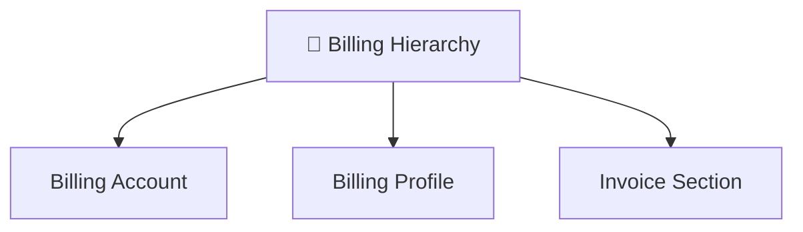
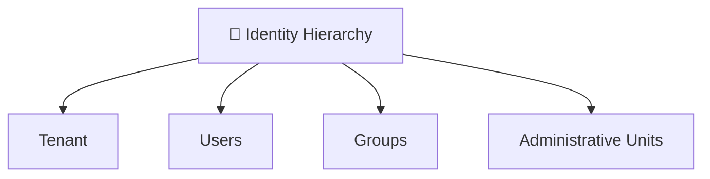
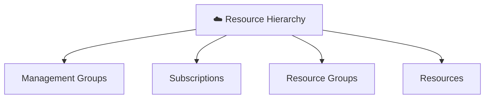
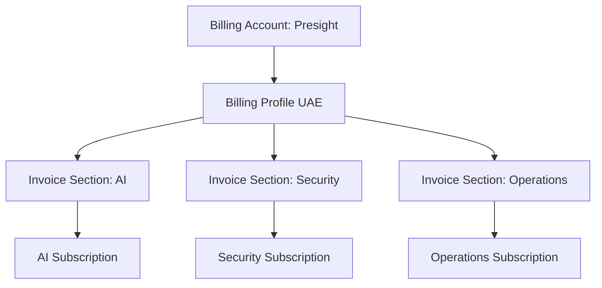
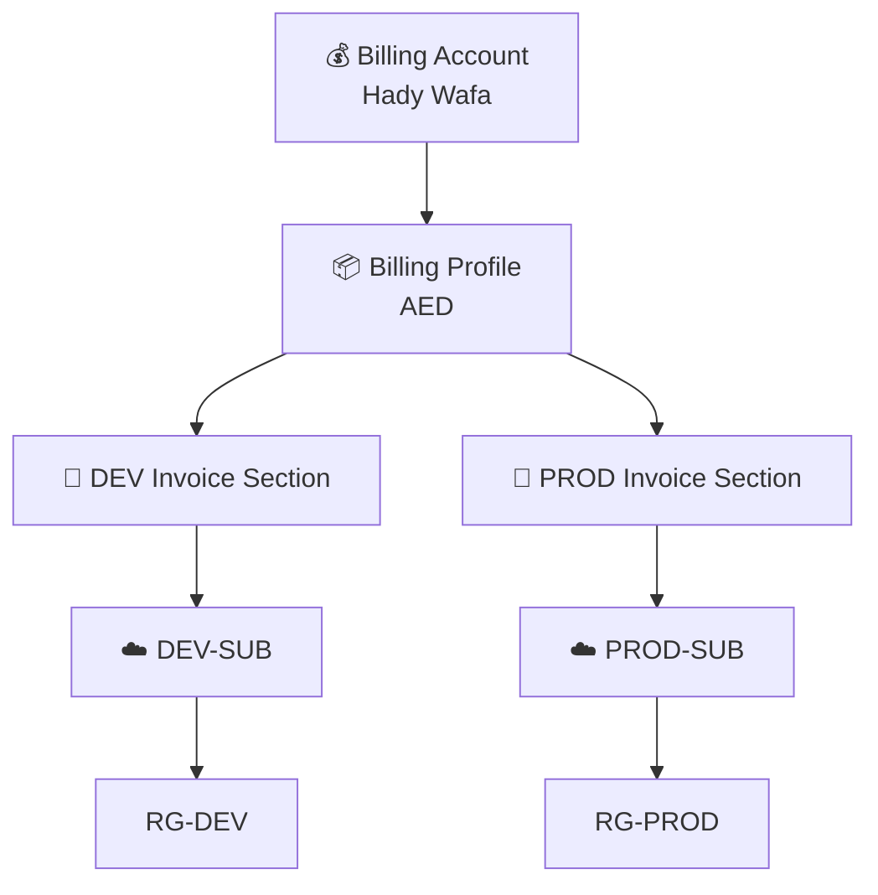
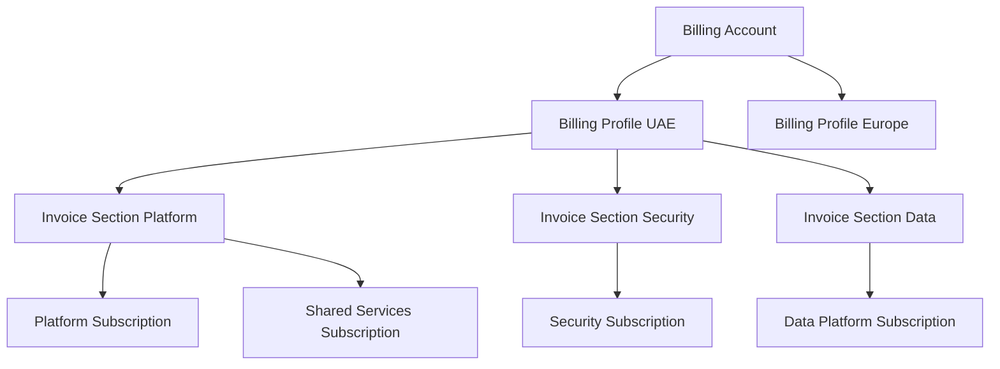

# 💰 Azure Billing Architecture

![[billing-account-1780254996031.webp|531x346]]

One of the most confusing topics in Azure is that Microsoft has **three completely different hierarchies** that people accidentally mix together:







Most Azure admins understand the Resource Hierarchy.
Most Entra admins understand the Identity Hierarchy.
Very few people understand the Billing Hierarchy.

---

## 🕰️ History of Azure Billing

### Era 1 — Azure Account (Old Model)

Back in the early Azure days:

```text
Azure Account
    │
    └── Subscription
```

Example:

```text
hady@outlook.com
     │
     └── Azure Subscription
```

- Very simple.
- Very limited.
- Not suitable for enterprises.

---

### Era 2 — Enterprise Agreement (EA)

Large companies started spending millions.

Microsoft introduced:

```text
Enterprise Agreement
```

Structure:

```text
Enrollment
│
├── Department
│
└── Account
      │
      └── Subscription
```

Example:

```text
Microsoft Corp
│
├── Finance
├── Development
├── Security
└── Operations
```

This solved enterprise scale.

---

### Era 3 — Microsoft Customer Agreement (MCA)

This is what YOU are using today.

Microsoft replaced many older billing models with:

```text
Microsoft Customer Agreement
(MCA)
```

This introduced:

```text
Billing Account
│
└── Billing Profile
      │
      └── Invoice Section
            │
            └── Subscription
```

---

## 🏢 Billing Account

### Definition

A Billing Account represents:

```text
The legal customer
```

Microsoft sees this as:

```text
Who is paying?
```

In your case:

```text
Billing Account

Hady Wafa
```

---

### Real Example

Imagine Emirates Group.

```text
Billing Account

Emirates Group
```

Microsoft issues invoices to:

```text
Emirates Group
```

not to individual subscriptions.

---

### What Lives Here?

#### Payment Relationship

```text
Customer Name
Address
Tax Information
```

#### Billing Ownership

```text
Billing Admins
Invoice Admins
```

#### Contract

```text
MCA
EA
Partner Agreement
```

---

## 📦 Billing Profile

### Definition

A Billing Profile is:

```text
A payment bucket
```

It controls:

```text
Invoice Currency
Payment Method
Invoice Frequency
Tax Handling
```

---

### Real Example

Imagine G42.

```text
Billing Account
│
├── UAE Profile
│      AED
│
├── Europe Profile
│      EUR
│
└── US Profile
       USD
```

Each profile:

```text
Different invoices
Different currencies
Different tax rules
```

---

### In Your Tenant

You currently have:

```text
Billing Profile

Hady Wafa
```

which uses:

```text
Visa Card
AED
UAE Tax Rules
```

---

## 📄 Invoice Section

This is where people get confused.

---

### Definition

Invoice Section is:

```text
Cost Separation
```

inside a Billing Profile.

---

### Think Like This

Billing Profile:

```text
One Credit Card
```

Invoice Section:

```text
How costs are split
```

---

### Example

Company:

```text
Presight
```

Billing Profile:

```text
Corporate AED Card
```

Invoice Sections:

```text
AI Platform
Data Engineering
Security
Operations
```

Result:

```text
One payment source
Multiple cost centers
```

---

## Example Invoice Structure



---

## ☁️ Subscriptions

This is where Azure resources live.

---

Example:

```text
Subscription

PROD-SUB
```

contains:

```text
AKS
Storage
VMs
Key Vault
App Service
```

---

Subscription is:

```text
Security Boundary
Billing Boundary
Quota Boundary
```

---

## Enterprise Best Practice

Instead of:

```text
One Subscription
```

use:

```text
Management Group
│
├── DEV-SUB
│
├── TEST-SUB
│
└── PROD-SUB
```

---

## Recommended Structure for You



---

## What Should Exist in Your Tenant?

### Billing Layer

```text
Billing Account
│
└── Billing Profile
```

No need for multiple billing profiles.

---

### Invoice Sections

```text
DEV
PROD
```

Optional but nice for learning.

---

### Resource Layer

```text
Management Groups
│
├── Development
│     └── DEV-SUB
│
└── Production
      └── PROD-SUB
```

---

## Real Enterprise Example (G42 / Emirates / Microsoft)



---

## Common Mistakes

### ❌ One Huge Subscription

```text
Everything
in one subscription
```

Result:

```text
No isolation
Hard governance
Hard cost tracking
```

---

### ❌ Confusing Billing Profile with Subscription

Many admins think:

```text
Billing Profile
=
Subscription
```

Wrong.

---

### ❌ Creating Multiple Billing Accounts

For personal learning:

```text
One Billing Account
```

is enough.

---

## 🎯 The Most Important Mental Model

When someone asks:

### Who pays?

Answer:

```text
Billing Account
```

---

### Which card/currency pays?

Answer:

```text
Billing Profile
```

---

### Which department receives the invoice?

Answer:

```text
Invoice Section
```

---

### Where do resources live?

Answer:

```text
Subscription
```

---

### Where do VMs and Storage Accounts live?

Answer:

```text
Resource Group
```

If you remember only one diagram, remember this:

```text
Billing Account
│
└── Billing Profile
      │
      └── Invoice Section
            │
            └── Subscription
                  │
                  └── Resource Group
                        │
                        └── Resources
```

This is the modern Azure MCA billing hierarchy used by most Azure tenants today, including the tenant you just created with Microsoft 365 Business Basic and Azure Pay-As-You-Go.
