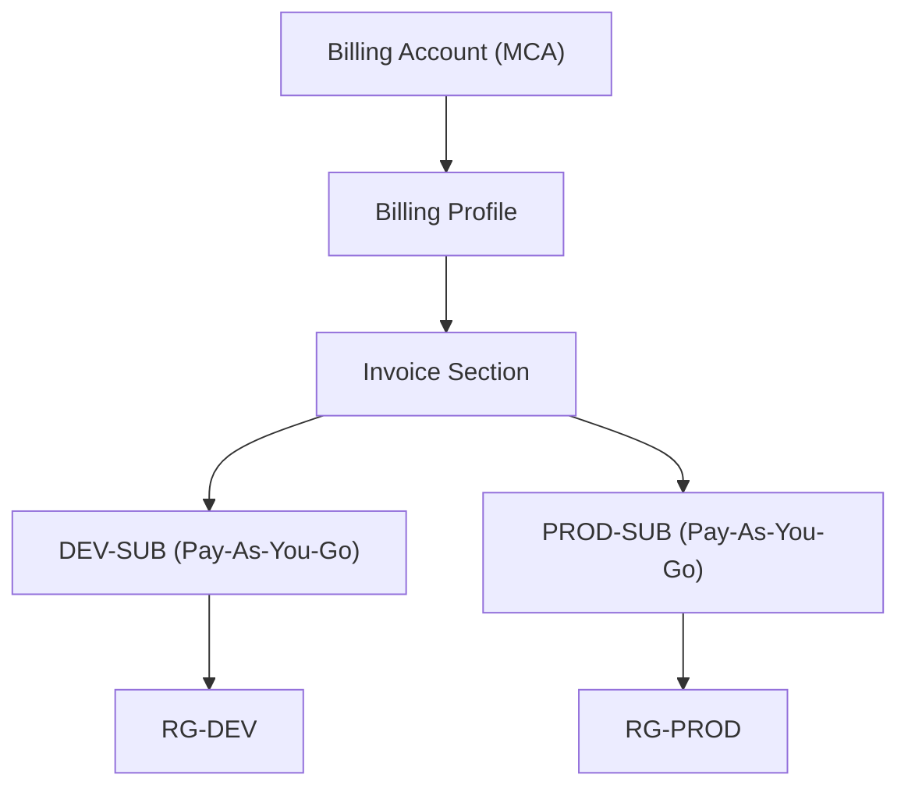

# What happened historically?

## Old Azure (2010–2020-ish)

Most personal Azure users had:

```text
MOSP
(Microsoft Online Subscription Program)
```

Also called:

```text
Pay-As-You-Go
```

Hierarchy:

```text
Billing Account
    │
    └── Subscription
```

Very simple.

Example:

```text
hadywafa@outlook.com
      │
      └── Azure Subscription
```

This is the model most old Azure training videos show.

---

# Then Microsoft introduced MCA

Microsoft wanted one billing platform for:

```text
Azure
Microsoft 365
Dynamics
Power Platform
Copilot
```

instead of every product having a separate billing engine.

So Microsoft started migrating customers to:

```text
Microsoft Customer Agreement
(MCA)
```

---

# What confuses everyone

People think:

```text
MCA
=
Enterprise
```

No.

Today you can have:

```text
Personal user
+
One credit card
+
One subscription
+
MCA
```

---

# Your OLD Outlook Account

You said:

```text
hadywafa@outlook.com
```

shows:

```text
MCA
```

This is normal.

Most likely:

```text
Originally:
MOSP

Later:
Microsoft migrated it
to MCA
```

without you noticing.

---

# Your NEW Tenant

You created:

```text
Microsoft 365 Business Basic
```

which automatically created:

```text
Entra Tenant
+
MCA Billing Account
```

So this tenant was born as MCA from day one.

---

# The Important Distinction

Many people mix these:

## Billing Contract

```text
MOSP
EA
MCA
MPA
```

with:

## Subscription Offer

```text
Pay-As-You-Go
Azure Free Trial
Visual Studio
Azure for Students
MSDN
```

They are different things.

---

# Example

You currently have:

```text
Billing Contract:
MCA
```

But inside it:

```text
Subscription Offer:
Pay-As-You-Go
```

Exactly like your screenshot showed:

```text
Offer:
Pay-As-You-Go
```

while the Billing Account is MCA.

---

# Think of it this way

## Contract Layer

```text
Microsoft Customer Agreement
```

defines:

```text
Billing Account
Billing Profile
Invoice Section
```

---

## Subscription Layer

defines:

```text
Pay-As-You-Go
Free Trial
Visual Studio
Student
Enterprise Subscription
```

---

# Your Two Accounts Compared

## Old Personal Account

```text
hadywafa@outlook.com

Contract:
MCA (probably migrated)

Offer:
Pay-As-You-Go
```

---

## New Professional Account

```text
hady@hadywafa.com

Contract:
MCA

Offer:
Pay-As-You-Go
```

So surprisingly:

```text
Old Account = MCA
New Account = MCA
```

The difference is not the billing contract.

The difference is:

```text
Old:
Personal Microsoft Account

New:
Microsoft 365 Organization
+
Entra Tenant
+
Custom Domain
+
Users
+
Licenses
```

---

# Why Microsoft moved everyone to MCA

Because MCA supports:

```text
Billing Profiles
Invoice Sections
Multiple Subscriptions
Azure
Microsoft 365
Dynamics
Power Platform
```

while MOSP was basically:

```text
Credit Card
+
One Subscription
```

and was too limited.

---

# If I were drawing your environment today



Notice:

```text
MCA
```

is the contract structure,

while:

```text
Pay-As-You-Go
```

is the subscription offer.

These are not mutually exclusive.

That is the piece almost every Azure beginner misses.
