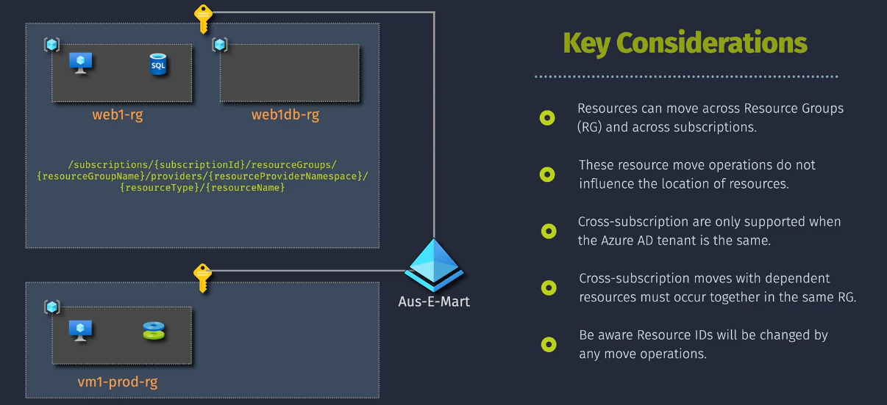

# 🚚 **Moving Azure Resources in Azure**

> 📖 Azure gives you flexibility to **organize, optimize, and govern** your resources. As your cloud grows, sometimes you’ll need to move resources to new **resource groups**, **subscriptions**, or even across **regions**.

<div align="center">

</div>

👉 Moving resources is not just housekeeping — it’s about:

- 💰 **Optimizing costs** → consolidate billing, use reservations.
- 🔐 **Enhancing security** → separate sensitive workloads.
- 📊 **Improving management** → organize by department, project, or lifecycle.
- 🏛 **Compliance** → align resources with data residency or regulations.

---

## ❓ **Why Move Azure Resources?**

There are plenty of real-world triggers:

1. **Resource Group Reorganization** → group related services together for visibility.
2. **Subscription Consolidation** → unify billing or reduce sprawl.
3. **Cost Management** → take advantage of discounts/reservations in another subscription.
4. **Compliance/Governance** → meet regional or regulatory requirements.
5. **Migration to Different Regions** → get closer to users (latency) or enable disaster recovery.
6. **Lifecycle Management** → separate Dev, Test, Prod.

---

## 🛡️ **Prerequisites & Limitations**

### ✅ **Prerequisites**

- **Permissions:** You need `Owner` or `Contributor` roles on both source & target.
- **Resource Support:** Not all resources can move (check [supported list](https://learn.microsoft.com/azure/azure-resource-manager/management/move-support-resources)).
- **Dependencies:** Dependent resources must move together.
- **Region compatibility:** Some resources don’t support cross-region moves.

### ⚠️ **Limitations**

- **Unsupported resources:** e.g., Azure AD objects can’t move.
- **Service-specific constraints:** some resources (App Service, VMSS) have special rules.
- **Resource locks:** `ReadOnly` or `Delete` locks must be removed.
- **Availability zones:** can restrict region moves.
- **Downtime:** some moves cause outages — plan for it.

---

## 🛠️ **Common Use Cases**

| Use Case                 | Example                                          | How to Move              |
| ------------------------ | ------------------------------------------------ | ------------------------ |
| 💰 Cost Optimization     | Consolidate multiple subscriptions for discounts | Portal / PowerShell      |
| 🔐 Security & Compliance | Segregate sensitive data                         | Move to stricter RG      |
| 🏢 Org Restructuring     | Align to departments                             | RG/Subscription reorg    |
| 🌍 Disaster Recovery     | Replicate to another region                      | **Azure Resource Mover** |
| 🚀 Lifecycle Mgmt        | Dev → Prod transition                            | CLI / PowerShell         |

---

## 🧰 **Methods to Move Azure Resources**

Azure offers several methods depending on scope & complexity:

1. 🖥 **Azure Portal** → Best for quick, ad-hoc moves.
2. ⚡ **Azure PowerShell** → Automate with scripts, batch operations.
3. 🐚 **Azure CLI** → Cross-platform, CI/CD friendly.
4. 🌍 **Azure Resource Mover** → Specialized for **region-to-region migration**.
5. 📜 **ARM Templates / Bicep** → Redeploy infra as code (infra cloning approach).

---

## 🧭 **Step-by-Step** Examples

### 1. 🔹 **Move with Azure Portal**

1. Go to **Resource Group** → click **Move**.
2. Choose **to another RG** or **subscription**.
3. Select destination.
4. Review & Validate.
5. Click **Move** → monitor progress under **Notifications**.

---

### 2. 🔹 **Move with PowerShell**

```powershell
# Login
Connect-AzAccount

# List resources
$resources = Get-AzResource -ResourceGroupName "SourceRG"

# Move to another RG
Move-AzResource -DestinationResourceGroupName "TargetRG" -ResourceId $resources.Id

# Or move to another subscription
Move-AzResource -DestinationSubscriptionId "xxxxxxxx-xxxx" -ResourceId $resources.Id
```

---

### 3. 🔹 **Move with Azure CLI**

```bash
az login

# List resource IDs
resources=$(az resource list --resource-group SourceRG --query "[].id" -o tsv)

# Move to another RG
az resource move \
  --destination-group TargetRG \
  --destination-subscription-id $(az account show --query id -o tsv) \
  --ids $resources
```

---

### 4. 🔹 **Move Across Regions** with **Azure Resource Mover**

```bash
# Create Move Collection
az resource-mover collection create \
  --name MyMoveCollection \
  --source-region eastus \
  --destination-region westus \
  --resource-group MyResourceGroup

# Add resource
az resource-mover move-resource create \
  --collection-name MyMoveCollection \
  --resource-group MyResourceGroup \
  --resource-id /subscriptions/{id}/.../MyVM

# Validate
az resource-mover validate --collection-name MyMoveCollection

# Initiate move
az resource-mover initiate-move --collection-name MyMoveCollection

# Complete
az resource-mover complete-move --collection-name MyMoveCollection
```

✨ Handles dependencies & complex moves automatically.

---

### 5. 🔹 **Redeploy with ARM Templates / Bicep**

This isn’t a “move” — it’s a **re-deployment**:

```bicep
param storageAccountName string
param location string = 'westus'

resource storage 'Microsoft.Storage/storageAccounts@2021-04-01' = {
  name: storageAccountName
  location: location
  sku: { name: 'Standard_LRS' }
  kind: 'StorageV2'
}
```

```bash
az deployment group create \
  --resource-group TargetRG \
  --template-file main.bicep \
  --parameters storageAccountName=mystorageacct
```

Great for **cross-region migration** or **infra re-creation**.

---

## 💡 **Best Practices**

- 📝 **Plan thoroughly** (dependencies, downtime).
- 🔒 **Remove locks** before moving.
- 💾 **Back up critical resources** (snapshots).
- 🤖 **Use automation** (CLI/PS for repeatability).
- ✅ **Validate first** → saves from mid-move failures.
- 📣 **Communicate downtime** to stakeholders.
- 🧪 **Test in non-prod** before Prod.
- 🌍 **Use Resource Mover for regions**.

---

## ⚠️ **Common Pitfalls**

- 🚫 Trying to move **unsupported resources** (e.g., Azure AD).
- 🔗 Forgetting dependencies (VM NICs, disks).
- 🔐 Resource locks blocking the move.
- ❌ Insufficient permissions.
- 🌎 Regional constraints / quota limits.
- ⏱ Underestimating downtime.
- 🔄 Not updating references post-move.

---

## 📌 **Summary**

Moving Azure resources is about **flexibility + governance**.

- Use **Portal** for quick moves, **CLI/PowerShell** for automation.
- Use **Resource Mover** for cross-region.
- Use **Bicep/ARM** for redeployment & cloning.
- Plan carefully, validate dependencies, automate, and **test first**.
