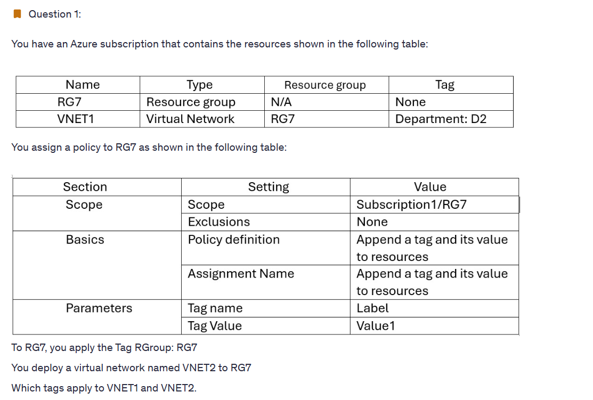

# Notes

## Q1

> 💭 By default, the policy assignment will only apply to newly created resources. Existing resources can be updated through a remediation task after the policy is assigned. However, since no remediation task is mentioned in the question, VNET1 will retain its existing tag "Department: D2." As VNET2 is a newly created resource, it will inherit the tag from the policy, which is "Label: Value1."
