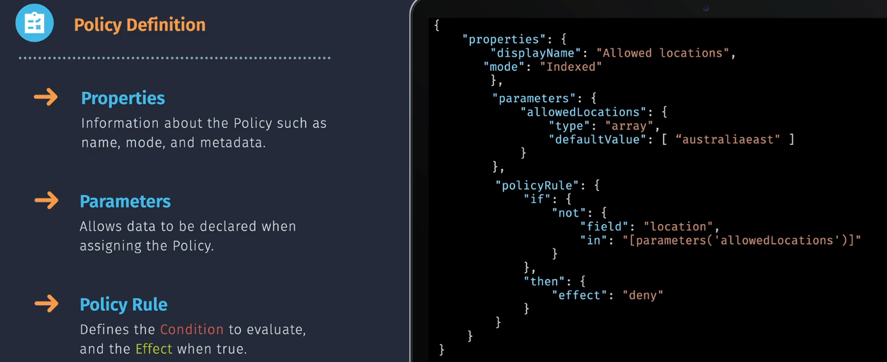

# 🛡️ Azure Policy

**What it is:** Azure’s **governance & compliance engine**.  
**What it does:** Checks resource **config/state** at the **control plane** and can [**block**, **fix**, or **flag**] deployments—at scale.

> **AWS mental map**
>
> - **Azure Policy** ≈ **AWS Config Rules** (detection) **+** parts of **Control Tower guardrails/SCPs** (prevention) **+** automated remediation (like AWS Config → SSM Automation).
> - **Initiatives** ≈ **Conformance Packs**.
> - **Management Groups** ≈ **AWS Organizations OUs**.

---

<div align="center">
  
</div>

---

## 🧩 Core concepts

- **Policy Definition** → _the rule._ JSON `if → then` logic. Reusable with **parameters**.
- **Initiative (Policy Set)** → _bundle of rules_ to meet a standard (e.g., “Prod Baseline”).
- **Assignment** → _where it applies_ (MG/Subscription/RG/Resource) with optional **exclusions**.
- **Exemption** → _formal exception_ (Waiver/Mitigated, can be time-bound, with justification).
- **Remediation Task** → _fix the old stuff_ (runs Modify / DeployIfNotExists against existing resources).
- **Compliance** → dashboard showing compliant / non-compliant / exempt.

---

## 🎯 How rules evaluate (the mechanics)

> Each policy is basically:
>
> 👉 **If** a condition is true (like “resource type is VM”)  
> 👉 **Then** do something (deny, audit, modify, deploy, etc.)

<div align="center">
  
</div>

---

- **Conditions**: are built using **fields** (aka aliases) like:

  - `location`
  - `tags['costCenter']`
  - `Microsoft.Compute/virtualMachines/sku.name`

- **Modes**

  - `Indexed` → common ARM-indexed resources.
  - `All` → broader cases (use when needed).

- **Effects** (what happens):

  - **❌ Deny** — Blocks create/update.
  - **🔍 Audit** — Doesn’t block; flags as non-compliant.
  - **➕ Append** — Adds fields during request processing.
  - **✏️ Modify** — Mutates the incoming request to comply (requires **assignment identity** + RBAC).
  - **🚀 DeployIfNotExists (DINE)** — If a related resource/config is missing, deploy it (requires **assignment identity** + RBAC).
  - **👀 AuditIfNotExists** — Flags when related resource/config is missing.
  - **⏸️ Disabled** — Allows quickly turning a rule off within an initiative.

- **Enforcement mode**

  - `Default` → enforce (deny/modify/deploy).
  - `DoNotEnforce` → evaluate only (great for **safe rollout**).

> **Effect prerequisites**:
>
> - **Modify/DINE** need a **managed identity on the assignment** and **roleDefinitionIds** (permissions) so the policy engine can deploy/patch on your behalf.

---

## 🧠 **Scope, Inheritance, Exclusions**

- Assign at any level: **MG / Subscription / RG / Resource**.
- **Inheritance**: children inherit assignments automatically.
- Add **exclusions** for RGs/resources (e.g., migration sandboxes).
- **Exemptions** (Waiver/Mitigated) explain _why_ something doesn’t follow the rule, and can expire.

---

## 🧑‍⚖️ **Exemptions (aka exceptions)**

Sometimes you can’t follow the rule. That’s where **Exemptions** come in:

- **Waiver** → We accept the risk, don’t enforce here.
- **Mitigated** → The requirement is met another way (like a third-party tool).
- **Time-bound** → With an expiry date and justification.

Exempt resources show up as “Exempt” in compliance reports.

---

## 🔁 Compliance & Fixing Old Stuff

- New resources are checked **at creation/update time**.
- Old resources → need **remediation tasks** to bring them into compliance.
- Compliance states: **Compliant / Non-compliant / Exempt / Not started / Unknown**.

---

## 🛡️ Why Identity & RBAC Matter

For **Modify** or **DINE**:

- The assignment needs a **managed identity**.
- That identity must have **roleDefinitionIds** (permissions) to actually fix or deploy stuff.
  Otherwise → remediation fails.

---

## ✍🏻 Everyday Examples

1. **Tag enforcement**

   - Deny any resource without a `costCenter` tag.

2. **Allowed regions**

   - Only let resources deploy in `EastUS` or `WestEurope`.

3. **Diagnostics**

   - If a Key Vault doesn’t have logs → automatically deploy diagnostic settings.

4. **VM settings**

   - Inside VM, check password length policy with Guest Configuration.

---

## 🧪 Practical Examples

### A - **Require Tag** (deny if missing) — JSON Definition

```json
{
  "properties": {
    "displayName": "Require tag on resources",
    "mode": "Indexed",
    "parameters": {
      "tagName": {
        "type": "String",
        "metadata": { "displayName": "Tag name" }
      }
    },
    "policyRule": {
      "if": {
        "field": "[concat('tags[', parameters('tagName'), ']')]",
        "exists": "false"
      },
      "then": { "effect": "deny" }
    }
  }
}
```

### B - **Auto-apply Diagnostic Settings** to Key Vaults — DINE (snippet)

```json
"policyRule": {
  "if": {
    "field": "type",
    "equals": "Microsoft.KeyVault/vaults"
  },
  "then": {
    "effect": "DeployIfNotExists",
    "details": {
      "type": "Microsoft.Insights/diagnosticSettings",
      "existenceCondition": { "field": "Microsoft.Insights/diagnosticSettings/logs.enabled", "equals": "true" },
      "roleDefinitionIds": [
        "/providers/Microsoft.Authorization/roleDefinitions/abcd-...-monitor-contributor"
      ],
      "deployment": {
        "properties": {
          "mode": "incremental",
          "template": { /* ARM/Bicep template enabling diagnostics */ }
        }
      }
    }
  }
}
```

> Assign with a **managed identity**, grant it **Monitor Contributor** (or equivalent) on the targets.

### C - **Modify** example — Append/normalize a tag

```json
"then": {
  "effect": "modify",
  "details": {
    "operations": [
      { "operation": "addOrReplace", "field": "tags.Environment", "value": "Prod" }
    ],
    "roleDefinitionIds": [
      "/providers/Microsoft.Authorization/roleDefinitions/b24988ac-6180-42a0-ab88-20f7382dd24c" /* Contributor */
    ]
  }
}
```

---

## 🛠️ Assignment & Remediation — CLI & Bicep

### CLI (Az)

```bash
# Create definition
az policy definition create \
  --name require-tag \
  --display-name "Require Tag" \
  --rules ./require-tag.json \
  --mode Indexed \
  --params ./require-tag-params.json \
  --subscription <subId> \
  --category Tags

# Assign with identity + DoNotEnforce first
az policy assignment create \
  --name enforce-tag-rg \
  --policy require-tag \
  --scope /subscriptions/<subId>/resourceGroups/<rgName> \
  --params '{ "tagName": { "value": "costCenter" } }' \
  --enforcement-mode DoNotEnforce \
  --assign-identity

# Flip to enforce later
az policy assignment update --name enforce-tag-rg --enforcement-mode Default

# Start remediation for existing resources
az policy remediation create \
  --name fix-old-resources \
  --policy-assignment enforce-tag-rg \
  --scope /subscriptions/<subId>/resourceGroups/<rgName>
```

### Bicep — Assignment with identity & exclusion

```bicep
param assignmentName string = 'enforce-tag-global'
param policyDefId string
param scope string
param tagName string = 'costCenter'
param excludedRgId string

resource assignment 'Microsoft.Authorization/policyAssignments@2022-06-01' = {
  name: assignmentName
  scope: resourceId('subscriptions', subscription().subscriptionId)
  properties: {
    displayName: 'Enforce Required Tag'
    policyDefinitionId: policyDefId
    enforcementMode: 'Default'
    parameters: {
      tagName: { value: tagName }
    }
    notScopes: [
      excludedRgId
    ]
  }
  identity: {
    type: 'SystemAssigned'
  }
  location: deployment().location // required when identity is used
}
```

---

## 🧭 AWS ↔ Azure Cheat-Sheet

| AWS Thing                    | Azure Equivalent                           | Key Difference                                                                 |
| ---------------------------- | ------------------------------------------ | ------------------------------------------------------------------------------ |
| **AWS Organizations OU**     | **Management Group**                       | Same hierarchy concept for org-wide targeting.                                 |
| **SCPs**                     | **Policy (Deny) / Deny Assignments**       | SCPs filter IAM actions; Azure Policy inspects resource **properties** at ARM. |
| **AWS Config Rule**          | **Policy Definition (Audit/Deny/Modify)**  | Azure adds **Modify/DINE** to auto-fix / deploy.                               |
| **Conformance Pack**         | **Initiative**                             | Pack/Initiative = bundle of rules for a standard.                              |
| **Config Remediation (SSM)** | **Remediation Task (Modify/DINE)**         | Needs **assignment identity + RBAC** in Azure.                                 |
| **Control Tower Guardrails** | **Initiatives at MG + Policy Assignments** | Similar outcomes via Policy at scale.                                          |

---

## ✅ Best Practices (human checklist)

- Start **with Audit/DoNotEnforce** → then flip to Deny once you’re confident.
- Use **Initiatives** instead of 50 separate policies. Easier to manage & report.
- Always **assign with identity** if using Modify/DINE.
- Document **Exemptions** with expiry & reason (auditors love this).
- Regularly check the **Compliance blade** in Azure Portal.
- Use **Management Groups** to push rules at scale.
