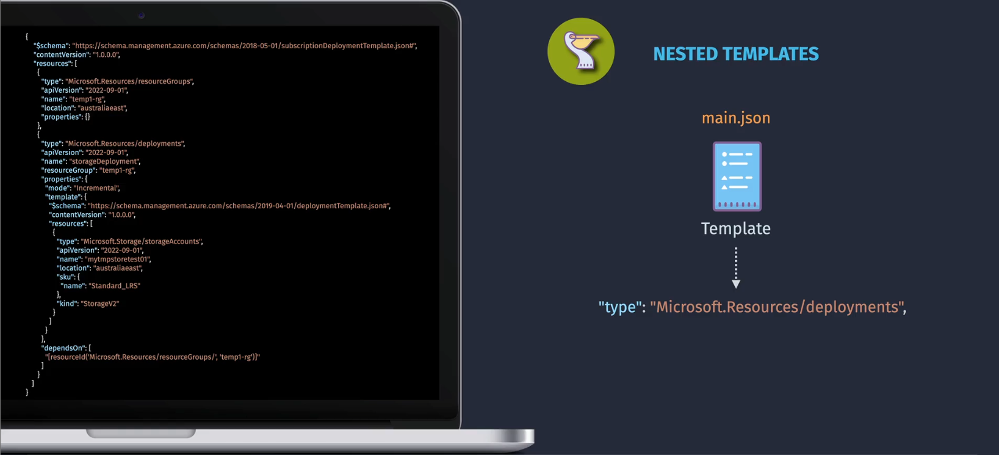
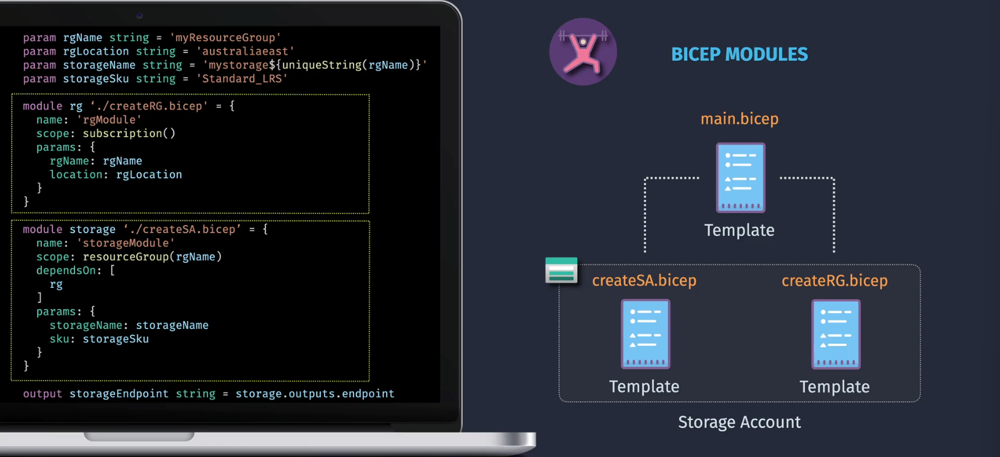

# 🧩 **Modular Templates in ARM**

As environments grow, **single, large ARM templates** become hard to manage.
Azure provides modularization methods to **split deployments into smaller, reusable units**:

---

<div align="center">
  
</div>

---

## 1️⃣ **Nested Templates**

- **Definition**:
  A **nested template** is an ARM template **embedded inside another template** as a resource of type `Microsoft.Resources/deployments`.
  Essentially, you include another JSON template _inside_ your main template.

<div align="center">
  
</div>

---

- **Example**:

  ```json
  {
    "$schema": "https://schema.management.azure.com/schemas/2019-04-01/deploymentTemplate.json#",
    "contentVersion": "1.0.0.0",
    "resources": [
      {
        "type": "Microsoft.Resources/deployments",
        "apiVersion": "2021-04-01",
        "name": "nestedVMDeployment",
        "properties": {
          "mode": "Incremental",
          "template": {
            "$schema": "https://schema.management.azure.com/schemas/2019-04-01/deploymentTemplate.json#",
            "contentVersion": "1.0.0.0",
            "resources": [
              {
                "type": "Microsoft.Compute/virtualMachines",
                "apiVersion": "2021-07-01",
                "name": "myVM",
                "location": "[resourceGroup().location]",
                "properties": {}
              }
            ]
          }
        }
      }
    ]
  }
  ```

- **Pros**:

  - Everything is in **one file** → easier to deploy.
  - Useful for **small reusable blocks**.

- **Cons**:

  - File gets **large and complex** quickly.
  - Harder to reuse across projects.

---

## 2️⃣ **Linked Templates**

- **Definition**:
  A **linked template** is a separate template file **stored remotely** (Azure Storage, GitHub, etc.) and referenced in your main template using a `uri`.

<div align="center">
  
</div>

---

- **Example**:

  ```json
  {
    "type": "Microsoft.Resources/deployments",
    "apiVersion": "2021-04-01",
    "name": "linkedStorageDeployment",
    "properties": {
      "mode": "Incremental",
      "templateLink": {
        "uri": "https://mystorage.blob.core.windows.net/templates/storage.json",
        "contentVersion": "1.0.0.0"
      },
      "parameters": {
        "storageAccountName": {
          "value": "myuniquestorageacct"
        }
      }
    }
  }
  ```

- **Pros**:

  - Promotes **true modularization** → templates can be reused across projects.
  - Keeps main template small & readable.
  - Enables **team collaboration** (different teams own different linked templates).

- **Cons**:

  - Requires templates to be stored in **accessible location** (Storage account, Git repo, etc.).
  - Adds dependency on **network access**.

---

## 3️⃣ **Bicep Modules**

- **Definition**:
  In **Bicep**, modularization is done with **modules**.
  Instead of JSON nesting/linking, you create a `.bicep` file and reference it as a module inside another `.bicep`.

<div align="center">
  
</div>

---

- **Example** (main.bicep):

  ```bicep
  module storageModule './storage.bicep' = {
    name: 'deployStorage'
    params: {
      storageAccountName: 'myuniquestorageacct'
      location: resourceGroup().location
    }
  }
  ```

- **storage.bicep**:

  ```bicep
  param storageAccountName string
  param location string

  resource storageAccount 'Microsoft.Storage/storageAccounts@2021-04-01' = {
    name: storageAccountName
    location: location
    sku: {
      name: 'Standard_LRS'
    }
    kind: 'StorageV2'
  }
  ```

- **Pros**:

  - Cleaner & **easier to read** than ARM JSON.
  - Strong **type checking & IntelliSense** in VS Code.
  - Supports **module reusability** (share `.bicep` files).
  - No need for `templateLink` → Bicep compiler bundles everything into JSON when deploying.

- **Cons**:

  - Requires using Bicep tooling (but recommended by Microsoft).

---

## 🔑 **Key Differences**

| Feature               | Nested Template         | Linked Template                        | Bicep Module            |
| --------------------- | ----------------------- | -------------------------------------- | ----------------------- |
| Storage               | Inside main template    | External file (via URI)                | External `.bicep` file  |
| Reusability           | Low                     | High                                   | Very High               |
| Complexity Management | Medium (but grows fast) | Better separation                      | Excellent               |
| Deployment Dependency | None                    | Needs remote file access               | None (compiled locally) |
| Best Use Case         | Small, local reuse      | Multi-team / enterprise-scale projects | Modern IaC workflows    |

---

## ✅ **Best Practices**

- For **modern deployments** → **Use Bicep Modules** (preferred).
- Use **Linked Templates** if still on ARM JSON and want reusability across projects.
- Use **Nested Templates** only for **small logical grouping** inside one template.
