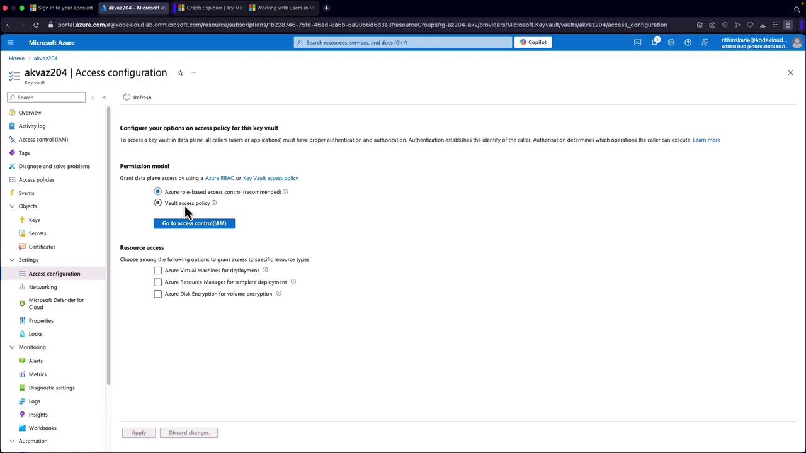
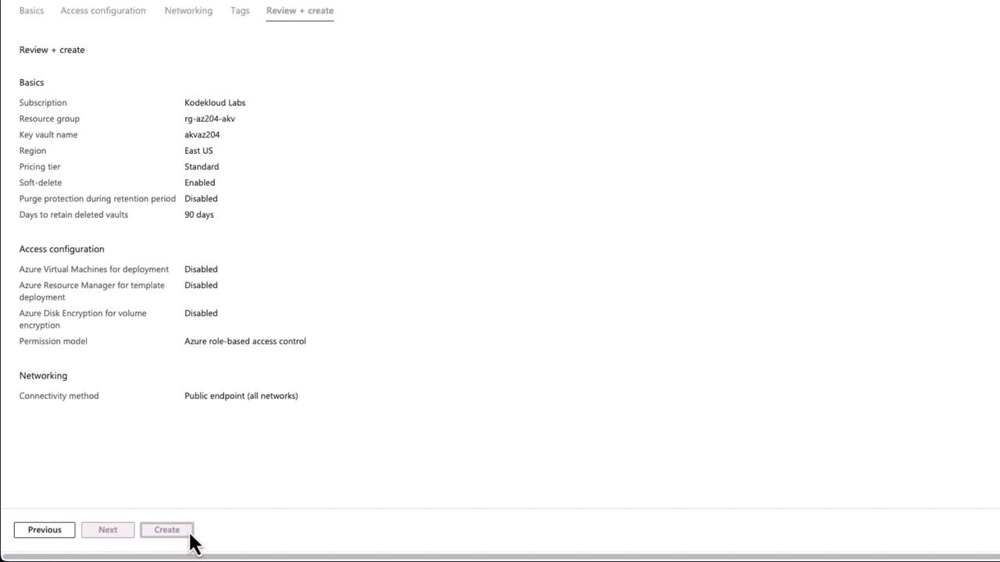

# 🔐 **Azure Key Vault (AKV)**

Azure Key Vault is a **cloud-based service** that helps you **securely store and manage sensitive information**, such as **keys, secrets, and certificates**. It’s a central place for managing cryptographic keys and secrets that applications and services use, without hardcoding them.

---

<div align="center">

</div>

---

> 💡 Think of Key Vault as **Azure’s equivalent of AWS KMS + Secrets Manager + Certificate Manager combined into one service**.  
> It gives you a **secure, centralized, audited** place to manage secrets, encryption keys, and TLS certificates.

---

## 🌟 Why Microsoft Created Key Vault

Before Key Vault, apps used to store secrets in:

- `appsettings.json` (bad ❌)
- Environment variables (better, but still scattered)
- Databases with weak protection

Problem: **secrets sprawled everywhere → security risk, auditing nightmare**.

Solution:

- **Centralized Management** → Manage all your secrets, keys, and certificates in one place.
- Secure with **HSMs (Hardware Security Modules)** in Premium tier.
- Enforce **fine-grained RBAC**.
- Integrate natively with **Azure SDKs, Functions, AKS, App Service, etc.**
- **Automatic Rotation** → Certificates and secrets can be rotated automatically.
- **Logging & Compliance** → Integration with **Azure Monitor**, **Event Hub**, **Sentinel** for audit.

---

## 🎭 **Types of Azure Key Vault Pricing Tier**

Choose between:

1. **Standard**: Software-based security
2. **Premium**: Hardware-based security modules, ideal for stringent compliance requirements

---

## 🧩 **Types of Azure Key Vault Data**

<div align="center"  >

</div>

---

### 1️⃣ **Secrets**

- Secure storage of sensitive data:

  - Connection strings
  - Passwords
  - API keys

- Example: Store a SQL DB password instead of writing it in app config.

  ```bash
  # Store a secret
  az keyvault secret set --vault-name MyKeyVault --name "DBPassword" --value "P@ssw0rd123"

  # Retrieve secret
  az keyvault secret show --vault-name MyKeyVault --name "DBPassword"
  ```

### 2️⃣ **Keys**

- Cryptographic keys for **encryption, decryption, signing, and key exchange**.
- Supports software-protected or **HSM-protected** keys.
- Use cases:

  - Data encryption at rest
  - Signing JWT tokens
  - TLS/SSL offloading

- Example:

  ```bash
  # Create RSA key
  az keyvault key create --vault-name MyKeyVault --name "encryptionKey" --protection software --kty RSA
  ```

### 3️⃣ **Certificates**

- Manage **X.509 certificates** for TLS/SSL.
- Automatic integration with **Certificate Authorities (CA)**.
- Auto-renewal supported.
- Example:

  ```bash
  # Import certificate
  az keyvault certificate import --vault-name MyKeyVault --name "mycert" --file cert.pfx
  ```

---

## 🧑‍💻 **Types of Access Control (RBAC vs Vault Access Policies)**

<div align="center"  >

</div>

---

- **Vault Access Policies**: older checkbox model → assign read/write/delete at vault level
- **Azure RBAC**: unified, fine-grained roles like:

  - `Key Vault Reader` → list metadata
  - `Key Vault Secrets User` → read secrets only
  - `Key Vault Crypto Officer` → encrypt/decrypt but not read key

<div align="center"  >

</div>

---

💡 **Use RBAC** for modern deployments (consistent across Azure).

---

## ⚙️ **How Key Vault Works Internally**

- **Management Plane (control who can manage vault)**

  - At the subscription/resource level
  - Managed via ARM RBAC (`Owner`, `Contributor`, etc.)

- **Data Plane (control who can read/write secrets)**

  - Enforced by **Key Vault RBAC** (e.g., `Key Vault Secrets User`)
  - Requests flow through HTTPS endpoint:

    ```ini
    # Standard key vault
    https://<vault-name>.vault.azure.net/secrets/<secret-name>/<version>
    # Premium key vault
    https://<vault-name>.managedhsml.azure.net/secrets/<secret-name>/<version>
    ```

- **Soft Delete + Purge Protection**

  - Even if someone deletes a secret, you can recover it
  - Purge protection ensures _irrevocable deletion requires explicit action_

---

## 🚀 **Creating a Key Vault (Portal)**

1. Search → **Key Vault** → _Create_
2. Configure:

   - Resource Group: `RG-Security`
   - Name: `akv-demo-204` (globally unique)
   - Pricing: **Standard** (software) or **Premium** (HSM)
   - Access Configuration:

     - **Vault Access Policy** (legacy) or
     - **Azure RBAC** (recommended ✅)

3. Enable **soft delete + purge protection**
4. Review → _Create_

- Once deployed, vault endpoint looks like:

  - for standard vault

    ```ini
    https://akv-demo-204.vault.azure.net/
    ```

  - for premium vault

    ```ini
    https://akv-demo-204.managedhsm.azure.net/
    ```

---

<div align="center">
  
</div>

---

## 💻 **Using Key Vault in .NET**

### Install packages:

```bash
dotnet add package Azure.Identity
dotnet add package Azure.Security.KeyVault.Secrets
```

### Example: Store & Retrieve a Secret

```csharp
using Azure.Identity;
using Azure.Security.KeyVault.Secrets;

var kvUri = "https://akv-demo-204.vault.azure.net/";
var client = new SecretClient(new Uri(kvUri), new DefaultAzureCredential());

// Store secret
client.SetSecret(new KeyVaultSecret("SQLConnectionString",
    "Server=dbserver;Database=appdb;User Id=appuser;Password=P@ssw0rd"));

// Get secret
KeyVaultSecret secret = client.GetSecret("SQLConnectionString");
Console.WriteLine($"Fetched Secret: {secret.Value}");
```

👉 Notes:

- `DefaultAzureCredential` automatically tries: Managed Identity, VS Code creds, CLI login.
- Never hardcode secrets — app just needs RBAC role like **Key Vault Secrets User**.

---

## 🔗 **Integration Scenarios**

1. **Applications**

   - Apps fetch secrets (e.g., DB connection strings) dynamically instead of storing them in configs.
   - Use **Managed Identity** → no need to handle credentials.

   Example (C# app snippet):

   ```csharp
   var client = new SecretClient(new Uri("https://mykeyvault.vault.azure.net/"), new DefaultAzureCredential());
   KeyVaultSecret secret = client.GetSecret("DBPassword");
   string dbPassword = secret.Value;
   ```

2. **Azure Services**

   - Integrates with:

     - **Azure SQL** → TDE keys in Key Vault.
     - **Azure Functions** → fetch secrets at runtime.
     - **VMs/VMSS** → disks encrypted using Key Vault keys.

3. **DevOps**

   - Pipelines fetch secrets at build/deploy time.
   - Example: GitHub Actions or Azure DevOps pipeline uses Key Vault secrets.

---

## 📊 **Backup & Recovery**

- Export and backup (keys, secrets, and certificates).

  ```bash
  # Backup a key
  az keyvault key backup --vault-name MyKeyVault --name encryptionKey --file encryptionKey.backup

  # Restore a key
  az keyvault key restore --vault-name MyKeyVault --file encryptionKey.backup
  ```

- Recovery features:

  - **Soft Delete** → Items recoverable even after deletion (default 90 days).
  - **Purge Protection** → Prevents permanent deletion.

---

## 🛡️ **Security & Best Practices**

- Use **Private Endpoints** → block public access.
- Always use **RBAC**, avoid legacy Access Policies.
- Enable **soft-delete + purge protection** → prevent accidental deletion.
- Rotate secrets & certificates automatically.
- Monitor access using **Azure Monitor / Sentinel**.
- Restrict export of HSM keys unless required.

---

## 📋 Best Practices

- ✅ **Use RBAC, not Access Policies** for consistency
- ✅ **Enable soft delete + purge protection** (default now)
- ✅ **Rotate secrets automatically** (Key Vault supports auto rotation)
- ✅ **Use Managed Identity** for apps → no embedded credentials
- ✅ **Never expose account keys** → always fetch secrets at runtime
- ✅ **Log access** with Azure Monitor + diagnostic settings
- ✅ **Use Premium tier** if compliance requires HSM
