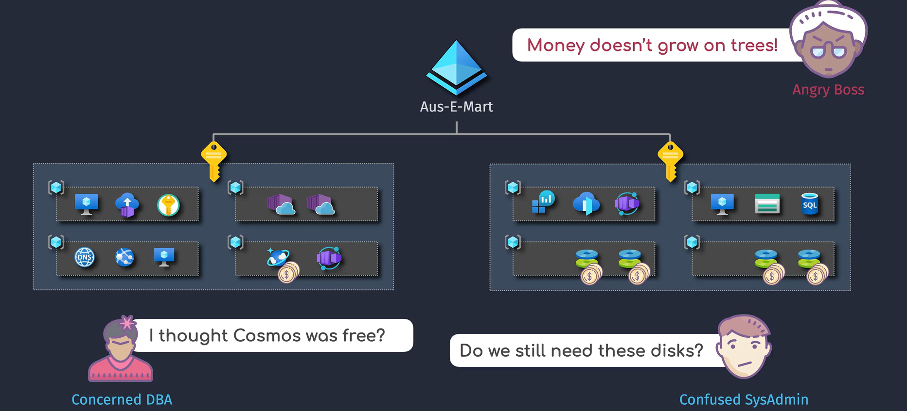
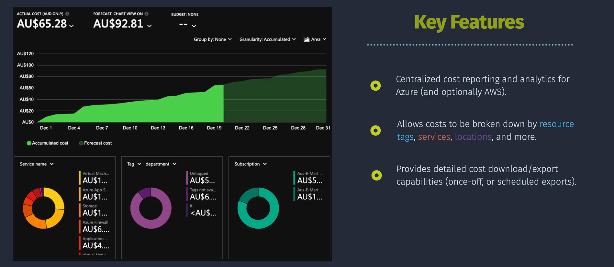
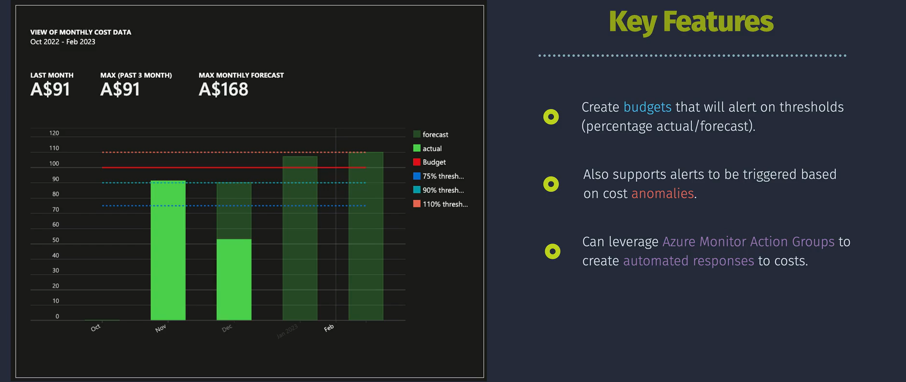
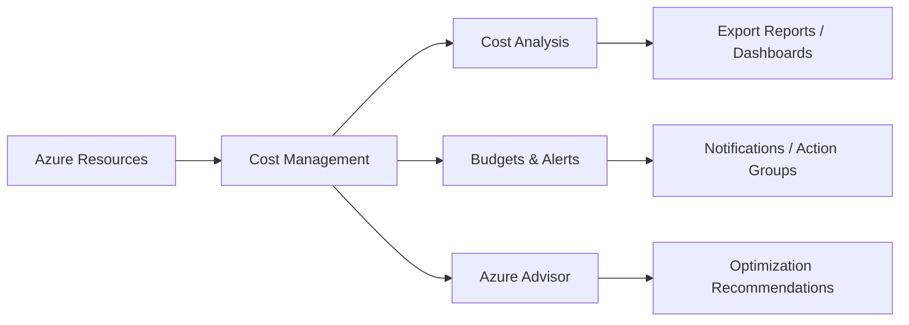

# 💰 Azure Cost Management in Azure

> 💡 _Managing costs in the cloud is like running a family budget 🏠💳 — you need to know where the money goes, avoid waste, and make smart investments._
>
> 📖 **Azure Cost Management** is the toolset Microsoft gives you to **track, control, and optimize** your cloud spend.

It’s part of the **Azure Monitor ecosystem** and integrates with billing to give you **visibility + governance + optimization** in one place.

---

## 📊 **1. Cost Analysis** — _Where’s my money going?_

> _**Cost Analysis** is your **visual spending dashboard**._  
> It lets you break down costs by time, service, department, or even individual resource.

---

### ✨ Features

- **Detailed Reporting** → Costs by subscription, service, resource group, or tag.
- **Custom Views** → Filter/group costs (e.g., by `Department` or `Project`).
- **Time Ranges** → View daily, monthly, or yearly spend.
- **Exporting** → Download reports in CSV/Excel for finance teams.

### 💡 Real Example

You run **10 VMs**:

- VM1–VM5 (Production) → \$1,200/month
- VM6–VM10 (Dev/Test) → \$700/month

👉 Cost Analysis shows **Dev/Test VMs idle after 6 PM**.  
Solution: Configure **auto-shutdown**, saving \~\$350/month.

### 🛠️ How to Use

1. Portal → **Cost Management + Billing → Cost Management → Cost Analysis**
2. Select scope (**subscription/resource group**).
3. Filter/group (e.g., by service name, tags).
4. Export if needed.

---

## 🚨 **2. Budgets & Alerts** — _Don’t overspend by accident_

> _Budgets and alerts are your **safety rails**._  
> They don’t stop usage but **warn you** before your bill goes out of control.

  

---

### ✨ Features

- **Budgets** → Define spending caps (monthly/quarterly/annual).
- **Alerts** → Trigger at % thresholds (e.g., 50%, 75%, 90%).
- **Action Groups** → Notify via email, SMS, Teams, or automation.

### 💡 Real Example

Budget = **\$5,000/month**

- Alert 50% = \$2,500 → Mid-month check
- Alert 75% = \$3,750 → Optimize resources
- Alert 90% = \$4,500 → Pause non-critical workloads

This avoids nasty end-of-month billing surprises.

### 🛠️ How to Set Up

1. Portal → **Cost Management → Budgets → Add**
2. Define **Scope**, **Amount**, and **Time Period**
3. Configure thresholds + Action Group
4. Review → Create

---

## 🤖 **3. Azure Advisor Recommendations** — _AI-powered cost saving_

> _Azure Advisor is like a **personal consultant**. It analyzes your usage and says:_  
> “Hey, you’re wasting money here. Want to save some?”

  

---

### ✨ Features

- **Cost Optimization** → Identify idle/underutilized resources.
- **Performance** → Suggest resizing/upgrades.
- **Security** → Harden weak configurations.
- **Reliability** → Improve resilience.

### 💡 Real Example

Advisor finds:

- VM `Prod-DB01` running at 8% CPU, costing \$400/month.  
  👉 Recommends resizing → saves \$250/month.

### 🛠️ How to Use

1. Portal → **Azure Advisor**
2. Review recommendations by category (Cost | Security | Performance | Reliability).
3. Implement changes → track **Impact**.

---

## ⚠️ Key Considerations

- **Granularity** → Reports vary at subscription vs resource group.
- **Retention** → Cost data stored for limited historical periods.
- **Tagging is Critical** → Use tags (`Dept=Finance`, `Env=Prod`) for cost attribution.
- **Reserved Instances & Savings Plans** → Up to 70% cheaper for predictable workloads.
- **Auto-scaling** → Avoid paying for idle resources.
- **Deletion Impact** → Don’t forget to clean up unused disks, NICs, and IPs — they still cost money.

---

## 🏆 **Best Practices**

1. **Tag Everything**

   - Enables reporting per team/project.

2. **Review Costs Regularly**

   - Weekly/monthly reports catch anomalies early.

3. **Set Budgets + Alerts**

   - Proactive financial control.

4. **Leverage Advisor**

   - Free cost optimization insights.

5. **Use Reserved Instances / Savings Plans**

   - Commit for long-term workloads → big discounts.

6. **Enable Auto-Scaling**

   - Scale up when needed, scale down when not.

7. **Optimize Storage**

   - Cold data → Archive tier, save massively.

8. **Remove Unused Resources**

   - Dev/test leftovers often eat budgets.

9. **Educate Teams**

   - Build a **cost-aware culture**.

10. **Automate Governance**

- Use **Azure Policies** + **Automation** to enforce cost rules.

---

## 📊 Visual Flow

---

## ⚖️ **Cost Management** 🆚 **Pricing Calculator** 🆚 **Advisor**

| Feature / Tool   | **Azure Cost Management**                                | **Azure Pricing Calculator**                                   | **Azure Advisor**                                                         |
| ---------------- | -------------------------------------------------------- | -------------------------------------------------------------- | ------------------------------------------------------------------------- |
| **Purpose**      | Ongoing **tracking & analysis** of real spend            | **Estimate costs** before deploying resources                  | **Recommendations** to optimize costs, performance, security, reliability |
| **When to Use**  | After resources are deployed (real billing data)         | Before deploying → for planning & forecasting                  | After deployment → for continuous optimization                            |
| **Data Source**  | Actual usage & billing data (post-consumption)           | Static service pricing models                                  | Telemetry + usage patterns of deployed resources                          |
| **Output**       | Charts, filters, cost breakdown, budgets, alerts         | Pricing estimates & scenarios                                  | Actionable recommendations (e.g., downsize, shutdown, reserve capacity)   |
| **Scope**        | Subscription, resource group, tags, individual resources | Any Azure service (you manually configure size, region, hours) | Resource-specific (VMs, databases, storage, etc.)                         |
| **Granularity**  | Real detailed costs (daily, monthly, yearly)             | High-level planning (based on assumptions)                     | Per-resource guidance (CPU %, idle disks, underutilized VMs)              |
| **Integrations** | Log Analytics, Action Groups, Automation                 | Export as Excel for planning/budgeting                         | Integrated in portal, links to implement changes                          |
| **Best For**     | Finance teams & cloud admins monitoring live spend       | Architects & planners forecasting project costs                | Engineers & DevOps teams optimizing workloads                             |
| **Limitations**  | Doesn’t forecast future costs                            | Doesn’t show actual usage — only estimates                     | Recommendations are limited to patterns Azure detects                     |

---

## 🧠 Easy Way to Remember

- **Pricing Calculator** → _Plan before you spend._
- **Cost Management** → _Track while you spend._
- **Advisor** → _Save after you spend._

---

## 💡 Example Walkthrough

- A company is **planning** to migrate 20 on-prem VMs to Azure.

  - Use **Pricing Calculator** to estimate monthly cost.

- After migration, the finance team wants to see actual usage.

  - Use **Cost Management → Cost Analysis** to track real spend.

- Then the DevOps team notices one VM always runs at 5% CPU.

  - Use **Advisor** to downsize the VM → cost savings.

---

## 📝 Summary

Azure Cost Management = **Visibility + Control + Optimization**.

- **Cost Analysis** → Find where money goes.
- **Budgets & Alerts** → Stay inside financial boundaries.
- **Azure Advisor** → Actively reduce waste.
- **Best Practices** → Tags, automation, reserved instances, and storage optimization.
