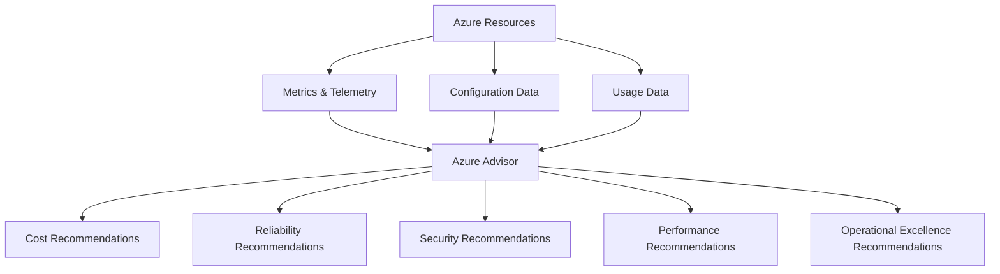

# 🎯 Azure Advisor

> 💡 _Azure Advisor is Microsoft's built-in cloud architect._
>
> It continuously analyzes your Azure environment and provides personalized recommendations to:
>
> - Reduce Cost 💰
> - Improve Reliability 🛡️
> - Increase Security 🔒
> - Boost Performance 🚀
> - Improve Operational Excellence ⚙️

Think of it as:

```text
Azure Resources
       │
       ▼
Azure Advisor
       │
       ▼
Architect Recommendations
```

Instead of manually reviewing hundreds of resources, Advisor does the analysis for you.

---

## 🏗️ How Azure Advisor Works

Azure Advisor continuously collects information from:

- Azure Monitor
- Azure Resource Manager
- Microsoft Defender for Cloud
- Usage Telemetry
- Performance Metrics
- Billing Data

Then it evaluates your environment against Microsoft's best practices.



---

## 🎯 Advisor Categories

AZ-305 expects you to know all 5.

| Category                  | Purpose                      |
| ------------------------- | ---------------------------- |
| 💰 Cost                   | Reduce Azure spending        |
| 🚀 Performance            | Improve speed and efficiency |
| 🛡️ Reliability            | Improve availability         |
| 🔒 Security               | Reduce security risks        |
| ⚙️ Operational Excellence | Improve operations           |

---

## 💰 Cost Optimization

Most common exam area.

Advisor analyzes:

- Idle VMs
- Underutilized VMs
- Unused Public IPs
- Idle ExpressRoute circuits
- Old snapshots
- Reserved Instance opportunities

---

### Example

Current VM:

```text
D8s_v5
8 vCPU
32 GB RAM

CPU Usage = 5%
```

Advisor says:

```text
Resize to D2s_v5
```

Result:

```text
70% cost reduction
```

---

### Exam Scenario

> Company runs 100 VMs.
>
> CPU utilization averages 4%.
>
> Company wants to reduce costs.

Correct answer:

✅ Review Azure Advisor Cost Recommendations

---

## 🚀 Performance

Performance recommendations focus on resource efficiency.

Examples:

- VM sizing
- SQL Database performance
- Cosmos DB throughput
- Storage performance

---

### Example

Database receives:

```text
50,000 requests/sec
```

Current SKU:

```text
Standard Tier
```

Advisor recommends:

```text
Premium Tier
```

because throttling occurs.

---

### Typical Recommendation

```text
Upgrade SKU
Increase DTUs
Increase IOPS
Move to Premium Storage
```

---

## 🛡️ Reliability

One of the most important AZ-305 sections.

Advisor checks:

- Availability Zones
- Backup configuration
- Fault tolerance
- Multi-region deployment

---

### Example

Current Architecture

```text
VM
│
└── Single Region
```

Advisor recommendation:

```text
Deploy VM in Availability Zone
```

or

```text
Enable Azure Backup
```

---

### Exam Scenario

> Mission-critical application has no backup.

Advisor recommends:

✅ Configure Azure Backup

---

## 🔒 Security

Security recommendations are largely integrated with:

Microsoft Defender for Cloud

Advisor surfaces those recommendations.

---

### Example Findings

```text
Storage Account
Public Access Enabled
```

Recommendation:

```text
Disable Public Access
```

---

Other common findings:

- Missing MFA
- Open ports
- Missing encryption
- Missing Defender plans

---

### Exam Tip

If you see:

```text
Security recommendation
```

Think:

```text
Defender for Cloud
        +
Azure Advisor
```

---

## ⚙️ Operational Excellence

Newest category.

Many candidates ignore it.

---

Advisor looks for:

- Resource consistency
- Governance
- Monitoring
- Automation opportunities

---

### Example

Advisor detects:

```text
Critical VM
No monitoring configured
```

Recommendation:

```text
Enable Azure Monitor
```

---

Another example:

```text
Resources missing tags
```

Recommendation:

```text
Apply governance standards
```

---

## 🎯 Advisor Score

Advisor calculates an overall score.

Example:

```text
Cost: 85%
Reliability: 92%
Security: 70%
Performance: 90%
Operations: 75%
```

Overall:

```text
Azure Advisor Score = 82%
```

Higher score = closer to Microsoft's best practices.

---

## ⚡ Quick Actions

One thing architects love:

Advisor recommendations often have:

```text
Fix Now
```

buttons.

Example:

```text
Enable Backup
```

Advisor can directly launch:

```text
Recovery Services Vault wizard
```

---

## 🔥 Azure Advisor vs Microsoft Defender for Cloud

This appears frequently in AZ-305.

| Feature            | Azure Advisor | Defender for Cloud |
| ------------------ | ------------- | ------------------ |
| Cost Optimization  | ✅            | ❌                 |
| Performance        | ✅            | ❌                 |
| Reliability        | ✅            | ❌                 |
| Security           | ✅            | ✅                 |
| Threat Detection   | ❌            | ✅                 |
| Security Score     | ❌            | ✅                 |
| Compliance Reports | ❌            | ✅                 |

---

## 🔥 Azure Advisor vs Azure Monitor

| Service              | Purpose                      |
| -------------------- | ---------------------------- |
| Azure Monitor        | Collect telemetry            |
| Log Analytics        | Store and query logs         |
| Application Insights | Application monitoring       |
| Azure Advisor        | Architecture recommendations |

Think:

```text
Azure Monitor
      │
      ▼
Collect Data

Azure Advisor
      │
      ▼
Tell Me What To Improve
```

---

## 🏆 AZ-305 Exam Focus

Microsoft commonly asks:

### Which service should you use to:

| Requirement                   | Service            |
| ----------------------------- | ------------------ |
| Reduce Azure costs            | Azure Advisor      |
| Identify idle VMs             | Azure Advisor      |
| Improve reliability           | Azure Advisor      |
| Find security recommendations | Azure Advisor      |
| View metrics                  | Azure Monitor      |
| Investigate logs              | Log Analytics      |
| Detect attacks                | Defender for Cloud |

---

## 🧠 Easy Way To Remember

```text
Azure Monitor
      ↓
Collect

Log Analytics
      ↓
Store

Application Insights
      ↓
Analyze Apps

Defender for Cloud
      ↓
Secure

Azure Advisor
      ↓
Recommend
```

### One-line exam memory trick

> **Azure Advisor does not monitor, secure, backup, or scale resources itself.**
>
> It analyzes your environment and recommends what an Azure architect would do. 🚀

This service appears in almost every AZ-305 domain because it touches Cost, Reliability, Security, Performance, and Operational Excellence simultaneously.
