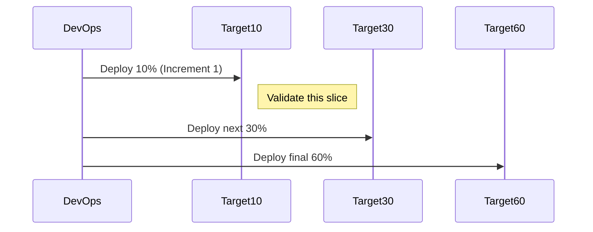

# 🐤 Azure DevOps Deployment Strategy: `canary`

The **Canary Strategy** is designed for **progressive exposure** — releasing your application to a **small subset of users or targets first**, and then expanding gradually once the deployment is verified.

It’s great for **low-risk production deployments**.

---

## 📘 Official Definition

> The `canary` strategy rolls out the deployment in **phases (increments)** to different target groups or traffic slices. If initial phases succeed, the rollout continues; if failure is detected early, rollback can be triggered without impacting the majority of users.

---

## 💡 Why “Canary”?

It’s named after **"canary in a coal mine"** — a small test subject (canary) is exposed to danger first. If it's okay, others follow.

---

## 🧠 Core YAML Structure

```yaml
jobs:
  - deployment: CanaryWebDeploy
    environment: "prod-env"
    strategy:
      canary:
        increments: [10, 30, 60] # Percentages of traffic or targets
        preDeploy:
          steps:
            - script: echo "🔍 Pre-deploy check"
        deploy:
          steps:
            - script: echo "🚀 Deploying to $(deployment.targetName)"
        postDeploy:
          steps:
            - script: echo "✅ Validated $(deployment.targetName)"
        on:
          failure:
            steps:
              - script: echo "🧯 Rolling back $(deployment.targetName)"
```

---

## 🧩 Diagram – Canary Strategy



---

## 📦 Breakdown of `canary` Properties

| Property     | Description                                             |
| ------------ | ------------------------------------------------------- |
| `increments` | Array of percentages (e.g., `[5, 25, 70]`) — each phase |
| `preDeploy`  | Runs before each increment                              |
| `deploy`     | Core deployment steps                                   |
| `postDeploy` | Validates each phase                                    |
| `on.failure` | Optional rollback logic per phase                       |

---

## 🧪 Real-World Canary Deployment Example

Let’s say you have 100 production App Service instances behind a load balancer, and want to deploy to:

- 10% of them first
- Then 30%
- Then the remaining 60%

```yaml
jobs:
  - deployment: CanaryDeploy
    displayName: "🐤 Canary Deployment to App Services"
    environment:
      name: prod-env
      resourceType: VirtualMachine
    strategy:
      canary:
        increments: [10, 30, 60]
        preDeploy:
          steps:
            - script: echo "🔎 Pre-check before increment"
        deploy:
          steps:
            - task: AzureCLI@2
              displayName: "Deploy to $(deployment.targetName)"
              inputs:
                azureSubscription: "MyAzureSub"
                scriptType: bash
                scriptLocation: inlineScript
                inlineScript: |
                  az webapp deployment source config-zip \
                    --name myapp \
                    --resource-group myrg \
                    --src $(Pipeline.Workspace)/myapp.zip
        postDeploy:
          steps:
            - script: echo "🧪 Testing increment $(deployment.targetName)"
        on:
          failure:
            steps:
              - script: echo "❌ Rollback triggered on $(deployment.targetName)"
```

---

## 🔧 Where Does `targetName` Come From?

Like `rolling`, you need **multiple deployment targets** defined in the environment (e.g., VMs, slots, or App Service deployments using traffic routing).

---

## 🧪 Canary with Traffic Routing (App Service Slots)

If you're using **App Service slots**, you can use `az webapp traffic-routing` to implement real canary logic:

```bash
az webapp traffic-routing set \
  --name myapp \
  --resource-group myrg \
  --distribution staging=10 production=90
```

As increments progress, shift more traffic to `staging`.

---

## ✅ Use Cases

| Use Case                             | Why Canary Works                       |
| ------------------------------------ | -------------------------------------- |
| Production rollout w/ traffic slices | ✅ Validate early phases               |
| Large-scale web services             | ✅ Minimize blast radius               |
| Progressive exposure for feedback    | ✅ Early monitoring                    |
| Safety-critical deployments          | ✅ Easier rollback if errors hit early |

---

## ⚖️ Canary vs. Rolling vs. RunOnce

| Feature            | Canary           | Rolling        | RunOnce     |
| ------------------ | ---------------- | -------------- | ----------- |
| Deploys in phases? | ✅ Yes           | ✅ Yes         | ❌ One shot |
| Traffic-based?     | ✅ (slots, LB)   | ❌             | ❌          |
| Multiple targets?  | ✅               | ✅             | ❌          |
| Rollback support   | ✅ per increment | ✅ per target  | ✅ global   |
| Zero downtime?     | ✅ With slots    | ✅ w/ planning | ❌          |

---

## 🧯 Add Approvals & Environment Variables

You can combine `canary` strategy with:

- **Approvals** via `environment: prod-env` (set in UI)
- **Scoped Variables** via environment-level vars
- **Manual Intervention** (via gates and checks)
