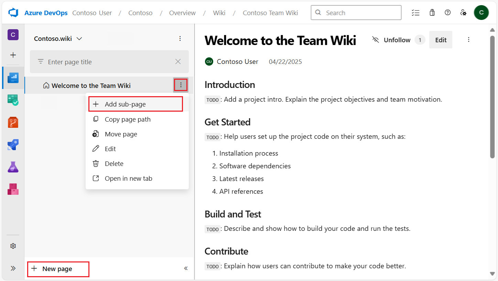
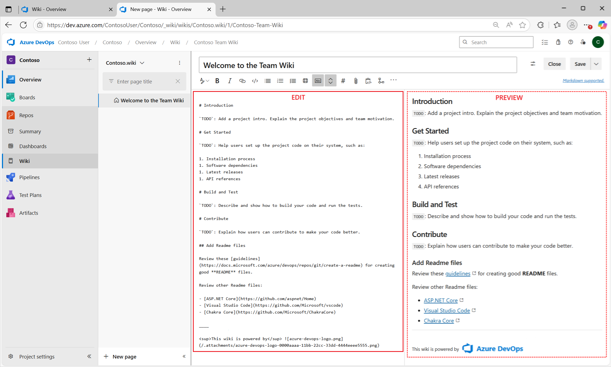

# 📖 Wikis & Knowledge Sharing in Azure DevOps

A **Wiki** is a **knowledge base** inside Azure DevOps.

- It Used for **documentation, notes, guides, and runbooks**.
- It Supports **Markdown** formatting (tables, links, code blocks, diagrams).
- It Can be linked directly to **work items, dashboards, and pipelines**.

> 👉 **Think of Wikis as “Notion inside Azure DevOps.”**

---

<div align="center">
  
</div>

<div align="center">
  
</div>

## 📝 Why Wikis Matter

Agile isn’t just about coding — it’s also about **communication and transparency**. Wikis provide:

- **Shared knowledge** → no more “it’s in Ahmed’s head.”
- **Process documentation** → checklists, onboarding docs, governance policies.
- **Decision history** → why the team chose Option A instead of B.
- **Runbooks** → is a **step-by-step guide** that tells you exactly what to do when something goes wrong or needs to be done repeatedly.
  - Think of it as: “If X happens, follow these steps to fix it.”

---

## 🖼️ Features of Wikis

- **Markdown support** → rich formatting, code, diagrams.
- **Page hierarchy** → sections, subpages.
- **Searchable** → find topics quickly.
- **Versioned** → track edits, roll back if needed.
- **Security** → respect Azure DevOps permissions (only contributors can edit).
- **Integration** →

  - Link Wiki pages to **Boards** (work items).
  - Display Wiki shortcuts as **Dashboard widgets**.
  - Reference Wiki docs inside **pipelines**.

---

## 🛠️ Types of Wikis in Azure DevOps

### **1️⃣ Project Wiki**

- Created at the **project level**.
- Stored in **Azure DevOps Wiki storage**, not in a Git repo.
- You can have **only one Project Wiki per project**.
- But → inside it, you can create **unlimited pages and subpages**.
- Name by **"Project Name + .wiki"**
- Acts like a **shared team knowledge base**.

📌 Example structure (Project Wiki):

```ini
Project Wiki
 ├─ Getting Started
 │   ├─ Install Dev Environment
 │   └─ IDE Setup
 ├─ Deployment
 │   ├─ Staging Guide
 │   └─ Production Guide
 ├─ Architecture
 │   ├─ Checkout System
 │   └─ Payment Gateway
```

👉 **Think of it as “one big Wiki site per project.”**

---

### **2️⃣ Published/Code Wiki**

- Created from a **Git repository** in your project.
- Docs are just **Markdown files (`.md`) in your repo**.
- You can have **multiple Code Wikis** (one per repo).
- Each repo’s `docs/` folder can become its own Wiki.
- Best for **documentation that lives with the code** (version-controlled).

📌 Example (inside repo):

```ini
/docs
 ├─ index.md
 ├─ architecture.md
 ├─ api/
 │   ├─ overview.md
 │   ├─ endpoints.md
 │   └─ errors.md
 └─ troubleshooting/
     ├─ index.md
     └─ database.md
```

Wiki (auto-generated):

```ini
Docs Wiki
 ├─ Architecture
 ├─ API
 │   ├─ Overview
 │   ├─ Endpoints
 │   └─ Errors
 └─ Troubleshooting
     ├─ Index
     └─ Database
```

👉 Each **folder = section**, each `.md` file = page.

---

### 🌲 Grouping & Structure

Both Project Wiki and Code Wiki support:

- **Hierarchies** → pages + subpages.
- **Multiple contributors** → anyone with rights can edit.
- **Version history** → track edits, roll back.
- **Markdown formatting** → tables, code, diagrams.

So → it’s **not one flat file**. It’s a **tree of organized docs**.

---

### ⚖️ Project vs Code Wiki

| Feature              | 🧾 Provisioned Wiki       | 🧠 Code/Published Wiki                |
| -------------------- | ------------------------- | ------------------------------------- |
| 📦 Creation          | From Portal UI            | From Git repo                         |
| 📄 Storage           | Auto Azure Repo (hidden)  | Custom repo of your choice            |
| ✍️ Editing           | Web UI (Markdown/WYSIWYG) | Markdown in code editor               |
| 🌲 Subpages          | Yes (tree)                | Yes (folder hierarchy)                |
| 📁 Count per project | 1 max                     | One per repo (multiple repos allowed) |
| 🏷️ Versioning        | Auto                      | Git commits                           |
| 🗝️ Permissions       | Inherited from project    | Controlled via repo permissions       |

## ✏️ How to Create Each One

### ✅ Provisioned Wiki

1. Go to **Azure DevOps > Project > Wiki**
2. Click **“Create project wiki”**
3. Start editing in browser (Markdown or GUI editor)

### ✅ Published Wiki

1. Create a **repo** (e.g. `infra-wiki`) in Azure Repos
2. Add `.md` files
3. Go to **Wiki → Publish code wiki**
4. Select your repo and folder (like `/docs`)
5. Voila — it’s browsable like a normal Wiki

---

## 🧠 Pro Tips from Me to You

- ✅ Use **Markdown headers and links** to create a Table of Contents
- 🔗 Interlink pages with `[[Page Name]]` (like a wiki)
- 🔐 Control access to published wikis using **repo policies**
- 💥 Use **branching** in Published Wikis to review doc changes via PRs
- 🔄 CI/CD integration? Published Wiki = ✅ (since it’s just Git!)

---

## 🔄 When to Use Which

| Type             | Where it lives         | Limitations     | Best For                                          |
| ---------------- | ---------------------- | --------------- | ------------------------------------------------- |
| **Project Wiki** | Azure DevOps (not Git) | One per project | Team-wide docs (onboarding, runbooks, policies)   |
| **Code Wiki**    | Git repo (`.md` files) | One per repo    | Dev-focused docs (API, architecture, design docs) |

👉 You can use **both together** in the same project:

- Project Wiki → _“How to set up dev environment”_.
- Code Wiki → _“Architecture of Checkout API”_.

---

## 💡 Real-World Uses

- **Onboarding docs** → “How to set up dev environment.”
- **Incident runbooks** → “Steps to restart payment service.”
- **Architecture diagrams** → “System context for Checkout API.”
- **Meeting notes & retrospectives** → Sprint 5 Retro Summary.
- **Governance policies** → “Branch strategy & PR rules.”

---

## 📊 Wikis vs Dashboards vs Boards

| Tool           | Purpose                  | Best For               | Example                      |
| -------------- | ------------------------ | ---------------------- | ---------------------------- |
| **Wikis**      | Knowledge/documentation  | Devs, Ops, PMs         | “How to deploy to prod”      |
| **Dashboards** | Reporting/project health | Managers, stakeholders | Burndown chart, build status |
| **Boards**     | Tracking work items      | Dev team               | PBI → Task → Done            |

👉 **Wikis = the memory. Dashboards = the cockpit. Boards = the engine room.**

---

## 🧾 Exam Tips

- If the question says _“team needs a knowledge base, store runbooks, share meeting notes”_ → **Wiki**.
- If it says _“visualize progress with burndown or velocity”_ → **Dashboard**.
- If it says _“track PBIs moving from To Do → Done”_ → **Board**.
- **Code Wiki vs Project Wiki**:

  - _Docs in Git repo_ → Code Wiki.
  - _Docs outside repo (project-wide)_ → Project Wiki.

---

## ✅ Recap

- Wikis = **documentation hub inside Azure DevOps**.
- Two types: **Project Wiki** & **Code Wiki**.
- **Wikis are not one file** → they’re structured collections of pages.
- **Project Wiki** = one per project, unlimited pages, team-wide docs.
- **Code Wiki** = one per repo, multiple allowed, lives in Git.
- Both support hierarchy, Markdown, history, and collaboration.
- Support **Markdown, versioning, links**.
- Used for **runbooks, onboarding, policies, architecture docs**.
- Integrate with Boards, Dashboards, and Pipelines.
