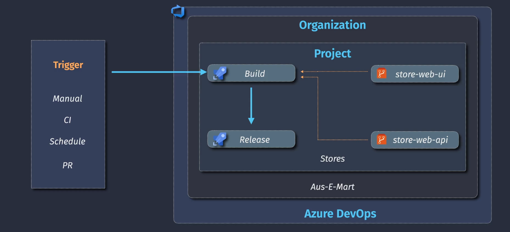

# 🚀 Azure Pipeline Overview

Azure Pipelines is a CI/CD (Continuous Integration / Continuous Delivery) service from Azure DevOps that automates building, testing, and deploying your code to any platform.

---

## 🧬 1. Azure Pipeline Lifecycle

<div align="center">
  
</div>

### 🔄 Lifecycle Stages:

| Stage                           | Description                                                    |
| ------------------------------- | -------------------------------------------------------------- |
| **1. Code**                     | Developer writes code in Azure Repos, GitHub, or external Git  |
| **2. Push / Pull Request**      | Code pushed or a PR is created                                 |
| **3. Pipeline Triggered**       | Pipeline starts based on trigger (e.g. `trigger:` or PR)       |
| **4. Build / Test Stage**       | Compiles code, runs unit tests, lints                          |
| **5. Artifacts**                | Builds produce outputs (e.g. ZIP, DLLs, containers)            |
| **6. Release Stage (optional)** | Artifact is deployed to environments (e.g. dev, staging, prod) |
| **7. Monitor**                  | Logs, results, alerts, dashboards for quality & health         |

> 🔁 This loop continues for every commit → ensuring **automation, quality & speed**.

---

## 🏗️ 2. Azure Pipeline Architecture

<div align="center">
  
</div>

---

### 🛠️ Core Components in the Architecture:

| Component                                          | Description                                                         |
| -------------------------------------------------- | ------------------------------------------------------------------- |
| **🧾 Pipeline Definition (`azure-pipelines.yml`)** | Describes the pipeline logic using YAML                             |
| **🤖 Pipeline Agent**                              | Executes the steps (can be **Microsoft-hosted** or **self-hosted**) |
| **🎯 Tasks**                                       | Atomic actions (e.g., `DotNetCoreCLI@2`, `AzureCLI@2`)              |
| **💼 Jobs**                                        | Group of steps (can run in **parallel** or **sequential**)          |
| **🏟️ Stages**                                      | High-level groups of jobs (e.g., **Build**, **Test**, **Deploy**)   |
| **📁 Artifacts**                                   | Compiled outputs saved and **passed to next stages**                |
| **⚡ Triggers**                                    | Auto-run pipelines on code change (e.g., CI or PR triggers)         |

> 💡 Think of YAML as your "pipeline-as-code" brain, and agents as your "hands" doing the work.

---

## 🧩 3. Azure Pipeline Components

<div align="center">
  
</div>

### 🛠️ Breakdown of Core Components:

| Component          | Description                                                                |
| ------------------ | -------------------------------------------------------------------------- |
| **📽️ Project**     | Top-level container for everything (repos, pipelines, boards)              |
| **🪈 Pipeline**     | Definition that controls build/deploy                                      |
| **🏟️ Stages**      | Logical grouping (e.g., Build, Deploy)                                     |
| **💼 Jobs**        | Runs on a single agent, can be parallel                                    |
| **🪜 Steps**        | Individual tasks or scripts                                                |
| **🎯 Tasks**       | Built-in or custom actions                                                 |
| **🔢 Variables**   | Reusable values across steps                                               |
| **📁 Artifacts**   | Outputs from build stage                                                   |
| **🌐 Environment** | Targets for deployment (Dev, QA, Prod)                                     |
| **✅ Approvals**   | Manual gates before proceeding (e.g., Manager must approve deploy to Prod) |

## ⏱️ Trigger Types in YAML

| 🚀 Trigger  | 🔍 Use Case Example                          |
| ----------- | -------------------------------------------- |
| `trigger:`  | CI trigger – run when code is pushed         |
| `pr:`       | PR trigger – run validation before merging   |
| `schedule:` | Daily/weekly builds (e.g. run every night)   |
| `pipeline:` | Trigger pipeline B when pipeline A completes |
| `manual:`   | Run on-demand (e.g. button press in portal)  |

Example:

```yaml
trigger:
  branches:
    include:
      - main
```

---

## 📦 Realistic YAML Example (Basic Build)

```yaml
trigger:
  branches:
    include:
      - main

pool:
  vmImage: ubuntu-latest

steps:
  - task: DotNetCoreCLI@2
    inputs:
      command: "build"
      projects: "**/*.csproj"
```

🧪 Builds all .NET projects on push to `main` using Microsoft-hosted Ubuntu agent.

---

## 🧠 Pro DevOps Tips

- Use **templates** to reuse pipeline logic across projects
- Combine **environments + approvals** for safe deployments
- Add **branch filters** to avoid triggering on every commit
- Use **secure files** and **variable groups** for secrets
- Analyze pipeline logs with **Azure Monitor / Log Analytics**
