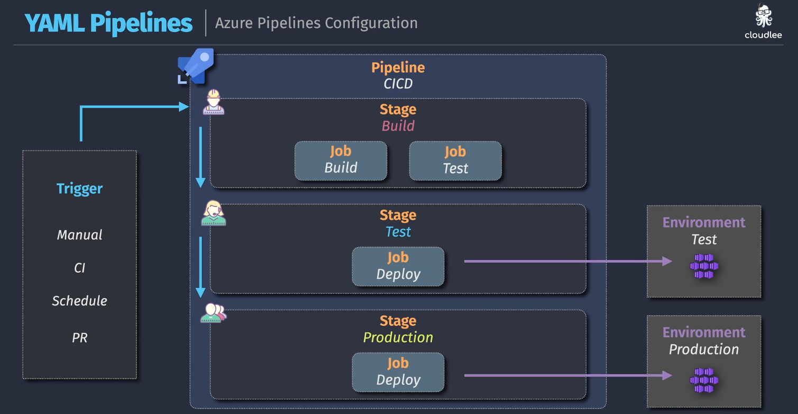
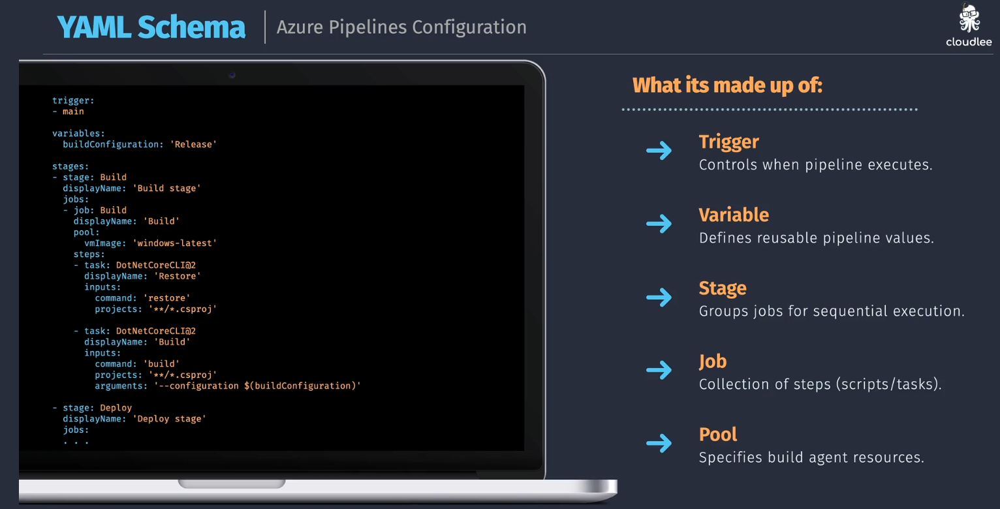
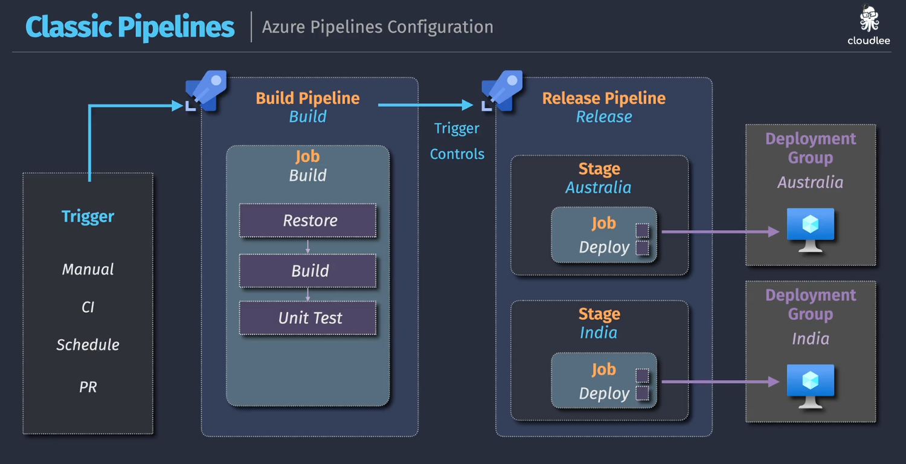

# ✍️ Azure DevOps Pipeline Editors — Classic vs YAML

> Azure Pipelines support two primary editors:
>
> - ✅ **Classic Editor** (UI-based, visual, legacy)
> - ✅ **YAML Editor** (code-based, modern)

Let’s break them down like a DevOps engineer would 👷‍♂️.

---

## 🧮 1. YAML Pipeline Editor

> 💡 **Modern DevOps standard** — fully version-controlled, code-based, scalable

<div align="center">
  
</div>

<div align="center">
  
</div>

---

### ✅ Features

| Feature                | Description                                                  |
| ---------------------- | ------------------------------------------------------------ |
| 📝 Git-based           | Pipeline logic is saved in your repo (`azure-pipelines.yml`) |
| 🧠 Pipeline-as-code    | Enables code reviews, approvals, traceability                |
| 🔄 Combined CI/CD      | Supports **multi-stage** build + deploy workflows            |
| ♻️ Reusable logic      | Supports templates, variables, runtime conditions            |
| 🔐 Uses `Environments` | Track deployments & approvals in environments (Dev/QA/Prod)  |

### 🛠️ Real YAML Example

```yaml
trigger:
  branches:
    include: [main]

pool:
  vmImage: "ubuntu-latest"

stages:
  - stage: Build
    jobs:
      - job: BuildApp
        steps:
          - task: DotNetCoreCLI@2
            inputs:
              command: "build"
              projects: "**/*.csproj"
  - stage: Deploy
    jobs:
      - deployment: DeployToWeb
        environment: "Dev"
        strategy:
          runOnce:
            deploy:
              steps:
                - script: echo Deploying to Dev!
```

✅ `environment: 'Dev'` refers to the **Azure DevOps Environment**, where you can configure approvals and monitor releases.

---

## 🎨 2. Classic Editor

> 💡 GUI-first, legacy-friendly option with full UI control
> Ideal for small teams or non-coders.

---

<div align="center">
  
</div>

---

### ✅ Features

| Feature                   | Description                                               |
| ------------------------- | --------------------------------------------------------- |
| 🖱️ Visual Designer        | Add tasks, phases, triggers using the Azure DevOps UI     |
| 🧱 Separate Pipelines     | Requires separate pipelines for Build and Release         |
| ✅ Manual Approvals       | Native UI support for pre/post-deployment approvals       |
| ❌ No Git versioning      | Pipeline logic stored in DevOps, not source-controlled    |
| 🚧 Uses Deployment Groups | Deploy to physical VMs, on-prem targets, or custom agents |

---

## 🧠 Environments vs Deployment Groups

| Feature               | YAML Pipeline (Modern) | Classic Pipeline (Legacy) |
| --------------------- | ---------------------- | ------------------------- |
| **Deployment Target** | `environment` block    | `Deployment Groups`       |
| **Approval Logic**    | Via environment UI     | Native pre/post approvals |
| **Scope**             | Logical Dev/Test/Prod  | VM/Agent group targeting  |
| **Security**          | Fine-grained + RBAC    | Agent-based               |

---

## 🔍 Classic vs YAML: Side-by-Side

| Feature                                  | YAML Pipeline Editor            | Classic Editor (UI)             |
| ---------------------------------------- | ------------------------------- | ------------------------------- |
| 🧠 Stored in Git                         | ✅ Yes                          | ❌ No                           |
| 📦 Multi-stage (build + release) support | ✅ Yes (Build + Deploy)         | ❌ Only with separate pipelines |
| ⛓️ Deployment Targets                    | `environments`                  | `deployment groups`             |
| 📝 Reusable Templates                    | ✅ Yes                          | ❌ No                           |
| 🧰 Conditions, Matrix Jobs               | ✅ Advanced control             | ❌ Very limited                 |
| 🖥️ Visual control                        | ❌ YAML only                    | ✅ Drag and drop                |
| 🔐 Approvals & gates                     | ✅ Via Environments             | ✅ Via Classic Stages           |
| ✅ Recommended for                       | DevOps/GitOps, versioning teams | Beginners, legacy migration     |

---

## 🧪 Real Project Example

| Scenario                                              | Editor to Use               |
| ----------------------------------------------------- | --------------------------- |
| You need Git-tracked pipeline with multi-stage CI/CD  | ✅ YAML Editor              |
| Your team prefers UI and visual control               | 🎨 Classic Editor           |
| You’re deploying to physical VMs                      | Classic + Deployment Groups |
| You want environment-level approval with traceability | YAML + `environment`        |

---

## 📌 Summary: Editor Decision Guide

| If You Want To...                            | Use This Editor                |
| -------------------------------------------- | ------------------------------ |
| ✅ Store pipeline as code in Git             | YAML Editor                    |
| ✅ Reuse logic and manage pipeline templates | YAML Editor                    |
| 🖱️ Build visually with no coding             | Classic UI                     |
| 🚀 Deploy to on-prem / physical targets      | Classic with Deployment Groups |
| 🔒 Add secure gates & approvals              | Both (via env or UI)           |
| 📚 Maintain existing legacy pipelines        | Classic Editor                 |

---

## 🔔 Final Tip

> ✅ For **new projects**: Always start with **YAML + Environments**
> ☑️ For **legacy teams**: Maintain Classic until phased out
