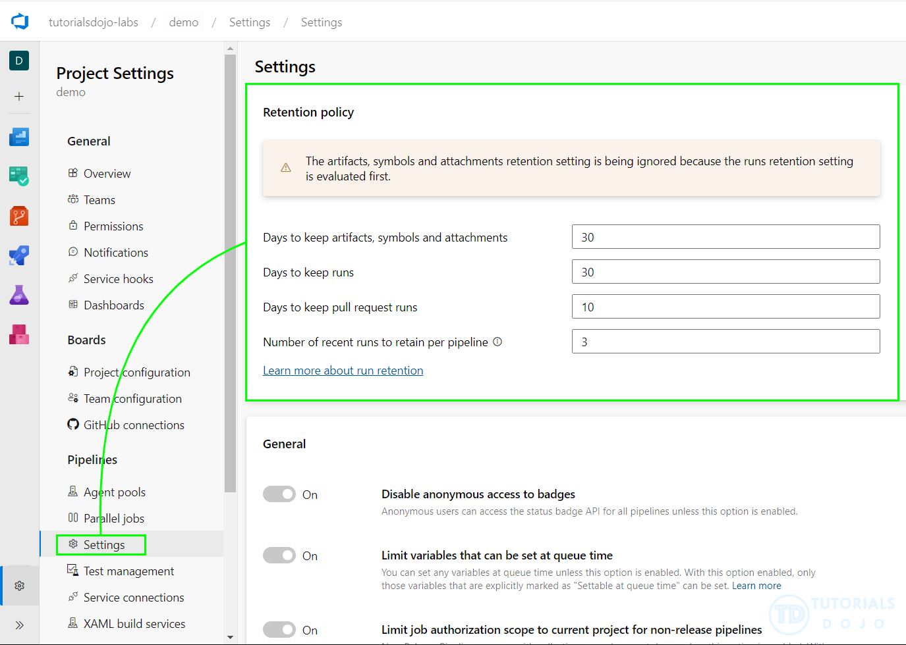
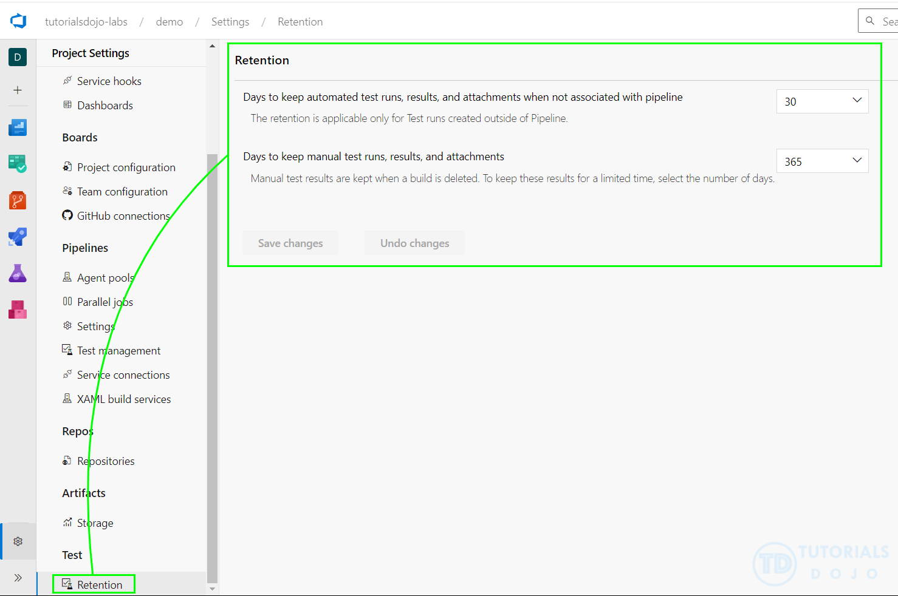
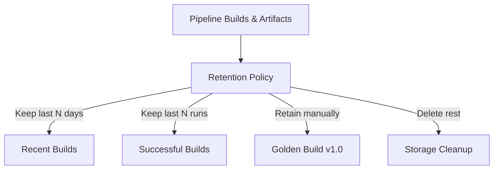

# 🗂️ Azure Pipeline Retention Policy

## 📌 1. What is Pipeline Retention?

👉 **Pipeline Retention Policy** = rules that control **how long build/run history, logs, and pipeline artifacts are kept** before Azure DevOps automatically deletes them.

💡 Without retention → every build forever → huge storage & \$\$\$ costs.
💡 With retention → only recent & important builds stay.

---

## 📌 2. What is Retained in Pipelines?

- ✅ **Build/Run records** (success/failure history).
- ✅ **Logs** (job/task logs).
- ✅ **Test results**.
- ✅ **Pipeline artifacts** (outputs like binaries, packages, reports).

⚠️ **Not the same as Azure Artifacts (feeds)** — this is about _build outputs_, not NuGet/npm/Maven feeds.

---

## 📌 3. Retention Policy Options

You can configure retention **at 3 levels**:

| Level                             | Scope                            | Example                                          |
| --------------------------------- | -------------------------------- | ------------------------------------------------ |
| **Organization / Project policy** | Global default for all pipelines | Keep last 30 days                                |
| **Pipeline policy**               | Override per pipeline            | Keep last 10 successful runs                     |
| **Per-run**                       | Protect specific runs            | “Retain indefinitely” (e.g., release build v1.0) |

---

## 📌 4. Configurable Rules

- **Maximum days to retain** → e.g., delete after 30 days.
- **Minimum # of successful runs** → always keep last X runs.
- **Keep runs with associated releases** → linked to release pipelines → never auto-delete.
- **Keep runs with retention lock** → marked “Retain Indefinitely.”

---

<div align="center">
  
</div>

<div align="center">
  
</div>

---

## 📌 5. How to Configure

### 🔹 A) Via Portal (UI)

1. Go to **Project Settings → Pipelines → Settings → Retention**.
2. Configure default policy (days + # of runs).
3. Or open a pipeline → **Edit → Retention** → set custom rules.

### 🔹 B) YAML (per pipeline)

```yaml
name: $(Build.DefinitionName)_$(Date:yyyyMMdd)$(Rev:.r)

trigger:
  - main

retention:
  days: 30 # keep runs for 30 days
  minimumRuns: 10 # keep at least 10 successful runs
  artifacts: 5 # keep artifacts from last 5 runs
```

### 🔹 C) Per Run (Manual)

- In **Pipelines → Runs → Select run → Retain → Retain indefinitely**.
- Useful for “golden builds” (e.g., release 1.0).

---

## 📌 6. Real-World Example

- Team runs **20 builds/day** → \~600/month.
- Without retention → thousands of builds stored.
- With retention:

  - Keep last **10 successful runs**.
  - Keep builds for **30 days max**.
  - Mark release builds as **retain indefinitely**.

Result → Clean history, lower storage, but important runs preserved.

---

## 📊 Visual Flow

<div align="center">



</div>

---

## 📌 7. Exam / Interview Tips

- If the question says:

  - **“Keep build v1.0 forever”** → Retain Indefinitely (per-run).
  - **“Clean old builds after 30 days”** → Retention policy.
  - **“Artifacts disappearing unexpectedly”** → Pipeline retention expired.
  - **“Keep last 3 successful runs”** → Minimum Runs setting.

⚠️ Don’t confuse:

- **Azure Artifacts Retention** = cleanup of package versions in feeds.
- **Azure Pipeline Retention** = cleanup of build/run history, logs, artifacts.

---

## ✅ TL;DR

- **Pipeline Retention** = auto cleanup of old builds/logs/artifacts.
- Configurable at **project, pipeline, or per-run** level.
- Rules = **days kept, # of runs kept, retain indefinitely**.
- Prevents storage bloat while keeping important builds safe.
