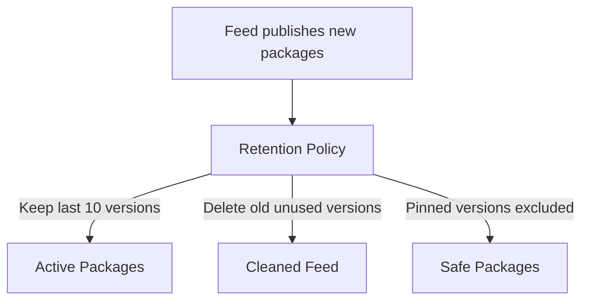

# 📦 Retention Policy in Azure Artifacts

## 📌 1. What is Azure Artifacts?

Azure Artifacts = the **package management service** in Azure DevOps.

- Supports **NuGet, npm, Maven, Python, Universal Packages**.
- Stores packages in **feeds** (private repos for your org).

💡 Just like GitHub Packages or JFrog Artifactory, but integrated into Azure DevOps.

---

## 📌 2. What is Retention Policy?

👉 **Retention Policy** = a rule that **automatically deletes old/unused package versions** from a feed to:

- Save storage costs.
- Reduce clutter in feeds.
- Keep only relevant, recently used packages.

⚠️ Packages can pile up quickly in CI/CD — every build may publish a new version. Without retention, feeds grow huge.

---

## 📌 3. How Retention Policy Works

- Configured **per feed** (not global).
- Applies to **package versions**, not the feed itself.
- Keeps versions based on:

  - ✅ **Number of versions** → e.g., keep last 10 versions.
  - ✅ **Days since last download** → e.g., delete if unused for 30 days.
  - ✅ **Pinned versions** → never deleted (e.g., LTS version).

---

## 📌 4. How to Configure Retention Policy

### 🔹 Method 1: Azure DevOps Portal (UI)

1. Go to **Azure DevOps → Artifacts → Select your Feed**.
2. Top-right: **⚙ Settings → Retention**.
3. Configure:

   - **Keep the last N versions**.
   - **Unconsumed versions older than X days**.
   - Exclude **pinned versions**.

4. Save.

---

### 🔹 Method 2: YAML Pipeline (Artifact cleanup)

Retention can also be set for build artifacts via pipeline YAML:

```yaml
jobs:
  - job: Build
    steps:
      - task: PublishPipelineArtifact@1
        inputs:
          targetPath: "$(Build.ArtifactStagingDirectory)"
          artifact: "drop"
          publishLocation: "pipeline"

# Retention for pipeline artifacts
name: "$(Build.DefinitionName)_$(Date:yyyyMMdd)$(Rev:.r)"
retention:
  artifacts: 5 # keep last 5 runs’ artifacts
```

👉 For **feeds/packages** retention is via portal,
👉 For **pipeline artifacts** retention is via YAML or pipeline settings.

---

## 📌 5. Example Scenario

- You publish a **NuGet package** on every build.
- Without retention: 500 builds = 500 versions in feed.
- With policy:

  - Keep **last 10 versions**.
  - Delete unused versions **older than 30 days**.
  - Pinned versions (like `v1.0-stable`) stay forever.

Result → feed stays clean, fast, and cheap.

---

## 📊 Visual Flow

<div align="center">



</div>

---

## 📌 6. Exam / Interview Tips

- “How to **prevent feed from growing endlessly**?” → Retention Policy.
- “How to **keep LTS package safe**?” → Pin version (excluded from cleanup).
- “Retention is configured at what level?” → Feed level.
- “What’s the difference?”

  - **Artifacts Retention (pipelines)** → cleanup old build outputs.
  - **Artifacts Retention (feeds)** → cleanup old package versions.

---

## ✅ TL;DR

- **Retention Policy** in Azure Artifacts = auto cleanup of old/unused package versions.
- Set per feed → by versions kept, age, and pinning.
- Prevents unlimited growth of feeds, reduces cost.
- Configured in **feed settings (UI)** or via **pipelines (for build artifacts)**.
- Exam keyword → _“keep feed clean, save storage, auto-delete old versions”_.
