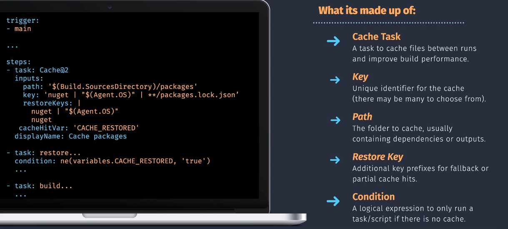

# ⚡ **Azure Pipeline Caching – From Scratch**

## 🧠 **How Pipeline Caching Works**

Caching in Azure Pipelines is about **speeding up builds** by reusing files (like NuGet packages or npm dependencies) across runs.

Here’s the flow:

1. **Add a `Cache@2` step** with a `key` and a `path`.
2. **At job start**, Azure DevOps looks up the `key` in its **remote cache store** (lives in Azure DevOps, not on the agent).

   - **Hit** → downloads cached files into your specified `path` (on the fresh agent).
   - **Miss** → nothing restored (first run, or lockfile changed).

3. Your steps run (e.g., `dotnet restore`, `npm ci`) and update that folder.
4. **At job end**, `Cache@2` **uploads the folder** back to the cache store, tagged with that key.

> 👉 Even though hosted agents are destroyed after each run, the **cache persists in Azure DevOps** and can be restored onto the next VM.

---

<div align="center">
  
</div>

---

## 🧩 **Workflow Overview**

- **Actors**

  - ☁️ **Azure DevOps (Service)**: orchestrates jobs & hosts the **remote cache store**.
  - 💻 **Agent VM**: ephemeral worker per job (especially for Microsoft-hosted).
  - **Cache\@2 (restore/save)**: the pre/post steps that talk to the cache store.
  - ⚙️ **Steps**: your package restore/build commands.

- **Truths**

  - cache lookup/download/upload happens between **Cache\@2** and the **remote cache store**, _not_ between agents.
  - agent VMs are destroyed after jobs; **cache persists** on the service.
  - a **miss** on run #1 is normal — it creates the cache used by run #2 (hit).

- **Workflow**
  1. a single job run (showing **restore → steps → save**) with both **hit/miss** branches, and
  2. a two-run timeline (**run #1 = miss → save**, **run #2 = hit**).

---

<div align="center">
  
</div>

---

## 🎬 **Single pipeline job** — cache restore + steps + save

```mermaid
sequenceDiagram
    autonumber
    participant DevOps as ☁️ Azure DevOps (Service)
    participant Runner as 💻 Agent VM (ephemeral)
    participant CacheRestore as Cache@2 (restore/save)
    participant CacheStore as 🗄️ Remote Cache Store

    Note over DevOps,Runner: Job is queued → fresh Agent VM is allocated

    DevOps->>Runner: 1. Start job & download pipeline definition
    Runner->>CacheRestore: 2. Execute Cache@2 (restore) with (key, path)
    CacheRestore->>CacheStore: 3. Lookup cache by key

    alt Cache hit
        CacheStore-->>CacheRestore: 4. Cache found (archive + metadata)
        CacheRestore-->>Runner: 5. Extract to path (e.g., $(Pipeline.Workspace)/.nuget or /.npm)
        Runner->>Runner: 6. Run steps (dotnet restore / npm ci / ng build)
        Runner-->>Runner: 7. Complete (fast due to cache)
    else Cache miss
        CacheStore-->>CacheRestore: 4. Not found
        CacheRestore-->>Runner: 5. Nothing restored
        Runner->>Runner: 6. Run steps (do full restore/build)
        Runner-->>Runner: 7. Complete (slower on first run / changed lockfile)
    end

    Runner->>CacheRestore: 8. Execute Cache@2 (save) with same key & path
    CacheRestore->>CacheStore: 9. Upload folder from path (create/update entry)
    CacheStore-->>CacheRestore: 10. Stored (ready for future runs)

    DevOps-->>Runner: 11. Job ends Agent VM is discarded
    Note over DevOps,CacheStore: ✅ Cache persists in the service (survives agent teardown)
```



---

## ⏱️ **Two-run lifecycle** — miss→save then hit

```mermaid
sequenceDiagram
    autonumber
    participant DevOps as ☁️ Azure DevOps (Service)
    participant CacheStore as 🗄️ Remote Cache Store

    rect rgba(89, 45, 45, 1)
      note over DevOps,CacheStore: ▶️ Run #1 (first time or different lockfile)
      participant Runner1 as 💻 Agent VM (Run 1)
      participant Restore1 as Cache@2 (restore/save)

      DevOps->>Runner1: 1. Start job (fresh VM)
      Runner1->>Restore1: 2. Restore with key
      Restore1->>CacheStore: 3. Lookup key
      CacheStore-->>Restore1: 4. MISS
      Runner1->>Runner1: 5. Full restore/build
      Runner1-->>Runner1: 6. Done (slow path)
      Runner1->>Restore1: 7. Save cache
      Restore1->>CacheStore: 8. Upload cache (create)
      DevOps-->>Runner1: 9. End job VM destroyed
    end

    rect rgba(20, 44, 20, 1)
      note over DevOps,CacheStore: ▶️ Run 2 (same key)
      participant Runner2 as 💻 Agent VM (Run 2)

      DevOps->>Runner2: 10. Start job (fresh VM)
      Runner2->>Restore1: 11. Restore with same key
      Restore1->>CacheStore: 12. Lookup key
      CacheStore-->>Restore1: 13. HIT (download archive)
      Restore1-->>Runner2: 14. Extract to path
      Runner2->>Runner2: 15. Steps use warm cache (fast)
      Runner2-->>Runner2: 16. Done
      Runner2->>Restore1: 17. Save cache (optional if changed)
      Restore1->>CacheStore: 18. Upload (update/skip if unchanged)
      DevOps-->>Runner2: 19. End job VM destroyed
    end

    Note over DevOps,CacheStore: 🔁 Repeat for further runs.
    Note over DevOps,CacheStore: Cache lives in AzDevOps are disposable.
```



---

## ✍🏻 **Examples – End to End**

### 🔹 ASP.NET Core (NuGet caching)

```yaml
# .NET SDK
- task: UseDotNet@2
  inputs:
    packageType: "sdk"
    version: "8.x"

# Redirect NuGet packages into workspace
- script: echo "##vso[task.setvariable variable=NUGET_PACKAGES]$(Pipeline.Workspace)/.nuget/packages"
  displayName: Set NUGET_PACKAGES

# Cache the folder
- task: Cache@2
  displayName: Cache NuGet packages
  inputs:
    key: 'nuget | "$(Agent.OS)" | **/packages.lock.json,**/*.csproj,global.json'
    restoreKeys: |
      nuget | "$(Agent.OS)"
    path: "$(NUGET_PACKAGES)"

# Restore/build
- script: dotnet restore
  displayName: dotnet restore

- script: dotnet build -c Release --no-restore
  displayName: dotnet build
```

🔑 Key points:

- Cache is keyed on **OS + lockfiles/project files**.
- If deps change → key changes → cache miss (fresh restore).
- On next run with same lockfile → cache hit → instant restore.

---

### 🔹 Angular (npm caching)

```yaml
# Node runtime
- task: NodeTool@0
  inputs:
    versionSpec: "18.x"

# Redirect npm cache into workspace
- script: npm config set cache $(Pipeline.Workspace)/.npm --global
  displayName: Set npm cache path

# Cache npm store (not node_modules!)
- task: Cache@2
  displayName: Cache npm store
  inputs:
    key: 'npm | "$(Agent.OS)" | package-lock.json'
    restoreKeys: |
      npm | "$(Agent.OS)"
    path: "$(Pipeline.Workspace)/.npm"

# Install packages (faster if cache hit)
- script: npm ci
  workingDirectory: "$(Build.SourcesDirectory)"
  displayName: npm ci

# Cache Angular CLI build cache
- task: Cache@2
  displayName: Cache Angular build cache
  inputs:
    key: 'angular-cache | "$(Agent.OS)" | "$(Build.SourceBranch)"'
    restoreKeys: |
      angular-cache | "$(Agent.OS)"
    path: "$(Build.SourcesDirectory)/.angular/cache"

# Build Angular
- script: npm run build
  workingDirectory: "$(Build.SourcesDirectory)"
  displayName: ng build
```

🔑 Key points:

- Cache the **npm store**, not `node_modules`.
- Add a second cache for `.angular/cache` → incremental Angular builds are much faster.
- Keys include OS + `package-lock.json` for npm; branch for Angular cache.

---

## 📒 **Deep Notes**

### 📌 **1. What `NUGET_PACKAGES` does**

By default NuGet uses a **user-profile** global cache:

- Windows: `%USERPROFILE%\.nuget\packages`
- Linux: `~/.nuget/packages`
- NuGet doesn’t restore per-project anymore.
- With **PackageReference**, packages go into one **global cache** folder.
- That’s the only thing worth caching. Project folders only contain references, not packages.

**⚠️ Problems with default paths:**

- Outside the workspace, not portable.
- Hard to cache because agents are ephemeral.
- On self-hosted agents, pipelines can pollute each other’s global cache.

**✅ Solution:**

#### 👉🏻 **Option A**

We use a **logging command** to move caches into the pipeline’s workspace:

```yaml
# Option A: logging command (works on any shell)
- script: echo "##vso[task.setvariable variable=NUGET_PACKAGES]$(Pipeline.Workspace)/.nuget/packages"
  displayName: Set NUGET_PACKAGES
```

> 📒 **`##vso[...]` Logging Commands**
>
> - Special syntax printed to `stdout` → agent interprets it as an instruction.
> - Format:
>
>   ```ini
>   ##vso[<area>.<command> property=value;]message
>   ```
>
> - Example we use:
>
>   ```bash
>   ##vso[task.setvariable variable=NUGET_PACKAGES]/home/vsts/work/1/.nuget/packages
>   ```
>
>   👉 Tells pipeline to set a variable usable later as `$(NUGET_PACKAGES)`.

---

#### 👉🏻 **Other valid ways**

```yaml
# Option B: pass as CLI switch
- script: dotnet restore --packages "$(Pipeline.Workspace)/.nuget/packages"
```

```yaml
# Option C: NuGet.config
# <configuration>
#  <config>
#    <add key="globalPackagesFolder" value="$(Pipeline.Workspace)/.nuget/packages" />
#  </config>
# </configuration>
```

Then wire the cache to that path:

```yaml
- task: Cache@2
  inputs:
    key: 'nuget | "$(Agent.OS)" | **/packages.lock.json,**/*.csproj,global.json'
    path: "$(NUGET_PACKAGES)"
  cacheHitVar: "CACHE_RESTORED"
```

---

### 📌 **2. What `cacheHitVar` does**

In **Cache@2**, **cacheHitVar** creates a pipeline variable you can check later:

```yaml
- task: Cache@2
  inputs:
    key: 'nuget | "$(Agent.OS)" | **/packages.lock.json'
    path: "$(NUGET_PACKAGES)"
  cacheHitVar: "CACHE_RESTORED" # <-- sets variables.CACHE_RESTORED = 'true' on hit
  displayName: Cache NuGet packages

# Only run a heavy restore if cache MISSED
- script: dotnet restore
  displayName: dotnet restore (only if cache miss)
  condition: ne(variables.CACHE_RESTORED, 'true')
```

> 👉🏻 This lets you **skip** `dotnet restore` (or `npm ci`) when the cache already primed the folder.

---

## 🏁 **Key Takeaways**

- **Cache lives in Azure DevOps service**, not on the agent machine.
- **`Cache@2` restores pre-job and saves post-job automatically.**
- Always **include lockfiles in keys** so caches invalidate safely when deps change.
- Always **scope caches to the workspace**, not global OS profile folders.
- Use **artifacts** for outputs you want to pass across jobs/stages; use **cache** for speeding up dependency restores.
- **Never cache `node_modules/`** on npm—OS & toolchain differences make it flaky. Cache the **npm cache** (or pnpm store) instead.
- For **Angular** always cache **`.angular/cache`** (and **`.nx/cache`** if using Nx).
- **Scope keys by OS**: `$(Agent.OS)`—binary caches differ by OS.
- **Use lockfiles** in keys: guarantees invalidation when deps change.
- **Containers/self-hosted**: use the same YAML—paths and keys still work.
- **Artifacts are not caches**: publish your **build outputs** as artifacts, not in caches.
- Use **`NUGET_PACKAGES` (or equivalent)** to **choose the folder** NuGet uses → enables caching.
- Use **`cacheHitVar`** (or `name: step` + `.CacheRestored`) to **know if the cache restored successfully** and **conditionally skip** expensive steps.

## 🎨 **Summary**

```mermaid
---
config:
  layout: elk
  elk:
    mergeEdges: false
    nodePlacementStrategy: LINEAR_SEGMENTS
---
flowchart TB
    subgraph AzureDevOps["☁️ Azure DevOps Service"]
      C1["Remote Cache Store</br>(persistent across runs)"]
      C2["Pipeline Artifacts Store</br>(also persistent, separate concept)"]
    end

    subgraph AgentVM["💻 Hosted Agent VM (ephemeral)"]
      W1["$(Pipeline.Workspace)</br>_local job folder"]
      P1["NuGet Cache </br>(moved to /_work/.nuget)"]
      P2["npm Cache </br>(moved to /_work/.npm)"]
      P3[".angular/cache </br>(client build cache)"]
    end

    Start[1️⃣ Pipeline Job Starts] --> CacheTask1["2️⃣ Cache@2 (restore)"]

    %% Correct arrows for restore
    CacheTask1 -->|Lookup key| C1
    C1 -->|Hit: download cache| W1
    C1 -.->|Miss: nothing restored| W1

    W1 --> Steps["3️⃣ ⚙️ **dotnet restore** </br>or</br> **npm ci** </br>or</br> **ng build**"]

    Steps --> CacheTask2["4️⃣ Cache@2 (save)"]
    CacheTask2 -->|Upload folder with key| C1

    Note1["💡 5️⃣ AgentVM is destroyed after job ends.</br>But caches/artifacts are uploaded back to Azure DevOps."]
    AgentVM --> Note1

    C1 -->|Next run: restore| AgentVM
```



---

### 📖 How to Read the Diagram

- **Cache Store (C1):** lives in Azure DevOps. Keeps your cached folders keyed by lockfiles/OS.
- **Agent VM (ephemeral):** fresh machine every job. Gets a workspace under `/home/vsts/work/1` or `C:\agent\_work\1`.
- **Cache\@2 (restore):** downloads matching cache from C1 → puts it into your workspace.
- **Steps (restore/build):** run on that folder.
- **Cache\@2 (save):** uploads updated folder back to C1.
- After job ends → VM deleted, but cache store persists.

---

✅ With this model in mind:

- **📦 Artifacts** = outputs you want to share with other jobs/stages.
- **🔄 Cache** = dependency/toolbox reuse between runs.
- **🗑️ Agent workspace** = disposable scratchpad, always wiped (for hosted).
