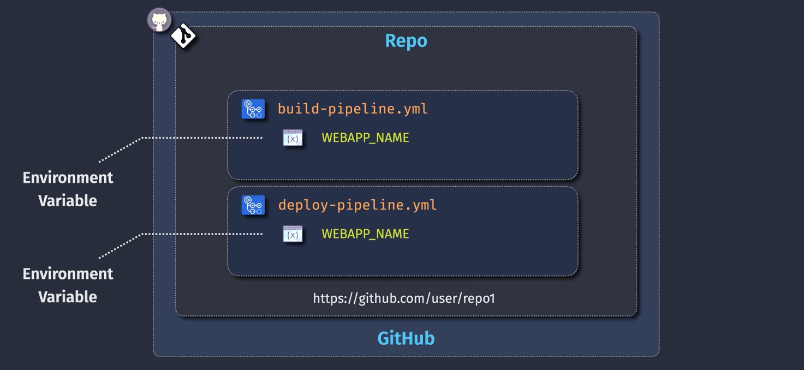
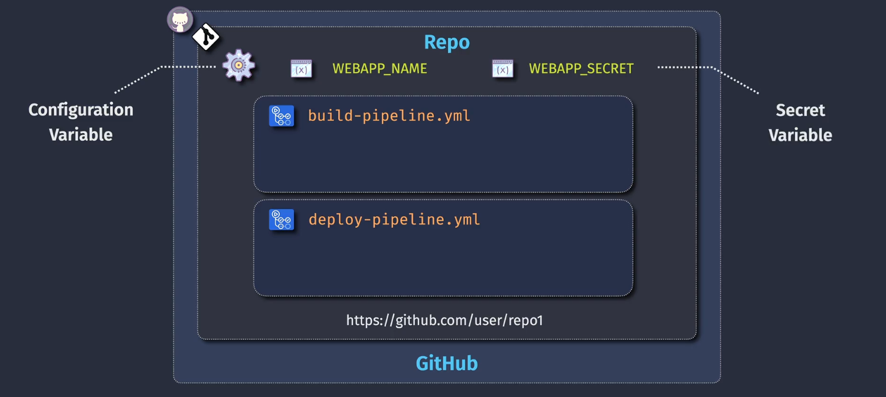

# 🧠 GitHub Actions Variables & Secrets – Part 1: Concepts, Types, and Scopes

> This guide explores **all types of variables and secrets** used in GitHub Actions, their **definition**, **resolution order**, **scopes**, and **secure usage** — essential before jumping into YAML demos.

---

## 📦 What Are Variables in GitHub Actions?

In GitHub Actions, **variables** are named values used to pass data into workflows and steps. They help avoid hardcoding values like app names, environments, or secrets (tokens, keys, passwords).

There are **two major categories**:

| Category     | Subtypes                                                                |
| ------------ | ----------------------------------------------------------------------- |
| 🔧 Variables | - System variables<br>- User-defined<br>- Environment variables         |
| 🔒 Secrets   | - Repository secrets<br>- Organization secrets<br>- Environment secrets |

---

## 🏷️ 1. System Variables (Built-in)

These are automatically provided by GitHub and available in all workflows.

### 🧬 Common Examples:

| Variable Name       | Description                               |
| ------------------- | ----------------------------------------- |
| `GITHUB_WORKFLOW`   | Name of the workflow file                 |
| `GITHUB_ACTION`     | Name of the current action                |
| `GITHUB_REF`        | Branch or tag ref                         |
| `GITHUB_SHA`        | SHA of the commit triggering the workflow |
| `GITHUB_ACTOR`      | Username that triggered the workflow      |
| `GITHUB_REPOSITORY` | Owner/repo name                           |
| `RUNNER_OS`         | The OS of the runner (Windows, Linux...)  |

You don’t define these — they’re injected automatically.

---

## ✍️ 2. User-Defined Variables

These are defined **manually in your workflow YAML** under the `env` or `jobs.<job>.env` or `steps.env` sections.

```yaml
env:
  NODE_ENV: production
  API_URL: https://api.example.com
```

Or inline in jobs/steps:

```yaml
jobs:
  build:
    env:
      FOLDER: "build"
    steps:
      - run: echo "Deploying from $FOLDER"
```

You can reference these using:

- **Bash-style:** `$VAR_NAME`
- **YAML-style:** `${{ env.VAR_NAME }}`

---

## 🌍 3. Environment Variables

Environment variables can be scoped in several ways:

| Scope      | Applies To      | Syntax                    |
| ---------- | --------------- | ------------------------- |
| Global     | All jobs        | `env:` at the root level  |
| Job-level  | A specific job  | `jobs.<job>.env:`         |
| Step-level | A specific step | `jobs.<job>.steps[].env:` |

🟡 These are not _secrets_. If your value must be hidden (e.g., passwords), use `secrets`.

---

## 🛡️ 4. Secrets

Secrets are **sensitive values** like passwords, tokens, keys — securely stored and never exposed in plain text.

GitHub provides **three scopes** of secrets:

### 🔐 a. Repository Secrets

- Defined per repo (`Settings → Secrets and variables → Actions`)
- Available to all workflows in that repo

### 🏢 b. Organization Secrets

- Shared across multiple repos
- Can be **scoped to specific repos**

### 🌳 c. Environment Secrets

- Scoped to **GitHub Environments**
- Often used with **deployment environments** like `dev`, `test`, `prod`
- Can be gated with **approvals**

---

### 🔑 Secret Usage Syntax:

```yaml
jobs:
  deploy:
    steps:
      - name: Use API Key
        run: curl https://api.example.com --header "Authorization: Bearer ${{ secrets.API_KEY }}"
```

🚨 Secrets can only be accessed via `${{ secrets.<name> }}`
❌ They’re not exposed in `env:` directly.

---

## 🧮 5. Variable & Secret Resolution Order

When referencing a variable, GitHub resolves them in this order:

1. **Step-level `env:`**
2. **Job-level `env:`**
3. **Workflow-level `env:`**
4. **System-provided variables**
5. **Secrets (if explicitly referenced)**

---

## 📸 Visual Reference

### 🧪 Environment Variables Panel:

<div align="center">
    
</div>

---

### 🔐 Repository Secrets:

<div align="center">
    
</div>

---

### 🏢 Organization Secrets:

<div align="center">
    
</div>

---

## 🧾 Summary Table

| Type           | Set Where?                        | Accessed As                  | Secret? | Scope             |
| -------------- | --------------------------------- | ---------------------------- | ------- | ----------------- |
| System Vars    | Built-in                          | `${{ github.xxx }}`          | ❌      | All workflows     |
| User Variables | `env:` in workflow/job/step       | `$NAME` or `${{ env.NAME }}` | ❌      | Step/Job/Workflow |
| Repo Secret    | Repo Settings → Actions → Secrets | `${{ secrets.NAME }}`        | ✅      | Whole repo        |
| Org Secret     | Org Settings                      | `${{ secrets.NAME }}`        | ✅      | Multiple repos    |
| Env Secret     | Defined in environment            | `${{ secrets.NAME }}`        | ✅      | Deployment env    |

---

## 🧠 Pro Tips

- Never print secrets using `echo` — they get masked automatically, but it’s still bad practice.
- Use environment secrets for **deployment approval pipelines**.
- Use organization secrets when you have shared CI/CD tokens across repos.
