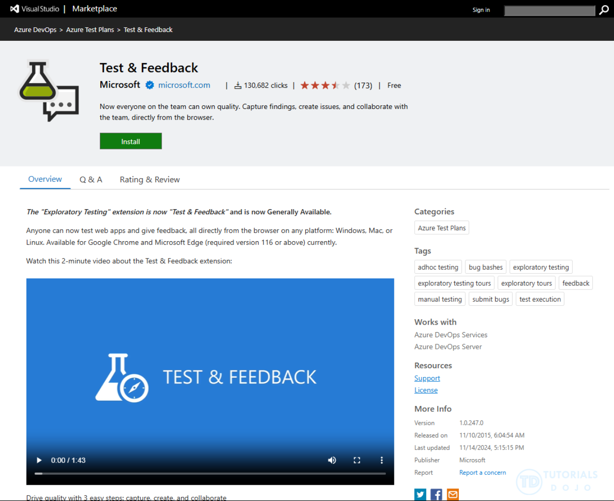

# 🧪 Microsoft Test & Feedback Extension

## 🔹 1. What is it?

- A **browser extension** (for Chrome/Edge).
- Lets testers, product owners, or even business users **report bugs, create test cases, capture feedback** **without leaving the app they’re testing**.
- Integrates directly with **Azure DevOps** (Boards, Test Plans, Work Items).

👉 Think of it as: **“Lightweight testing + feedback tool right inside your browser.”**

---

  

---

## 🔹 2. Why Use It?

- 🚀 Speed up bug reporting (capture screenshots, notes, and system info in one click).
- 🎯 Great for **exploratory testing**.
- 🔄 Connects to Azure DevOps → feedback goes straight into your backlog (as Bugs, Tasks, or Test Cases).
- 👩‍💻 Works for both **signed-in testers** (connected to Azure DevOps project) and **stakeholders** (can submit feedback without license).

---

## 🔹 3. Modes of Use

The extension works in **two modes**:

1. **Connected Mode**

   - Signed in to Azure DevOps project.
   - Bugs & test cases go directly into your project Boards/Backlog.
   - Example: QA team testing Sprint 5 features in staging.

2. **Standalone Mode**

   - Not connected to Azure DevOps.
   - Captures screenshots, notes, recording.
   - Useful when customer/stakeholder just wants to give feedback, later export to DevOps.

---

## 🔹 4. Key Features

| Feature                  | What it Does                                          | Example                     |
| ------------------------ | ----------------------------------------------------- | --------------------------- |
| 📸 Screenshot & Annotate | Capture page and highlight issues                     | Circle broken UI button     |
| 🎥 Screen Recording      | Record steps before a bug                             | Show repro steps for crash  |
| 📝 Notes                 | Add text feedback while testing                       | “Search takes 5s to load”   |
| 🐞 Create Bug            | Files bug in Azure Boards with repro info             | Bug auto-links to Test Case |
| ✅ Create Test Case      | Convert exploratory session into structured Test Case | “Login → Search → Checkout” |
| ⚙️ System Info           | Captures browser/OS details                           | “Chrome 127, Windows 11”    |

---

## 🔹 5. Real Example

You’re testing **E-Shop Checkout Flow** in staging:

1. Open E-Shop in browser.
2. Launch **Test & Feedback extension**.
3. Hit **Start Session**.
4. Click through “Add to Cart → Checkout → PayPal Payment.”
5. Notice bug: “PayPal button not clickable.”
6. Take screenshot, annotate it.
7. Click **Create Bug** → fills:

   - Title: “PayPal button not clickable”
   - Screenshot attached
   - Browser info auto-captured

8. Bug auto-created in Azure Boards under Sprint 5.

👉 No need to switch to DevOps manually — all context is captured.

---

## 🔹 6. Hands-On in Azure DevOps

- Install extension from \[Chrome Web Store / Edge Add-ons].
- In Azure DevOps → **Test Plans → Exploratory Testing**.
- Start session → run tests → log bugs.
- Work items created are traceable (links Test Case ↔ Bug).

---

## 🔹 7. Who Uses It?

- **Testers** → Exploratory + manual testing.
- **Developers** → Reproduce bugs quickly with recordings.
- **Business users** → Provide UAT feedback easily.
- **Product Owners** → Validate stories without writing formal test plans.

---

## ✅ TL;DR

- Microsoft Test & Feedback = **browser extension** for quick bug reporting & exploratory testing.
- Works in **connected mode** (Azure DevOps) or **standalone mode**.
- Captures **screenshots, recordings, notes, system info**.
- Creates **Bugs / Test Cases** directly in Azure DevOps Boards.
- Best for **fast feedback loops** in Agile/DevOps teams.

---

⚡ Exam Tip:
If you see a question like → _“Which tool allows testers and stakeholders to capture screenshots, record sessions, and file bugs directly into Azure DevOps without extra licensing?”_ → Answer = **Microsoft Test & Feedback Extension** ✅.

---

## 📚 References:

- <https://learn.microsoft.com/en-us/azure/devops/test/perform-exploratory-tests?view=azure-devops>
- <https://learn.microsoft.com/en-us/azure/devops/test/provide-stakeholder-feedback?view=azure-devops>
