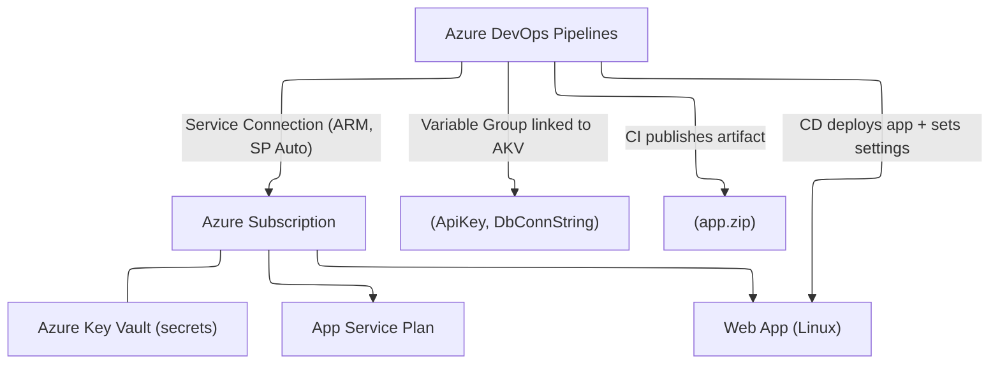

# 🚀 Project: Azure Pipelines + AKV + Service Connection + Variable Group

## 🗂 Repo Layout

```ini
/app
  package.json
  server.js
/infra
  main.bicep
azure-pipelines-ci.yml
azure-pipelines-cd.yml
README.md  (this page)
```

---

## 🧭 What You’ll Deploy

- **App Service Plan** (Linux)
- **Web App** (Linux, Node 18 as example)
- **System-assigned Managed Identity** on the Web App (future-proof for KV references)
- **Your app** (simple Node.js displaying values from environment)



---

## ✅ Prerequisites

- Azure subscription (Owner/Contributor on target **Resource Group**).
- Azure DevOps project (permission to create **Service connections**, **Variable groups**).
- You can run `az` (Azure CLI) locally if you want to test commands.

---

## 🧱 One-Time Setup (Portal + DevOps)

> These steps are done **once** before running pipelines.

### 1) Resource Group (recommended)

Create (or pick) a resource group, e.g. `rg-demo-app-prod` in `eastus`.

### 2) Key Vault + Secrets

Create a **Key Vault** (e.g., `kv-demo-prod`) and add secrets:

- `ApiKey` = `prod-123`
- `DbConnString` = your real connection string

> If your Key Vault uses **RBAC**, the DevOps service connection’s SP must have **Key Vault Secrets User** on the vault scope. If it uses **Access Policies**, grant **Get** on secrets.

### 3) Azure DevOps **Service Connection** (Azure RM, SP **Automatic**)

- DevOps → **Project Settings → Service connections → New → Azure Resource Manager**
- Choose **Service principal (automatic)**
- Select your subscription, scope it to **Resource Group** if possible
- Name it: **`sc-azure-auto`**
- Allow access to all pipelines (or restrict to specific ones)

### 4) **Variable Group** linked to Key Vault

- DevOps → **Pipelines → Library → Variable groups → New variable group**
- Name: **`vg-prod`**
- **Link secrets from an Azure Key Vault** → choose your subscription → `kv-demo-prod` → **Authorize**
- Add secrets to include: `ApiKey`, `DbConnString`
- Add **non-secrets** too (plain variables in same group):

  - `resourceGroup = rg-demo-app-prod`
  - `location = eastus`
  - `webAppName = web-demo-prod`
  - `appServicePlan = asp-demo-prod`
  - `keyVaultName = kv-demo-prod`

- Save

> Now pipelines can use **`$(ApiKey)`** and **`$(DbConnString)`** directly — no extra fetch stage needed.

---

## 📁 Files (copy/paste)

### /app/package.json

```json
{
  "name": "kv-sc-vg-demo",
  "version": "1.0.0",
  "private": true,
  "main": "server.js",
  "scripts": {
    "start": "node server.js",
    "build": "echo \"(no build step for demo)\"",
    "test": "echo \"(no tests for demo)\""
  },
  "dependencies": {
    "express": "^4.19.2"
  }
}
```

### /app/server.js

```js
const express = require("express");
const app = express();

const port = process.env.PORT || 8080;
const apiKey = process.env.ApiKey || "(missing ApiKey)";
const db = process.env["ConnectionStrings__Default"] || "(missing DbConnString)";

app.get("/", (_req, res) => {
  res.type("text/plain").send(
    `Hello from Web App 🎉

Env:
  ApiKey: ${apiKey}
  ConnectionStrings__Default: ${db.substring(0, Math.min(db.length, 60))}...`
  );
});

app.listen(port, () => console.log(`Listening on ${port}`));
```

### /infra/main.bicep

```bicep
param location string
param appServicePlan string
param webAppName string
param keyVaultName string  // For future: KV references / RBAC bindings

resource plan 'Microsoft.Web/serverfarms@2023-12-01' = {
  name: appServicePlan
  location: location
  sku: {
    name: 'P1v3'
    tier: 'PremiumV3'
    size: 'P1v3'
    capacity: 1
  }
}

resource web 'Microsoft.Web/sites@2023-12-01' = {
  name: webAppName
  location: location
  identity: {
    type: 'SystemAssigned'  // future-proof: allow KV references later
  }
  properties: {
    httpsOnly: true
    serverFarmId: plan.id
    siteConfig: {
      linuxFxVersion: 'NODE|18-lts'
    }
  }
}

// NOTE: We assume Key Vault already exists so Variable Group can pull secrets
// If you prefer to create KV here, you must create VG after first infra run.
```

### azure-pipelines-ci.yml (CI: build & publish)

```yaml
trigger:
  - main

pool:
  vmImage: ubuntu-latest

variables:
  - group: vg-prod # brings in AKV secrets + non-secrets (we only need non-secrets here)

stages:
  - stage: CI
    displayName: "Build & Publish"
    jobs:
      - job: Build
        steps:
          - checkout: self

          - task: NodeTool@0
            inputs:
              versionSpec: "18.x"

          - script: |
              cd app
              npm ci
              npm test --if-present
              npm run build --if-present
            displayName: "Build"

          - script: |
              mkdir -p $(Build.ArtifactStagingDirectory)/drop
              cd app
              zip -r $(Build.ArtifactStagingDirectory)/drop/app.zip .
            displayName: "Package"

          - task: PublishBuildArtifacts@1
            inputs:
              pathToPublish: "$(Build.ArtifactStagingDirectory)/drop"
              artifactName: "webapp"
              publishLocation: "Container"
```

### azure-pipelines-cd.yml (CD: infra + deploy)

```yaml
pr: none
trigger: none

pool:
  vmImage: ubuntu-latest

variables:
  - group: vg-prod # AKV-linked secrets + non-secrets
  - name: azureServiceConnection
    value: sc-azure-auto # ARM service connection (SP Automatic)

stages:
  - stage: Infra
    displayName: "Deploy Infra (Bicep)"
    jobs:
      - job: DeployInfra
        steps:
          - checkout: self
          - task: AzureCLI@2
            displayName: "Deploy Bicep"
            inputs:
              azureSubscription: $(azureServiceConnection)
              scriptType: bash
              scriptLocation: inlineScript
              inlineScript: |
                az deployment group create \
                  --resource-group "$(resourceGroup)" \
                  --template-file "infra/main.bicep" \
                  --parameters location="$(location)" \
                               webAppName="$(webAppName)" \
                               appServicePlan="$(appServicePlan)" \
                               keyVaultName="$(keyVaultName)"

  - stage: Deploy
    displayName: "Deploy App"
    dependsOn: Infra
    jobs:
      - job: WebDeploy
        steps:
          - download: current
            artifact: webapp

          - task: AzureCLI@2
            displayName: "Deploy ZIP to Web App + Apply Settings"
            inputs:
              azureSubscription: $(azureServiceConnection)
              scriptType: bash
              scriptLocation: inlineScript
              inlineScript: |
                # 1) Deploy app package
                az webapp deploy \
                  --name "$(webAppName)" \
                  --resource-group "$(resourceGroup)" \
                  --src-path "$(Pipeline.Workspace)/webapp/app.zip" \
                  --type zip

                # 2) Apply secrets as app settings (coming from VG linked to AKV)
                az webapp config appsettings set \
                  --name "$(webAppName)" \
                  --resource-group "$(resourceGroup)" \
                  --settings \
                    ApiKey=$(ApiKey) \
                    ConnectionStrings__Default=$(DbConnString)
```

---

## 🧪 Runbook

1. **Push** the repo (with the files above) to your DevOps project.
2. Create **CI** pipeline from `azure-pipelines-ci.yml`. Run it → expect **artifact `webapp/app.zip`**.
3. Create **CD** pipeline from `azure-pipelines-cd.yml`.

   - Start it manually (first time).
   - **Infra** creates/updates plan + web app.
   - **Deploy** pushes app and sets app settings from **AKV via Variable Group**.

4. Open your **Web App URL** (e.g., `https://web-demo-prod.azurewebsites.net`) → you should see the env values printed.

---

## 🔐 Security & Design Notes

- **Service Connection** (Azure RM, SP **Automatic**) stores creds securely and logs in for you → no secrets in YAML.
- **Variable Group linked to AKV** pulls **secrets at runtime** (ApiKey, DbConnString). No need for `AzureKeyVault@2`.
- **Least privilege**: scope service connection to **Resource Group**.
- **Rotation**: rotate secrets in **Key Vault**; pipelines pick up new values automatically.
- **Masking**: secret variables are masked in logs by DevOps.
- **Future-proof**: Web App has **Managed Identity** — you can switch to **Key Vault References** later (no secrets copied into app settings).

> **Optional (KV References)**:
> If you prefer not to set app settings from the pipeline, enable Web App’s Managed Identity and set:
>
> ```ini
> ApiKey = @Microsoft.KeyVault(SecretUri=https://kv-demo-prod.vault.azure.net/secrets/ApiKey/<versionGuid>)
> ConnectionStrings__Default = @Microsoft.KeyVault(SecretUri=https://kv-demo-prod.vault.azure.net/secrets/DbConnString/<versionGuid>)
> ```
>
> Grant Web App’s **system-assigned** identity the **Key Vault Secrets User** role on the vault.

---

## 🛠 Troubleshooting

- **CD fails to read variables**: confirm **Variable Group** is **authorized** for the pipeline and actually **linked to Key Vault** (with the same secret names).
- **RBAC/permissions errors**: ensure `sc-azure-auto` has role at **RG** scope and you waited a few minutes for propagation.
- **Key Vault authorization**: when linking the variable group, the UI must be **Authorized**; if RBAC, grant **Key Vault Secrets User** to the DevOps SP on the KV.
- **Web app not starting**: check **App Service → Log stream** and **Container settings**; `PORT` set by App Service, Node listens on `process.env.PORT`.

---

## 🧰 Variations

- **.NET app**: replace `/app` with a .NET publish step; zip the publish folder.
- **Multiple environments**: create `vg-dev`, `vg-test`, `vg-prod`; parametrize the CD with `- group: vg-$(env)` or use multi-stage with approvals.
- **Bicep adds KV**: if you want Bicep to create Key Vault, run **Infra once** to create it, **then** link the Variable Group to that new vault.

---

## 🏁 TL;DR

- **CI** builds and publishes `app.zip`.
- **CD** uses **Service Connection** to deploy infra + app.
- **Secrets** come from **AKV via Variable Group** (no extra fetch stage).
- Clean, secure, repeatable — and easy to extend.
