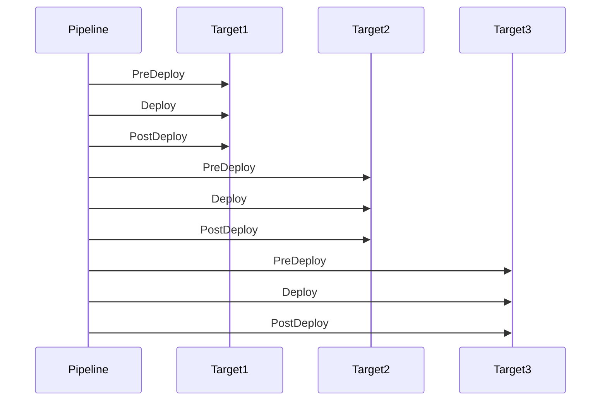

# 🔁 Azure DevOps Deployment Strategy: `rolling`

The **Rolling Strategy** deploys your application **in batches or slices** (like servers, pods, targets) **one at a time or in groups**, minimizing risk and allowing safer rollouts.

---

## 📘 Official Definition

> The `rolling` strategy divides deployment targets (VMs, containers, slots, etc.) into batches and deploys to them **sequentially**, one batch at a time. It allows monitoring, validation, and rollback for each batch before proceeding.

---

## 🎯 When to Use It

✅ Multi-instance environments (like VMs or App Service slots)
✅ You want **controlled, gradual rollout**
✅ Want to reduce blast radius if a deployment fails
✅ Need **batch-by-batch rollback** support
✅ Have SLA requirements for **zero downtime deployments**

---

## 🧱 Basic Structure of `rolling`

```yaml
jobs:
  - deployment: DeployRolling
    environment: "prod-env"
    strategy:
      rolling:
        maxParallel: 2 # Max number of targets deployed at once
        preDeploy:
          steps:
            - script: echo "🔍 Pre-deployment checks"
        deploy:
          steps:
            - script: echo "🚀 Deploying to $(deployment.targetName)"
        postDeploy:
          steps:
            - script: echo "✅ Post-deploy validation"
```

---

## 🧠 Key Properties

| Property      | Description                                      |
| ------------- | ------------------------------------------------ |
| `maxParallel` | How many targets to deploy **in parallel**       |
| `preDeploy`   | Optional logic **before each batch**             |
| `deploy`      | Main deployment logic (runs per target or batch) |
| `postDeploy`  | Logic after deployment (e.g. validate batch)     |
| `on.failure`  | Rollback for failed batches                      |

---

## 🖼️ Mermaid Diagram – Rolling Strategy



---

## 🧪 Real Example: Rolling Deployment to App Services

Let’s say you have 3 Azure App Service **slots** (`slot1`, `slot2`, `slot3`) and want to deploy gradually.

### 👇 YAML

```yaml
jobs:
  - deployment: RollingWebDeploy
    displayName: "🔁 Rolling Deploy to Slots"
    environment:
      name: "prod-env"
      resourceType: VirtualMachine # or generic
    strategy:
      rolling:
        maxParallel: 1
        preDeploy:
          steps:
            - script: echo "🧪 Pre-check for $(deployment.targetName)"
        deploy:
          steps:
            - task: AzureCLI@2
              displayName: "🚀 Deploy to $(deployment.targetName)"
              inputs:
                azureSubscription: "MyAzureSub"
                scriptType: bash
                scriptLocation: inlineScript
                inlineScript: |
                  az webapp deployment source config-zip \
                    --name myapp \
                    --slot $(deployment.targetName) \
                    --resource-group my-rg \
                    --src $(Pipeline.Workspace)/app.zip
        postDeploy:
          steps:
            - script: echo "✅ Validated $(deployment.targetName)"
```

> The value of `$(deployment.targetName)` is injected from the **target list**, usually VMs or deployment targets configured in the environment.

---

## 🧯 Add Rollback to Rolling Strategy

```yaml
on:
  failure:
    steps:
      - script: echo "🧯 Rollback on $(deployment.targetName)"
```

> This runs **per failed target**, not globally.

---

## 💡 Pro Tips

| Tip                                                                   | Reason |
| --------------------------------------------------------------------- | ------ |
| Use `maxParallel: 1` for safer, slower rollout                        |        |
| Validate each batch with `postDeploy`                                 |        |
| Add `on.failure` to rollback failing target                           |        |
| Combine with **approvals + checks** for maximum control               |        |
| Great with **App Service slots**, **VMs**, or **multi-node clusters** |        |

---

## 📌 Summary Table

| Feature           | Value                                                |
| ----------------- | ---------------------------------------------------- |
| Risk Level        | ✅ Low (partial rollout)                             |
| Use for           | Multi-target environments                            |
| Supports rollback | ✅ Yes (per target)                                  |
| Pre/Post hooks    | ✅ Yes                                               |
| Approvals         | ✅ Yes via `environment:`                            |
| Zero downtime     | ✅ Yes (when used with slots or load-balanced infra) |

---

## 🌐 Related: What Are “Targets”?

- In `rolling` strategy, your environment must define **multiple deployment targets**
- Targets can be:

  - VMs in a deployment group
  - Azure Arc machines
  - Kubernetes nodes (via multi-agent pools)
  - App Service slots or resources
