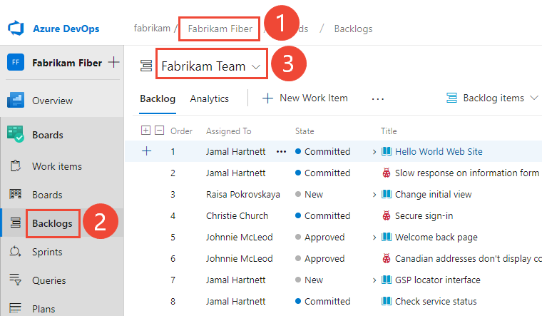
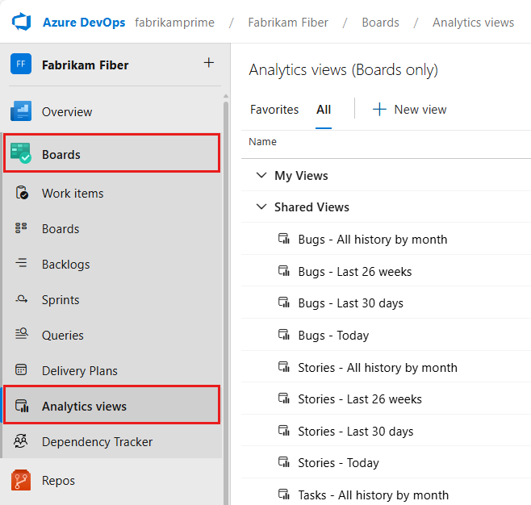
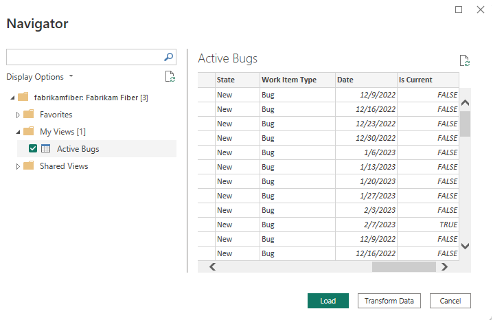

# 🗂️ Azure DevOps Boards – The Engine of Agile 🚦

_Azure Boards is an **agile work tracking tool** inside Azure DevOps for **planning, tracking, and discussing work** across teams._

---

> 📖 **Official Definition**:  
> Azure Boards is a web-based service that enables teams to plan, track, and discuss work across the entire development process, while it supports agile methodologies. Azure Boards provides a customizable platform for managing work items, allowing teams to collaborate effectively and streamline their workflow.

It’s like **Jira**, but native to Azure DevOps — perfect if you’re already using Azure Repos, Pipelines, or Test Plans.

---

## 🧩 **Azure Boards Features**

You can track and manage work and access various functions within each of the following hubs.

| **Azure Boards Feature** | **Function / Description**                                                                                                                                                                                                                                    |
| ------------------------ | ------------------------------------------------------------------------------------------------------------------------------------------------------------------------------------------------------------------------------------------------------------- |
| **📰 Work Items**        | Access lists of work items based on criteria like assigned to you, followed items, or ones you viewed/updated.                                                                                                                                                |
| **📊 Boards**            | View work items as cards and update their status through drag-and-drop, similar to physical sticky notes on a whiteboard. Use this feature to implement Kanban practices and visualize work flow for a team.                                                  |
| **📦 Backlogs**          | Plan, order, and organize work items. Use product backlogs for projects and portfolio backlogs for grouping under features/epics.                                                                                                                             |
| **📅 Sprints**           | Access your team's filtered view of work items based on a specific sprint or iteration path. Assign work to a sprint by using drag-and-drop from the backlog. implement Scrum practices by interacting with a backlog list or card-based Taskboard.practices. |
| **🔍 Queries**           | Generate custom work item lists and perform various tasks, such as triage work, make bulk updates, and view relationships between work items. Queries also allow for creating status and trend charts that can be added to dashboards.                        |
| **📅 Delivery Plans**    | Calendar view of work items across teams and sprints. Aligns up to 15 team backlogs and shows dependencies.                                                                                                                                                   |
| **🧪 Analytics Views**   | Create highly sophisticated Power BI reports, based on Azure Boards data (work items). Access default Analytics views or create a custom view.                                                                                                                |

---

  

---

### 📰 1. **Work Items** = Building Blocks

Everything starts with **Work Items**.

- A Work Item = a digital record of something that must be tracked.
- Types depend on the **Process** (Basic, Agile, Scrum, CMMI):

  - **Agile** → Epic, Feature, User Story, Task, Bug
  - **Scrum** → Epic, Feature, Product Backlog Item (PBI), Task, Bug
  - **Basic** → Epic, Issue, Task
  - **CMMI** → Epic, Requirement, Change Request, Task

📌 Each Work Item has:

- **Title/Description** → what needs to be done
- **State** → where it is (To Do, Doing, Done, etc.)
- **Priority** → how important
- **Assigned To** → who owns it
- **Links** → parent/child relationships

👉 Think of Work Items as **cards in your system** — everything else organizes and reports on them.

---

### 📦 **2. Backlogs** – Planning Future Work

- Backlogs = **prioritized lists of work items**, arranged by level:

  - Epic backlog → big initiatives
  - Feature backlog → mid-sized chunks
  - Story/PBI backlog → team-level work

- Purpose = **planning & prioritization**

📌 Example:

- Epic: _Checkout System_
- Feature: _Payment Gateway_
- User Story/PBI: _As a user, I want to pay with credit card_

👉 **Backlog = master product to-do list**.

---

### 📊 **3. Boards** – Visualizing Progress

- Boards = **Kanban view of work items**.
- Columns = states (To Do → Doing → Done).
- Cards = Work Items (Story, Task, Bug, etc.).
- Used for **daily tracking**.

📌 Example:

- Card: “Add to cart” → dragged from Doing → Done.

👉 **Board = visual workflow for the team**.

---

### 🕒 **4. Sprints** – Time-Boxing Work

- Sprint = **time-boxed iteration (2–4 weeks)**.
- Sprint Backlog = subset of backlog items chosen for this sprint.
- Tools inside Sprints:

  - **Capacity Planning** → set availability per member.
  - **Burndown Chart** → tracks progress over sprint.
  - **Task Board** → sprint-focused Kanban.

📌 Example:

- Sprint 1 Goal = “Browsing & Cart features.”
- Items = P1 (Product List), P2 (Product Details), P3 (Add to Cart).

👉 **Sprint = mini project with a deadline.**

---

### 🔍 **5. Queries** – Reporting on Work Items

- Queries = **filters to slice work items**.
- Types: Flat list, Tree, Direct links.
- Queries can be turned into charts or widgets.

📌 Example:

- Query: _All bugs assigned to Ahmed in Sprint 2_.
- Query: _All PBIs tagged as “High Priority.”_

👉 **Query = Excel filter saved in DevOps.**

---

### 📅 **6. Delivery Plans** – Multi-Team Roadmaps

- Delivery Plans = **timeline view of work items** across teams/projects.
- Purpose: Align releases, track dependencies.
- Visual like a **Gantt chart**.

📌 Example:

- Team A → Feature: Product Catalog (Sprint 3)
- Team B → Feature: Payment Gateway (Sprint 4)
- Delivery Plan shows both on timeline.

👉 **Delivery Plan = big-picture roadmap view.**

---

### 📈 **7. Analytics Views** – Custom Data for Reporting

- Analytics Views = curated datasets of Work Items for **custom reporting**.
- Used with **Power BI or Excel**.
- Good for advanced metrics beyond built-in charts.

📌 Example:

- Analytics View: _All completed PBIs last 90 days with Story Points_ → feed into velocity trend report.

👉 **Analytics View = raw data → custom reports.**

---

## 🖼️ **Azure Boards Features UI**

### 📰 **1. Work Items**

  

  

- **✅ What actions you can do here**:
  - Create new work items (e.g., bug, task, user story)
  - Assign items to yourself or others
  - Add tags, comments, attachments
  - Link items to epics, features, or other work items
  - Track history and updates

---

### 📊 **2. Boards**

  

  

- **✅ What actions you can do here**:
  - Drag cards between columns (e.g., To Do → Doing → Done)
  - Customize columns and swimlanes
  - Filter by team member, tag, or work item type
  - Update status directly from the board
  - Add new work items inline

---

### 📦 **3. Backlogs**

  

  

- **✅ What actions you can do here**:
  - Reorder items by priority
  - Break down epics into features and stories
  - Assign items to sprints or iterations
  - View roll-up progress across levels
  - Estimate effort (story points, time)

---

### 📅 **4. Sprints**

  

  

- **✅ What actions you can do here**:
  - Assign work items to a sprint
  - View sprint backlog and taskboard
  - Track progress with burndown charts
  - Set capacity per team member
  - Conduct sprint planning and review

---

### 🔍 **5. Queries**

  

  

- **✅ What actions you can do here**:
  - Build flat or hierarchical queries
  - Filter by state, tags, area path, or custom fields
  - Save and share queries with your team
  - Export results or pin to dashboards
  - Use queries for bulk edits or triage

---

### 📅 **6. Delivery Plans**

  

  

- **✅ What actions you can do here**:
  - Add multiple team backlogs (up to 15)
  - Visualize work items across iterations
  - Identify and manage cross-team dependencies
  - Update work items directly from the plan
  - Filter by team, area path, or work item type

---

### 🧪 **7. Analytics Views**

  

 

  

  

- **✅ What actions you can do here**:
  - Access default views (e.g., work item trends, velocity)
  - Create custom views with filters and joins
  - Connect to Power BI for advanced reporting
  - Build dashboards for leadership or SLA tracking
  - Analyze historical data for retrospectives

## 🔄 **How They All Fit Together**

- **Work Items** = foundation (everything is a work item).
- **Backlogs** = plan/prioritize all work items.
- **Sprints** = choose subset for short-term delivery.
- **Boards** = track items visually during execution.
- **Queries** = slice/filter work items.
- **Delivery Plans** = roadmap view across teams.
- **Analytics Views** = data extraction for reporting.

---
