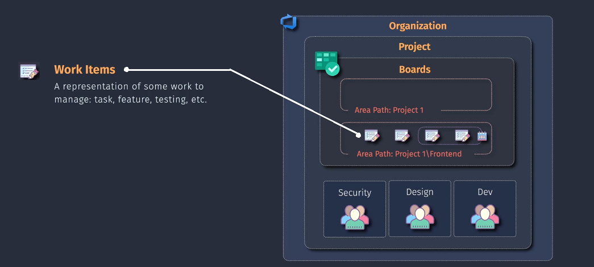
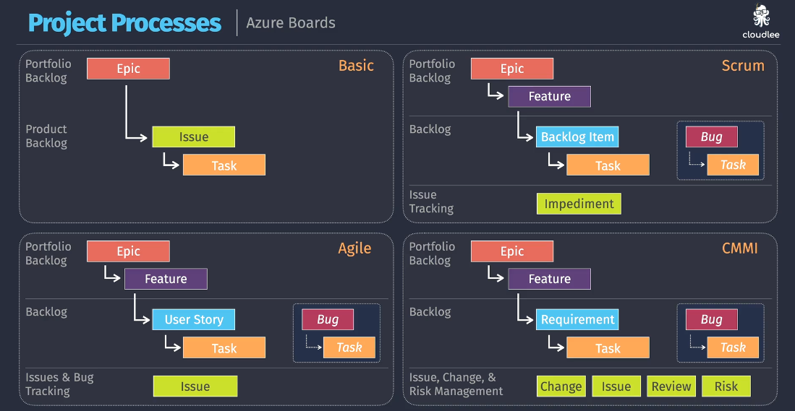

# 🔖 Azure DevOps Work Items

> "A work item is like a sticky note on whiteboard — it tracks everything your team wants to build, fix, discuss, or remember."

---

## 🧩 What Is a Work Item?

A **work item** in Azure DevOps is a **single unit of work** used to:

- 📌 Track features, bugs, or tasks
- ⛓️ Connect code to deployments
- ✅ Manage planning & progress
- 💬 Collaborate via comments, attachments, state transitions

> Think of it like a **Jira ticket** or a **GitHub issue** — but with richer integrations into your builds, code, and pipelines.

---

  

---

## 🧠 Key Components of a Work Item

| Property               | Description                                    |
| ---------------------- | ---------------------------------------------- |
| 🏷️ Title               | Brief name for the task                        |
| 🧾 Description         | What needs to be done and why                  |
| 👤 Assigned To         | Who’s responsible                              |
| 🧭 State               | New → Active → Resolved → Closed               |
| 🕓 Priority / Severity | Business urgency                               |
| 🔗 Links               | Related work items, PRs, commits               |
| 🏷️ Tags                | Label for easy filtering                       |
| 📎 Attachments         | Diagrams, screenshots, logs                    |
| 🧪 Custom Fields       | Estimation, customer impact, environment, etc. |

---

## 📊 Work Item Processes in Azure DevOps

When you create a new **Azure DevOps Project**, you must pick a **Process**.
👉 This choice defines:

- The **types of work items** available (User Story, PBI, Requirement, etc.).
- The **workflow states** (New → Active → Resolved → Closed, etc.).
- The **hierarchy** (Epic → Feature → Story → Task).

Think of a Process as the **vocabulary + rules** your team will use to track work.

---

  

**1️⃣** Agile
**2️⃣** Basic
**4️⃣** CMMI
**4️⃣** Scrum

---

## 🟢 1. **Basic Process** (Super Simple)

- **Work items:**

  - Epics → Issues → Tasks

- **States:** To Do → Doing → Done
- Best for **small teams/new to Agile**.
- Simplest process, no complex hierarchy.

📌 _Example:_

- Epic: “Checkout System”
- Issue: “Implement cart”
- Task: “Create cart API”

👉 Easy, but **too simple for large Agile teams**.

---

## 🟡 2. **Agile Process** (Agile Manifesto-Oriented)

- **Work items:**

  - Epic → Feature → User Story → Task (plus Bugs)

- **States:** New → Active → Resolved → Closed
- Best for **teams using Agile principles** (but not strict Scrum).

📌 _Example:_

- Epic: “Shopping Experience”
- Feature: “Product Catalog”
- User Story: “As a user, I want to view product details.”
- Task: “Build product details API”

👉 **Most popular choice** for teams practicing **Agile + Kanban**.

---

## 🔵 3. **Scrum Process** (Time-Boxed Sprints)

- **Work items:**

  - Epic → Feature → PBI (Product Backlog Item) → Task (plus Bugs)

- **States:** New → Approved → Committed → Done
- Terminology matches **Scrum framework**.
- Best for teams running **formal Scrum (sprints, reviews, retros)**.

📌 _Example:_

- Epic: “Checkout System”
- Feature: “Payment Integration”
- PBI: “Enable credit card checkout”
- Task: “Connect to payment gateway”

👉 **Key difference** → instead of “User Story,” you see **PBI**.

---

## 🟣 4. **CMMI Process** (Enterprise / Heavy Governance)

- **CMMI = Capability Maturity Model Integration** → governance-heavy.
- **Work items:**

  - Epic → Requirement → Task → Change Request, Review, Issue, etc.

- **States:** Proposed → Active → Resolved → Closed
- Designed for **large organizations** with strict compliance & documentation needs.

📌 _Example:_

- Epic: “Checkout System”
- Requirement: “System must support PCI DSS compliance.”
- Change Request: “Update encryption algorithm.”
- Task: “Modify payment service.”

👉 Rarely used for small teams → exam trick: **CMMI = heavy documentation**.

---

## 📊 Comparison Table (Exam Cheat Sheet)

| Process   | Hierarchy                                            | Naming            | States                                | Best For                    |
| --------- | ---------------------------------------------------- | ----------------- | ------------------------------------- | --------------------------- |
| **Basic** | Epic → Issue → Task                                  | Simple names      | To Do → Doing → Done                  | Small/simple teams          |
| **Agile** | Epic → Feature → User Story → Task                   | Agile naming      | New → Active → Resolved → Closed      | Most Agile teams            |
| **Scrum** | Epic → Feature → PBI → Task                          | Scrum naming      | New → Approved → Committed → Done     | Scrum teams (sprints)       |
| **CMMI**  | Epic → Requirement → Task (+ Change Request, Review) | Governance naming | Proposed → Active → Resolved → Closed | Enterprise/compliance-heavy |

---

📊 **Visual from your image**:

  

---

## 🔁 Common Workflows

| Task              | Work Item Flow                       |
| ----------------- | ------------------------------------ |
| Feature Request   | Epic → Feature → User Story → Task   |
| Bug Fix           | Bug → Task → Pull Request            |
| Incident Response | Issue → Assign DevOps → Close on Fix |
| Release Planning  | Epic → Iterations → Feature delivery |

---

## 👥 Work Items + Teams

- Each **Team** works within a **project**, but can have:

  - Their own **Area Path**
  - Their own **Iterations**
  - Their own **Boards and Backlogs**

So teams like Security, Design, and Dev (as shown in your image) can **track separately but stay connected** under the same project umbrella. 🌂

---

## 🗺️ Work Item Paths (Hierarchy + Scoping)

### 1. **Area Path**

> “Where does this work item belong organizationally?”

- Define _teams, components, features_
  `e.g., Project1\Frontend`, `Project1\Security`

### 2. **Iteration Path**

> “When is this work item planned for?”

- Define _sprints, releases, quarters_
  `e.g., Sprint 1`, `Q3 Milestone`, `Release 2.0`

📌 You can **filter boards, backlogs, charts** using Area and Iteration Paths.

---

## 🔗 Work Item Linking

> You can link items for traceability, dependencies, and reporting.

| Link Type                        | Meaning                           |
| -------------------------------- | --------------------------------- |
| 🔗 **Parent/Child**              | Builds hierarchy                  |
| 🧩 **Related**                   | Not dependent, but connected      |
| 🧱 **Predecessor/Successor**     | One depends on the other          |
| ⛓️ **Associated Changeset / PR** | Tracks what code fixed what issue |

---

## 🧪 Example of Work Item

Let’s say you’re an **SRE** handling a postmortem:

1. **Epic** → Improve Incident Response Process
2. **Feature** → Add Alerting for Frontend Latency
3. **User Story** → Add Prometheus rule
4. **Task** → Create alert config
5. **Bug** → Alert not firing due to label mismatch

You link all these together, assign them to people, update states as work progresses, and track them in Boards or Dashboards 📈

---

## ✅ Summary

| Feature            | Value                                                 |
| ------------------ | ----------------------------------------------------- |
| 📦 Definition      | Atomic unit of work (task, bug, story, feature, etc.) |
| 🔗 Relationships   | Link to commits, PRs, test cases, builds              |
| 📊 Supports        | Agile, Scrum, CMMI, Basic                             |
| 🧱 Hierarchy       | Epic → Feature → Story/Task/Bug                       |
| 🧭 Scoped by       | Area Paths (who), Iteration Paths (when)              |
| 👥 Used By         | Devs, PMs, QA, DevOps, SREs, Design teams             |
| 🔄 Integrated With | Azure Repos, Pipelines, Test Plans, GitHub            |
