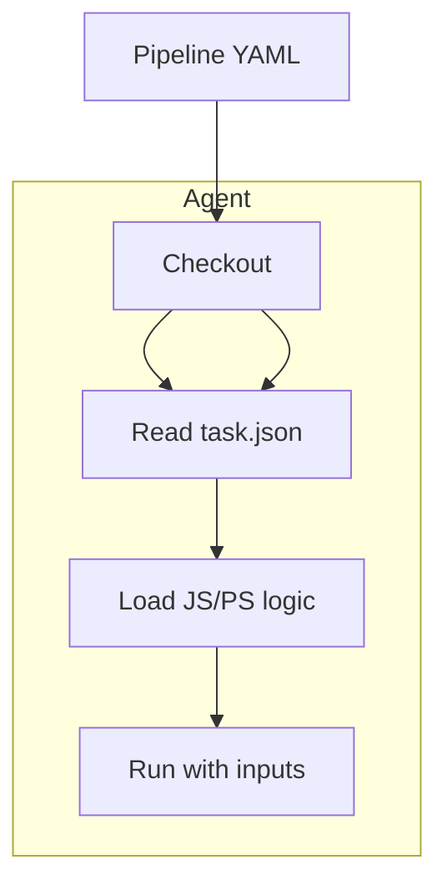

# 🧩 Azure Pipeline `steps`

In Azure Pipelines (YAML), the **`steps`** section defines **a sequence of actions** to execute in a **job**. These steps are executed one by one on the assigned agent (VM).

## 🛠️ Types of Steps

| Type     | Example usage                | What it does                        |
| -------- | ---------------------------- | ----------------------------------- |
| `script` | Runs inline shell/PowerShell | Executes raw commands on the agent  |
| `task`   | Runs predefined logic        | Uses reusable, versioned task logic |

---

## 🔍 Example

```yaml
steps:
  - checkout: self

  - task: UseDotNet@2
    inputs:
      packageType: "sdk"
      version: "7.0.x"

  - script: dotnet build MyApp.sln
    displayName: "Build the project"

  - task: PublishPipelineArtifact@1
    inputs:
      targetPath: "$(Build.ArtifactStagingDirectory)"
      artifact: "drop"
```

---

## 🧠 Inside the `task` Step

> A `task` is a **reusable unit of logic** written in **Node.js**, **PowerShell**, **TypeScript**, or even **containerized scripts**.

### 💡 How Azure Finds a Task

When you write:

```yaml
- task: UseDotNet@2
```

Azure DevOps:

1. Finds `UseDotNet` in the [Marketplace](https://marketplace.visualstudio.com/azuredevops).
2. Downloads the v2 version.
3. Parses its `task.json` file.
4. Executes its `index.js` or `main.ps1` with inputs you pass.

---

## 📦 Anatomy of a Task (under the hood)

Every task is packaged as a folder with:

```ini
UseDotNet/
├── task.json        👈 Metadata (name, inputs, author, etc.)
├── icon.png         🎨 Optional branding
├── node_modules/    📦 Dependencies (if Node)
├── main.js          📜 Main logic (JS/TS)
└── ps_modules/      📁 Optional PowerShell modules
```

### 🔧 `task.json` – The brain

```json
{
  "id": "abc123-...",
  "name": "UseDotNet",
  "friendlyName": "Use .NET SDK",
  "inputs": {
    "version": {
      "type": "string",
      "required": true,
      "defaultValue": "6.0.x"
    }
  },
  "execution": {
    "Node": {
      "target": "main.js"
    }
  }
}
```

---

## ✨ YES! You Can Create Your Own Task

> You can build **custom tasks** for your organization or share on the marketplace.

### 🛠️ Create a Custom Task in Node.js (Example)

```bash
mkdir MyTask && cd MyTask
tfx build tasks create
```

### 1. Define metadata in `task.json`

### 2. Write logic in `index.js`

```js
const tl = require("azure-pipelines-task-lib/task");

async function run() {
  try {
    const message = tl.getInput("message", true);
    console.log(`Hello: ${message}`);
  } catch (err) {
    tl.setResult(tl.TaskResult.Failed, err.message);
  }
}
run();
```

### 3. Package it

```bash
tfx build tasks upload --task-path MyTask
```

🔐 You'll need a **PAT** (Personal Access Token) and Azure DevOps CLI (`tfx-cli`)

---

## 🧪 Task Execution Flow (Visual)

<div align="center">



</div>

---

## 🧰 How to Reference Tasks

| Scope          | Example usage                               |
| -------------- | ------------------------------------------- |
| Marketplace    | `task: Docker@2`                            |
| Built-in       | `task: PublishPipelineArtifact@1`           |
| Local task     | `task: ./custom-tasks/HelloWorld@1`         |
| Container task | Runs a script from a Docker container image |

---

## 🧨 Advanced: Task Libraries

- **azure-pipelines-task-lib**: Official helper library for Node
- Handles inputs, outputs, logging, status codes
- Add to your `package.json`:

  ```bash
  npm install azure-pipelines-task-lib --save
  ```

---

## 🧪 Pro Tip: Debug a Task Step

Add this to pipeline to view extra logs:

```yaml
variables:
  system.debug: true
```

---

## ✅ Summary

| Concept            | Details                                                     |
| ------------------ | ----------------------------------------------------------- |
| `steps`            | Instructions executed inside a job                          |
| `task`             | Reusable logic units like `DotNetCoreCLI`, `AzureCLI`, etc. |
| Internals          | Run Node.js/PowerShell, defined via `task.json`             |
| Custom Task        | Fully supported! Write in JS/TS or PowerShell               |
| Built-in vs Custom | Use Microsoft or marketplace tasks, or bring your own       |
