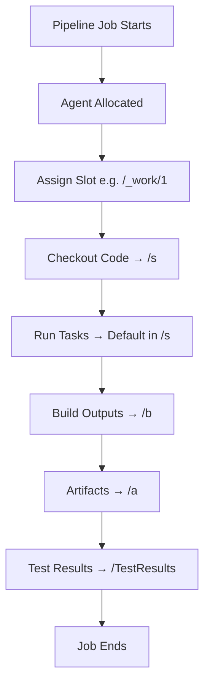

# 💻 **Azure Pipelines Agent Directory Workflow (From Scratch)**

## 📌 **1. The Agent Root & Its World**

When you install (or use) an agent, it has a **root folder** where all jobs live.

- **Hosted agent (Microsoft’s VM):**

  - Linux root: `/home/vsts/`
  - Windows root: `C:\agent\`
    👉 This VM is **ephemeral**: everything is wiped when the job ends.

- **Self-hosted agent:**

  - You pick the folder (e.g., `C:\azagent` or `/opt/azagent`).
  - Inside, the agent creates `_work` and other helper folders.

🔑 **Key sibling dirs inside root:**

```ini
/_work   # active job workspaces
/_temp   # temp files
/_tool   # tool cache
```

---

## 📌 **2. `_work` Structure**

Each pipeline/project on that agent gets assigned a **numeric slot**. Example:

```ini
/_work/
  ├─ 1/    # slot 1
  │   ├─ s/   → sources (repo after checkout)
  │   ├─ b/   → binaries (Build.BinariesDirectory)
  │   ├─ a/   → artifacts (ArtifactStagingDirectory)
  │   └─ TestResults/
  ├─ 2/    # slot 2 for another pipeline
  ├─ _temp/
  └─ _tool/
```

⚡ Important:

- The number (`1`, `2`, …) is **not your run ID**. It’s a **stable slot** assigned by the agent.
- Multiple runs of the same pipeline on the same agent will keep reusing the same number.

---

## 📌 **3. Numeric Slot**

- **Hosted agent (Microsoft provided):**  
  👉 Every job gets a **brand-new machine**. When the job ends, the whole machine (with all folders) is deleted.  
  ✅ In this case → you don’t really need to worry about numeric slots. They exist only during that job, then vanish.

- **Self-hosted agent (your own machine):**  
  👉 The agent lives permanently on your machine, and it needs a way to **separate different pipelines/projects** that run on it.  
  ✅ Here is where the **numeric slots** come in.

---

### 🔢 What Is a Numeric Slot?

Think of a **locker number at a gym** 🏋️.

- You install an agent on your machine.
- It creates a `_work` folder.
- Inside `_work`, it gives each pipeline/project a **locker number** (like `1`, `2`, `3`…).
- That locker has subfolders:

  - `s` → sources
  - `b` → binaries
  - `a` → artifacts
  - `TestResults` → test output

Example:

```ini
/_work/
  ├─ 1/   # Locker #1 for Pipeline A
  │   ├─ s/
  │   ├─ b/
  │   └─ a/
  ├─ 2/   # Locker #2 for Pipeline B
  │   ├─ s/
  │   ├─ b/
  │   └─ a/
```

👉 So, **numeric slot = “workspace locker” for a pipeline**.

---

### 🚀 How They’re Used

- If **Pipeline A** runs on your self-hosted agent, the agent assigns it locker `1`.
- If later **Pipeline B** also runs, the agent gives it locker `2`.
- Next time Pipeline A runs again → it will reuse locker `1` (same spot).

💡 That’s why things can **persist** between runs on self-hosted agents (like your `node_modules` or `.git` folder).

---

### ✅ Hosted vs Self-hosted in One Sentence

- **Hosted agent** → fresh machine each time, no slots matter (they’re deleted).
- **Self-hosted agent** → permanent machine, needs slots (`1`, `2`, `3`) to keep pipelines separate.

---

## 📌 **4. Default Directories & Variables**

Azure injects **variables** that map to these folders. Use them instead of hardcoding.

| Variable                                                             | Meaning                       | Path Example                    |
| -------------------------------------------------------------------- | ----------------------------- | ------------------------------- |
| `$(Pipeline.Workspace)`                                              | Run root folder               | `/home/vsts/work/1`             |
| `$(Build.SourcesDirectory)` / `$(System.DefaultWorkingDirectory)`    | Repo checkout path            | `/home/vsts/work/1/s`           |
| `$(Build.BinariesDirectory)`                                         | Compiled output               | `/home/vsts/work/1/b`           |
| `$(Build.ArtifactStagingDirectory)` / `$(System.ArtifactsDirectory)` | Staging for artifacts         | `/home/vsts/work/1/a`           |
| `$(Common.TestResultsDirectory)`                                     | Test results                  | `/home/vsts/work/1/TestResults` |
| `$(Agent.TempDirectory)`                                             | Agent temp files              | `/home/vsts/work/_temp`         |
| `$(Agent.ToolsDirectory)`                                            | Installed tool cache          | `/home/vsts/work/_tool`         |

---

## 📌 **5. Lifecycle Per Run**

Here’s what happens each run:

<div align="center">



> Hosted agent → **VM destroyed** and Everything gone.  
> Self-hosted agent → **workspace persists** in `/work/<N>`.

</div>

---

## 📌 **6. Cleanup & Reuse**

### 🖥 Hosted Agent

- One job → fresh VM/container
- After run: **entire VM is discarded**
- No persistence, no reuse

### 🏠 Self-hosted Agent

- Workspaces **stay** unless you clean them
- Options:

  - **Job-level cleanup**

    ```yaml
    jobs:
      - job: Build
        workspace:
          clean: all # outputs | resources | all
    ```

  - **Checkout cleanup**

    ```yaml
    - checkout: self
      clean: true
    ```

  - **Agent pool maintenance** (UI) → scheduled cleanups of old sources, outputs, caches

---

## 📌 **7. Multi-Client & Concurrency**

- A single agent = **1 job at a time**.
- If you want parallel jobs on the same machine → install **multiple agents**, each in its own folder.
- Different projects/pipelines can use the same agent → they’ll reuse different slots (`1`, `2`, …) under `_work`.

✅ Safety net: No two jobs share the same slot **at the same time**.

---

## 📌 **8. Container Jobs** 🐳

- When you use `container:`, the agent **mounts its `_work`** into the container:

  - `/__w` → `_work`
  - `/__t` → `_temp`

- Inside the container:

  ```ini
  /__w/1/s
  /__w/1/b
  /__w/1/a
  ```

- Cleanup rules: same as host. Container goes away, but host folders persist on self-hosted.

---

## 📌 **9.Practical Best Practices**

1. **Always use variables** → portable between OS, hosted/self-hosted, containers.
2. **Clean strategically**:

   - For CI (fast) → keep sources, clean outputs
   - For Release (safe) → clean everything

3. **Enable pool maintenance** → prevent disk explosions on self-hosted.
4. **Don’t assume `/1`**. Use `$(Pipeline.Workspace)` → future-proof.
5. **Multi-repo checkout** → secondary repos live under `/s/<RepoName>` unless you override `path:`.

---

## 🏁 **TL;DR**

- Each pipeline run = **workspace slot (`/work/<N>`)**, not a unique run ID.
- **Hosted agent** → full cleanup each run (disposable VM).
- **Self-hosted agent** → reuses same slot → you must manage cleanup.
- Use **variables** (not paths) and **maintenance policies** to stay sane.
