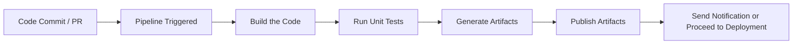

# 🏗️ Azure DevOps Build Pipelines — Deep Dive & Real Examples

> **Build Pipelines** are the backbone of **CI (Continuous Integration)** in Azure DevOps.  
> They automate building, testing, packaging, and producing artifacts from your codebase.  
> Whether you use .NET, Node.js, Java, or Python — the goal is the same: **turn raw code into build outputs you can test and ship**.

---

## 🚦 What Happens in a Build Pipeline?

> Here’s a high-level lifecycle:



---

## 🧠 Build Pipeline Goals

| Goal                  | Description                                      |
| --------------------- | ------------------------------------------------ |
| ✅ Build Code         | Compile source code into executables, DLLs, etc. |
| ✅ Run Tests          | Unit tests, integration tests, linting           |
| ✅ Create Artifacts   | ZIP, JAR, EXE, Docker image, etc.                |
| ✅ Push to Feed       | (Optional) Push to NuGet, npm, Maven             |
| ✅ Trigger Next Stage | Deploy to Dev / QA environments automatically    |

---

## 🧰 Build Pipeline Structure (YAML Style)

A pipeline is defined in YAML as `azure-pipelines.yml`. It usually contains:

- `trigger`: What starts the pipeline?
- `pool`: Which agent to run on?
- `steps`: What actions to perform?
- `jobs`: Group of related steps
- `stages`: Optional — if you want multiple build/test phases

---

## 🛠️ Example: .NET Core Build Pipeline

```yaml
trigger:
  branches:
    include:
      - main

pool:
  vmImage: "windows-latest"

variables:
  buildConfiguration: "Release"

steps:
  - task: UseDotNet@2
    inputs:
      version: "7.0.x"

  - script: dotnet restore
    displayName: "Restore NuGet packages"

  - script: dotnet build --configuration $(buildConfiguration)
    displayName: "Build the solution"

  - script: dotnet test --configuration $(buildConfiguration)
    displayName: "Run unit tests"

  - task: PublishBuildArtifacts@1
    inputs:
      PathtoPublish: "$(Build.ArtifactStagingDirectory)"
      ArtifactName: "drop"
```

🧾 Output:

- Builds the project
- Runs unit tests
- Publishes output to the pipeline artifacts

---

## 🧪 What Does the Pipeline Agent Do?

Think of the **agent** as a temporary worker that:

1. Downloads your repo code
2. Runs each `step` (like `dotnet restore`, `npm install`, etc.)
3. Collects logs and stores artifacts
4. Cleans up after the job

🔁 Each build = fresh environment

---

## 💡 Key Concepts in a Build Pipeline

| Concept               | Description                                                             |
| --------------------- | ----------------------------------------------------------------------- |
| **Self-hosted Agent** | Runs on your machine or VM (custom needs)                               |
| **Microsoft-hosted**  | Azure-provided clean VM (e.g., Ubuntu, Windows, macOS)                  |
| **Artifacts**         | Files produced from build (e.g., ZIP, JAR, DLL)                         |
| **Triggers**          | Start the pipeline automatically (on commit, PR, schedule, or manually) |
| **Templates**         | Reusable YAML logic (e.g., `build-template.yml`)                        |
| **Variables**         | Inject environment-specific or secret values                            |

---

## 📦 Build Artifacts in Azure DevOps

- Output from the build (ZIPs, DLLs, test results)
- Stored under **Pipeline → Runs → Artifacts**
- Can be passed to **Release Pipelines** or downloaded manually

---

## 🚀 Triggering Builds

| Trigger Type   | Example                                        |
| -------------- | ---------------------------------------------- |
| **CI Trigger** | `trigger:` in YAML for branches (auto run)     |
| **PR Trigger** | `pr:` for pull requests                        |
| **Manual**     | Run from Azure DevOps UI                       |
| **Scheduled**  | Nightly builds, every hour, etc. (`schedules`) |

---

## ✅ Summary: When to Use Build Pipelines

Use a **Build Pipeline** when you want to:

- Compile your app automatically on commit
- Run test suites regularly
- Validate PRs before merging
- Create and distribute versioned build outputs
- Trigger further CD processes like deployments
