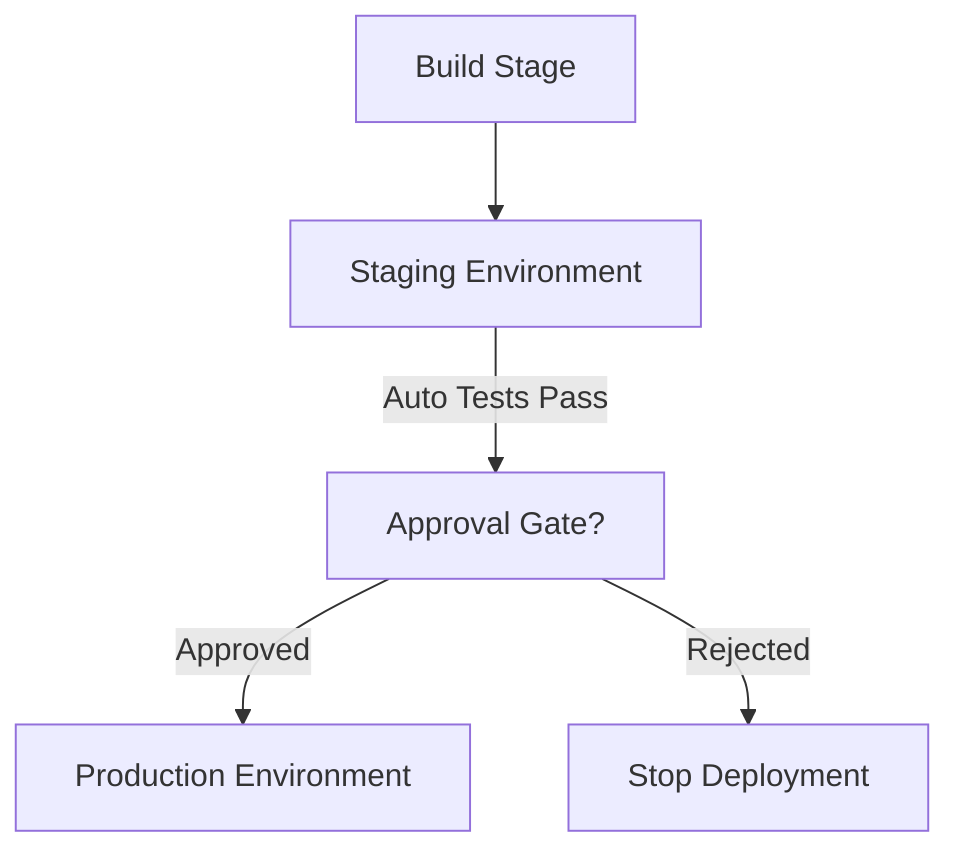

# 🌍 Azure DevOps **Environments** (Hands-On)

## 📌 1. What is an Environment?

👉 In Azure DevOps, an **Environment** is a **named collection of resources** (VMs, Kubernetes clusters, Azure Web Apps, etc.) where you **deploy applications** in YAML pipelines.

But it’s **more powerful** than Deployment Groups:

- Adds **approvals** (manager sign-off before Prod deploy).
- Adds **checks** (quality gates, branch policies, work item linking).
- Supports **resource types** (VMs, K8s, Azure resources).
- Provides **auditing & traceability** (who approved, what deployed).

💡 Think: **Deployment Group 2.0** 🚀 with governance built in.

---

## 📌 2. Why Use Environments?

- 🛡️ **Compliance & governance** → approvals + checks.
- 🧑‍💼 **Team workflows** → dev deploys to Staging, manager approves Prod.
- 🔄 **Modern YAML pipelines** → full CI/CD in one pipeline file.
- ☁️ **Supports hybrid targets** → Azure, K8s, self-hosted VMs.

---

## 📌 3. Real-World Example

You’re deploying an **e-commerce app**:

- **Environment: Staging** → deploy to test VM, auto tests run.
- **Environment: Production** → deploy to AKS cluster, requires approval by Team Lead.

👉 The **same pipeline** handles both, but with **different checks**.

---

## 📌 4. Hands-On: Creating an Environment

### 🔹 Step 1: Create Environment

1. In **Azure DevOps → Pipelines → Environments**.
2. Click **New Environment**.
3. Give it a name (e.g., `Production`).
4. Add **resource type**:

   - Virtual machines
   - Kubernetes cluster
   - Azure Web App
   - None (just for approvals, no infra attached).

---

### 🔹 Step 2: Add Resources

- If **VMs**: Install the **agent** on target machines (like Deployment Groups).
- If **Kubernetes**: Connect cluster via **Service Connection**.
- If **Azure Web App**: Pick app from subscription via service connection.

---

### 🔹 Step 3: Add Approvals & Checks

- Click **Approvals & Checks** inside the environment.
- Examples:

  - Require **manual approval** before deployment.
  - Enforce **branch policy** (only `main` can deploy).
  - Require **work items linked** to commit.
  - Check for **Azure Policy compliance**.

---

## 📌 5. Using Environment in a YAML Pipeline

Example: Deploy a **.NET app** to a VM inside `Production` environment.

```yaml
trigger:
  - main

pool:
  vmImage: "ubuntu-latest"

stages:
  - stage: Build
    jobs:
      - job: BuildJob
        steps:
          - task: DotNetCoreCLI@2
            inputs:
              command: "build"
              projects: "**/*.csproj"

  - stage: Deploy
    jobs:
      - deployment: DeployWebApp
        environment: "Production" # ✅ Targets environment
        strategy:
          runOnce:
            deploy:
              steps:
                - task: CopyFilesOverSSH@0
                  inputs:
                    sshEndpoint: "prod-vm-ssh"
                    sourceFolder: "$(Build.SourcesDirectory)"
                    contents: "**"
                    targetFolder: "/var/www/myapp"
```

👉 Here:

- **Environment = Production**.
- Pipeline deploys artifact to VM.
- If you set approval → the pipeline **pauses** until approved.

---

## 📌 6. Environment Checks in Action

- You deploy to **Staging** → auto deploy, auto test runs.
- You deploy to **Production** → pipeline **pauses**:

  - Manager gets notification → Approve/Reject.
  - If approved → deploy continues.
  - If rejected → pipeline stops.

This provides **governance and traceability** ✅.

---

## 📊 Visual Diagram



---

## 📌 7. Environment vs Deployment Group

| Feature    | Deployment Group     | Environment                |
| ---------- | -------------------- | -------------------------- |
| Used In    | Classic Releases     | YAML Pipelines             |
| Targets    | VMs (on-prem, cloud) | VMs, K8s, Azure, approvals |
| Governance | None                 | Approvals + Checks         |
| Status     | Legacy               | Recommended ✅             |

👉 Exam Tip: If the question mentions **YAML + approvals + checks** → Answer = **Environment**.

---

## ✅ TL;DR

- **Environment** = modern target for deployments in YAML pipelines.
- Supports **VMs, K8s, Azure resources**.
- Adds **Approvals & Checks** → governance + compliance.
- Replaces **Deployment Groups**.
- Perfect for **multi-stage pipelines** (Dev → QA → Prod).
