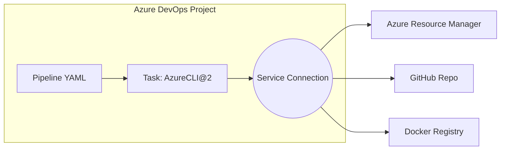

# 🔗 **Azure DevOps Service Connections**

## 📖 **What is a Service Connection?**

A **Service Connection (SC)** in Azure DevOps = a **secure “bridge” between your pipeline and an external system**.

- It stores credentials/secrets (e.g., Azure SPN, GitHub token, Docker registry password).
- Pipelines reference the SC **by name** instead of hardcoding secrets.
- Azure DevOps handles authentication under the hood.

👉 Think of it as a **vaulted credential + configuration object** inside Azure DevOps.

---

## ⁉️ **Why Do We Need It?**

Without SCs, every pipeline would require:

- Explicit Client IDs, Secrets, Certificates, Tokens.
- Repeated authentication steps everywhere.
- Insecure storage of creds inside YAML. ❌

With SCs:

- Credentials are stored **once** (encrypted in DevOps).
- Pipelines reference them safely.
- Rotation/updating secrets happens in one place.

---

## 🏗️ How It Fits in Azure Pipelines

<div align="center">



</div>

> ✅ Pipeline tasks reference the Service Connection to perform actions on external systems.

---

## 🤹🏻 **Types of Service Connections**

<div align="center">
  
</div>

---

Some common types:

- **Azure Resource Manager (ARM)** → uses **Service Principal** from Entra ID.
- **GitHub / GitHub Enterprise** → uses OAuth or PAT.
- **Docker Registry / ACR** → uses username/password or SPN.
- **AWS, GCP, Bitbucket, Jenkins, SonarCloud** → many built-in connectors.
- **Generic Service Connection** → raw credentials for custom services.

---

## 🔐 Azure Resource Manager (ARM) Types

Azure is the most common target. Let’s break down ARM connection types.

| 🔗 ARM Connection Type                  | 📌 Use Case                                           | 👤 Auth                  |
| --------------------------------------- | ----------------------------------------------------- | ------------------------ |
| **Service Principal (Automatic)**       | Default, most secure                                  | Entra ID App SP          |
| **Service Principal (Manual)**          | When you provide appId, secret, tenant                | Entra ID SP              |
| **Managed Identity**                    | When running pipeline from Azure-hosted agent with MI | System-assigned identity |
| **Workload Identity Federation (OIDC)** | Modern SP-less auth                                   | Entra ID + OIDC          |

---

<div align="left">
  
</div>

---

### ⚙️ **How It Works Internally (Azure Example)**

Let’s take **Azure Resource Manager Service Connection**:

1. You create an **App Registration (SPN)** in Entra ID.
2. Assign it RBAC role (e.g., Contributor) at Subscription/Resource Group.
3. Create a Service Connection in DevOps:

   - Paste **Tenant ID, Subscription ID, Client ID, Client Secret**.
   - SC stores them securely in DevOps.

4. In pipeline YAML, you reference SC by name:

   ```yaml
   - task: AzureCLI@2
   inputs:
       azureSubscription: "sc-azure-demo"
       scriptType: bash
       scriptLocation: inlineScript
       inlineScript: az group list
   ```

5. At runtime:

   - Pipeline agent contacts DevOps service.
   - DevOps injects SC credentials into the job (as temp token).
   - Task uses those creds to login (`az login --service-principal`).
   - Executes `az`/ARM calls securely.

---

## 🕳️ **What Is Stored Internally?**

Inside DevOps:

- Encrypted JSON with:

  - **Client ID** (like username)
  - **Secret/Cert** (like password)
  - **Tenant ID**
  - **Subscription ID**

- Metadata: Connection name, type (AzureRM, Docker, GitHub), access policies.

🔒 Stored in DevOps backend KeyVault-like service.
Admins can configure **who can use the connection** in pipelines.

---

## 🖼️ **Portal Views**

- **Project Settings → Service Connections**
- Each SC can be:

  - **Authorized for all pipelines**
  - Or require explicit approval per pipeline

---

## 🔧 Create Azure Resource Manager Connection (Manual)

> You need: `Subscription Owner` or `User Access Administrator` role

### 🔹 Steps:

1. Go to **Project Settings** → **Service connections**
2. Click ➕ **New Service Connection**
3. Select **Azure Resource Manager**
4. Choose one:

   - 📦 **Automatic**: Let DevOps create SP
   - 🧾 **Manual**: Provide:

     - Subscription ID
     - Tenant ID
     - App ID + Secret (Service Principal)

5. Set **scope level**:

   - Subscription or Management Group

6. Save and give it a name like `AzureRM-DevSub`

🔒 Optionally restrict access to pipelines or users.

---

<div align="left">
  
</div>

---

## 🔄 Reuse in Pipeline

```yaml
trigger:
  - main

pool:
  vmImage: "ubuntu-latest"

steps:
  - task: AzureCLI@2
    inputs:
      azureSubscription: "AzureRM-DevSub"
      scriptType: "pscore"
      scriptLocation: "inlineScript"
      inlineScript: |
        az group create --name demo-rg --location eastus
```

> 🔁 The `azureSubscription` field uses the Service Connection name.

---

## ✅ Best Practices

| 🧠 Tip                   | 💬 Explanation                                           |
| ------------------------ | -------------------------------------------------------- |
| 🔐 Avoid secrets in YAML | Always use secure connections and pipeline variables     |
| 🏷️ Use friendly naming   | Name connections per env (e.g., `AzureRM-Staging`)       |
| 🔄 Rotate secrets        | If using SP manually, rotate client secrets periodically |
| 👥 Restrict access       | Use RBAC and project-level permissions                   |
| 🧪 Test permissions      | Run test pipeline to validate access before full deploy  |

---

## 🔍 How to View & Manage

- Go to **Project Settings → Service Connections**
- Click any connection to:

  - 🔍 View details
  - 🔁 Refresh token / secret
  - 🛑 Disable
  - 🧼 Delete

---

## 🧪 Verify from CLI

```bash
az ad sp list --display-name "<AppName>"
az ad sp credential list --id <AppID>
```

Use to check if SP exists, roles assigned, expiry dates.

---

## 🧵 Summary Table

| 🔌 Type  | 👨 Auth         | 📁 Scope      | 🏗️ Used by            |
| -------- | --------------- | ------------- | --------------------- |
| Azure RM | SP or MI        | Sub / MG      | CLI / ARM / Terraform |
| GitHub   | PAT / OAuth     | Org / Repo    | GitHub Task, Checkout |
| Docker   | Basic / SP      | Registry      | Docker Push           |
| K8s      | Kubeconfig / SP | AKS / Cluster | Helm / Kubectl        |

## 🏁 **TL;DR**

- A **Service Connection** = a **secure credential object** in DevOps.
- It ties pipelines to external services (Azure, GitHub, Docker, etc.).
- Internally, for Azure, it’s basically a **Service Principal’s Client ID/Secret** stored encrypted.
- At runtime, DevOps injects those creds into tasks (like AzureCLI\@2) to log in.
- You **reference SC by name** in YAML; never hardcode secrets.

---
