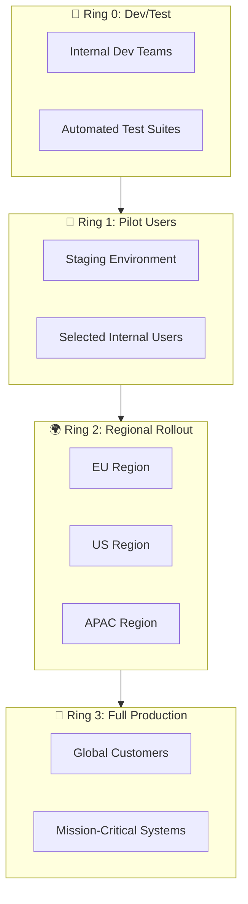

# 🔔 **Ring Deployments**

## 🌐 **What Is Ring Deployment?**

A **Ring Deployment** is a **progressive rollout strategy** where software is released in **controlled waves (rings)**, instead of to everyone at once.

> 🛟 Imagine throwing a stone in water 🌊 → ripples spread outward in **rings**. That’s exactly how features are rolled out:
>
> - Start with a **tiny inner circle** (internal users/testers).
> - Then a **slightly bigger circle** (pilot customers).
> - Then a **wider circle** (regional rollout).
> - Finally, the **big outer circle** (all users).

---

## 🎯 **Why Do We Use Rings?**

1. **🛡️ Risk reduction**

   - If a bug appears, it only affects a small ring.

2. **📢 Early feedback**

   - Pilot users give real-world feedback before general release.

3. **🚀 Progressive adoption**

   - Enterprise-scale changes are tested gradually.

4. **⏪ Rollback safety**

   - Easier to stop rollout if issues appear in early rings.

5. **📜 Compliance & governance**

   - Large orgs (Microsoft, AWS, Google) must prove features are validated before hitting production-wide customers.

---

## 🛑 **Without Rings vs ✅ With Rings**

- ❌ Without Rings → Deploy straight to 1 million users. If it breaks → big outage.
- ✅ With Rings → Deploy first to 100 users, then 5k, then 100k, then everyone. If it breaks → stop early, only small group affected.

---

## 🔢 **Typical Ring Structure**

Different companies define rings differently, but a **common model** looks like:

| Ring          | Audience                               | Purpose                           | Example Size |
| ------------- | -------------------------------------- | --------------------------------- | ------------ |
| **Ring 0** 🛠️ | Internal developers/testers            | Dogfooding, catch obvious bugs    | \~50 users   |
| **Ring 1** 👩‍👩‍👧‍👦 | Early adopters / pilot customers       | Real-world validation             | 1–5%         |
| **Ring 2** 🌍 | Larger customer set / regional rollout | Wider telemetry & stability check | 10–30%       |
| **Ring 3** 🚀 | All users (General Availability)       | Full production release           | 100%         |

---

## 🔎 **How Ring Deployment Works**

<div align="center">



</div>

### Steps:

1. Deploy to **Ring 0** (internal).

   - Monitor errors, crashes, performance.
   - If OK → move forward.

2. Deploy to **Ring 1** (early adopters).

   - Collect user feedback.
   - If OK → promote same build to next ring.

3. Deploy to **Ring 2** (regional / partial users).

   - Validate stability at scale.

4. Deploy to **Ring 3** (everyone).

   - Final rollout.

---

## 🛠️ **How to Implement Rings in Azure DevOps**

### 🔹 Step 1: Define Rings as **Environments**

- Create environments: `ring0`, `ring1`, `ring2`, `ring3`.
- Add **checks** (approvals, gates, monitoring) for each ring.

### 🔹 Step 2: Use **Multi-Stage Pipeline**

YAML Example:

```yaml
stages:
  - stage: Ring0
    displayName: Deploy to Ring 0
    jobs:
      - deployment: ring0
        environment: ring0
        strategy:
          runOnce:
            deploy:
              steps:
                - script: echo "Deploying to internal testers..."

  - stage: Ring1
    dependsOn: Ring0
    jobs:
      - deployment: ring1
        environment: ring1
        strategy:
          runOnce:
            deploy:
              steps:
                - script: echo "Deploying to pilot users..."

  - stage: Ring2
    dependsOn: Ring1
    jobs:
      - deployment: ring2
        environment: ring2
        strategy:
          runOnce:
            deploy:
              steps:
                - script: echo "Deploying to partial prod..."
```

### 🔹 Step 3: Add **Approvals & Gates**

- Ring 0 → auto deploy (no approvals).
- Ring 1 → needs manager approval.
- Ring 2 → requires gates (Azure Monitor alerts, error rate checks).
- Ring 3 → final release manager approval.

---

## 🔧 **Tools & Techniques That Help**

- **Feature Flags** → Control which users see the new feature.
- **Azure DevOps Gates** → Block next ring if telemetry shows errors.
- **App Insights & Azure Monitor** → Monitor health between rings.
- **Approvals** → Human signoff before promoting to next ring.

---

## 🆚 **Ring vs Rolling Deployment**

| Aspect            | Ring Deployment                   | Rolling Deployment              |
| ----------------- | --------------------------------- | ------------------------------- |
| **Focus**         | _Users / Environments_            | _Infrastructure (servers/pods)_ |
| **Rollout Style** | Deploy to user groups in waves    | Deploy to servers one by one    |
| **Risk Control**  | Users limited                     | Servers limited                 |
| **Example**       | Dev → Pilot users → All customers | Update 10 web servers gradually |

👉 **Rings = user-centric**  
👉 **Rolling = infra-centric**  
➡️ They can be combined:

- Use **Rolling Deploy** _inside each Ring_.

---

## 📌 **Real-World Example**

### Microsoft Office / Windows Updates:

- **Ring 0** → Microsoft engineers (dogfooding).
- **Ring 1** → Microsoft employees worldwide.
- **Ring 2** → Windows Insider community.
- **Ring 3** → Public release.

---

## 🏆 **Best Practices for Ring Deployments**

1. **Always monitor between rings** → telemetry is your guardrail.
2. **Use the same build** across rings → prevents “works in test, fails in prod.”
3. **Automate promotion** → use approvals/gates in Azure DevOps.
4. **Use feature flags** → safer than deploying separate builds.
5. **Keep Ring 0 small & fast** → catch critical bugs early.
6. **Define rollback rules** → e.g., stop rollout if error rate > 2%.

---

## ✅ **Summary**

- **Ring Deployment = phased rollout to user groups in waves.**
- Purpose: **minimize risk, collect feedback, ensure stability**.
- Works perfectly in **Azure DevOps** with multi-stage pipelines, approvals, and gates.
- Not the same as Rolling Deployment (infra-based).
- Used by Microsoft, Google, AWS for large-scale product rollouts.
