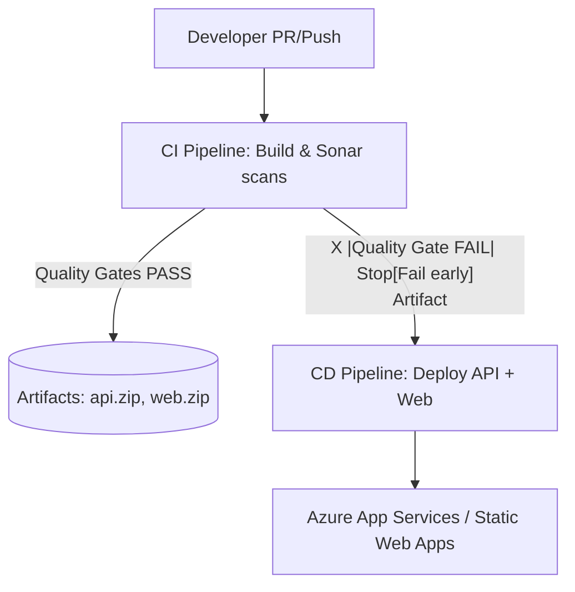

# 🌊 SonarCloud CI/CD for **.NET API + Angular** (Azure DevOps)

## 🎯 Goal

- Run **SonarCloud** on every commit/PR for **two apps** (API + Web).
- **Fail the pipeline** if the **Quality Gate** doesn’t pass.
- Only deploy **after** both apps pass quality checks.

---

## 📦 Repo Layout

```ini
/api
  src/YourApi/YourApi.csproj
  tests/YourApi.Tests/YourApi.Tests.csproj  (has coverlet.collector)
  ...
/web
  package.json
  angular.json
  src/...
azure-pipelines-ci.yml       # Build + Sonar scan (two jobs: api & web)
azure-pipelines-cd.yml       # Deploy only if CI succeeded (quality gates passed)
README.md
```

> ✅ **Coverage**:
>
> - .NET: via **coverlet.collector** in the test project (OpenCover format).
> - Angular: **Karma/Jest** produces **lcov.info**.

---

## 🧩 Architecture at a Glance

<div align="center">



</div>

- **SonarCloud** runs in **CI**.
- **Quality Gate** must pass → else **CI fails** (no deploy).
- **CD** consumes CI artifacts only when CI succeeded.

---

## ✅ Prerequisites

1. **SonarCloud account & organization**

   - Create org & two projects:

     - `contoso-api`
     - `contoso-web`

   - Create **Azure DevOps service connection** of type **SonarCloud** (e.g., `sc-sonarcloud`) bound to your organization.

2. **Azure DevOps Service Connection (Azure RM)** for deployment

   - Name: `sc-azure` (scope: your target Resource Group or Subscription)

3. **.NET test coverage**

   - Add to `/api/tests/YourApi.Tests/YourApi.Tests.csproj`:

     ```xml
     <ItemGroup>
       <PackageReference Include="coverlet.collector" Version="3.*" />
     </ItemGroup>
     ```

4. **Angular coverage**

   - Ensure `ng test --watch=false --code-coverage` (Karma) produces `coverage/lcov.info`.

---

## 🔧 Sonar Project Keys (decide now)

- API → `contoso-api`
- Web → `contoso-web`
- SonarCloud organization key → `your-org`

> You’ll use these in the **SonarCloudPrepare** tasks.

---

## 🧪 CI Pipeline (Build + Scan + Gate)

**File: `azure-pipelines-ci.yml`**

- Two **parallel jobs**: `api` and `web`.
- Each job does **Prepare → Build/Test → Analyze → Publish**.
- **Quality Gate** is enforced by the **Publish** task — if it fails, the job fails.

```yaml
trigger:
  - main

pr:
  - main

pool:
  vmImage: "ubuntu-latest"

stages:
  - stage: BuildAndScan
    displayName: "Build & SonarCloud Scan"
    jobs:
      # ==================== API (.NET) ====================
      - job: api
        displayName: "API - .NET Build, Test, Sonar"
        steps:
          - checkout: self

          # 1) SonarCloud prepare (MSBuild mode)
          - task: SonarCloudPrepare@1
            displayName: "SonarCloud Prepare (API)"
            inputs:
              SonarCloud: "sc-sonarcloud" # Service connection (SonarCloud)
              organization: "your-org"
              scannerMode: "MSBuild"
              projectKey: "contoso-api"
              projectName: "Contoso API"
              extraProperties: |
                sonar.cs.opencover.reportsPaths=$(Build.SourcesDirectory)/**/coverage.opencover.xml
                sonar.cs.vstest.reportsPaths=$(Agent.TempDirectory)/*.trx

          # 2) Build & Test with coverage (OpenCover)
          - task: UseDotNet@2
            inputs:
              packageType: "sdk"
              version: "8.x"

          - task: DotNetCoreCLI@2
            displayName: "Restore"
            inputs:
              command: "restore"
              projects: "api/**/*.csproj"

          - task: DotNetCoreCLI@2
            displayName: "Build"
            inputs:
              command: "build"
              projects: "api/**/*.csproj"
              arguments: "--configuration Release --no-restore"

          - task: DotNetCoreCLI@2
            displayName: "Test (with coverage)"
            inputs:
              command: "test"
              projects: "api/tests/**/*.csproj"
              arguments: >-
                --configuration Release --no-build
                --logger trx
                /p:CollectCoverage=true
                /p:CoverletOutputFormat=opencover
                /p:CoverletOutput=$(Build.SourcesDirectory)/api/TestResults/Coverage/

          # 3) Sonar Analyze
          - task: SonarCloudAnalyze@1
            displayName: "SonarCloud Analyze (API)"

          # 4) Sonar Publish (blocks on Quality Gate)
          - task: SonarCloudPublish@1
            displayName: "SonarCloud Publish (API) - Enforce Quality Gate"
            inputs:
              pollingTimeoutSec: "300" # wait up to 5 min for gate result

          # 5) Package artifact for CD (zip publish output)
          - script: |
              dotnet publish api/src/YourApi/YourApi.csproj -c Release -o $(Build.ArtifactStagingDirectory)/api_publish
              cd $(Build.ArtifactStagingDirectory)/api_publish
              zip -r $(Build.ArtifactStagingDirectory)/api.zip .
            displayName: "Package API"

          - task: PublishBuildArtifacts@1
            inputs:
              pathToPublish: "$(Build.ArtifactStagingDirectory)/api.zip"
              artifactName: "api"
              publishLocation: "Container"

      # ==================== WEB (Angular) ====================
      - job: web
        displayName: "WEB - Angular Build, Test, Sonar"
        steps:
          - checkout: self

          - task: NodeTool@0
            inputs:
              versionSpec: "18.x"

          - script: |
              cd web
              npm ci
              npm run test -- --watch=false --code-coverage
              npm run build -- --configuration=production
            displayName: "Build & Test (Angular)"

          # 1) SonarCloud prepare (Other mode)
          - task: SonarCloudPrepare@1
            displayName: "SonarCloud Prepare (WEB)"
            inputs:
              SonarCloud: "sc-sonarcloud"
              organization: "your-org"
              scannerMode: "Other"
              configMode: "manual"
              projectKey: "contoso-web"
              projectName: "Contoso Web"
              extraProperties: |
                sonar.sources=web/src
                sonar.exclusions=**/*.spec.ts,**/node_modules/**,**/dist/**
                sonar.tests=web/src
                sonar.test.inclusions=**/*.spec.ts
                sonar.javascript.lcov.reportPaths=web/coverage/lcov.info

          # 2) Sonar Analyze (CLI)
          - task: SonarCloudAnalyze@1
            displayName: "SonarCloud Analyze (WEB)"

          # 3) Sonar Publish (blocks on Quality Gate)
          - task: SonarCloudPublish@1
            displayName: "SonarCloud Publish (WEB) - Enforce Quality Gate"
            inputs:
              pollingTimeoutSec: "300"

          # 4) Package web artifact (zip dist)
          - script: |
              cd web/dist
              # find subfolder (Angular outputs dist/<app-name>)
              APP_DIR=$(ls -1 | head -n 1)
              cd $APP_DIR
              zip -r $(Build.ArtifactStagingDirectory)/web.zip .
            displayName: "Package WEB"

          - task: PublishBuildArtifacts@1
            inputs:
              pathToPublish: "$(Build.ArtifactStagingDirectory)/web.zip"
              artifactName: "web"
              publishLocation: "Container"
```

### 👀 What to expect

- If **either** API or Web **fails the Quality Gate**, that **job fails** → Stage fails → **CD won’t trigger**.
- If both pass → artifacts **api.zip** & **web.zip** are published.

---

## 🚀 CD Pipeline (Deploy only if CI succeeded)

**File: `azure-pipelines-cd.yml`**

- Triggers on the **CI pipeline’s** successful run.
- Deploys **API** (zip) to **Azure App Service (Linux)**.
- Deploys **Web** (zip) to **Azure App Service** (or Static Web Apps if you prefer).

```yaml
# This pipeline is triggered by the CI pipeline when it succeeds.
# Replace 'CI-Pipeline-Name' with the name of your CI pipeline in DevOps.

resources:
  pipelines:
    - pipeline: ci
      source: CI-Pipeline-Name
      trigger:
        branches:
          - main

pool:
  vmImage: "ubuntu-latest"

variables:
  azureServiceConnection: "sc-azure"
  resourceGroup: "rg-contoso-prod"
  location: "eastus"
  apiAppName: "contoso-api-prod"
  webAppName: "contoso-web-prod"

stages:
  - stage: Deploy
    displayName: "Deploy API + Web"
    jobs:
      - job: API
        displayName: "Deploy API App Service"
        steps:
          - download: ci
            artifact: api

          - task: AzureCLI@2
            displayName: "Deploy API (zip)"
            inputs:
              azureSubscription: $(azureServiceConnection)
              scriptType: bash
              scriptLocation: inlineScript
              inlineScript: |
                az webapp create --resource-group "$(resourceGroup)" --plan "asp-contoso-prod" --name "$(apiAppName)" --runtime "DOTNET:8" --only-show-errors || true
                az webapp deploy \
                  --name "$(apiAppName)" \
                  --resource-group "$(resourceGroup)" \
                  --src-path "$(Pipeline.Workspace)/api/api.zip" \
                  --type zip

      - job: WEB
        displayName: "Deploy Web App Service"
        dependsOn: API
        steps:
          - download: ci
            artifact: web

          - task: AzureCLI@2
            displayName: "Deploy WEB (zip)"
            inputs:
              azureSubscription: $(azureServiceConnection)
              scriptType: bash
              scriptLocation: inlineScript
              inlineScript: |
                az webapp create --resource-group "$(resourceGroup)" --plan "asp-contoso-prod" --name "$(webAppName)" --runtime "NODE:18-lts" --only-show-errors || true
                az webapp deploy \
                  --name "$(webAppName)" \
                  --resource-group "$(resourceGroup)" \
                  --src-path "$(Pipeline.Workspace)/web/web.zip" \
                  --type zip
```

> 💡 Prefer **Azure Static Web Apps** for Angular? Swap the WEB job to use `AzureStaticWebApp@1` and your SWA token instead of App Service.

---

## 🧪 Quality Gates: How Blocking Works

- Each project (API & Web) has a **Quality Gate** in SonarCloud (default: “Sonar way”).
- The task **`SonarCloudPublish@1`** waits for analysis and **fails the job** if the gate fails.
- Because jobs are in the same stage, **CI stage fails** if any gate fails → **CD won’t run**.

**Typical gate rules** (adjust in SonarCloud UI):

- No new **Critical/Blocker** issues
- **Coverage on new code ≥ 80%**
- **Duplications on new code ≤ 3%**

---

## 🧪 Local/Repo Tips

- **.NET tests**: ensure tests exist under `/api/tests/...` and use **coverlet.collector**.
- **Angular tests**: `ng test --watch=false --code-coverage` produces `coverage/lcov.info`.
- If Angular dist path varies, update the ZIP step in CI.

---

## 🔐 Security & Governance

- **SonarCloud service connection** uses OAuth/token, not hard-coded secrets in YAML.
- **Azure RM service connection** (ARM SP) manages credentials for deploy.
- Use **branch policies** so PRs **must pass CI stage** (thus pass Quality Gates) before merge.

---

## 🧭 Runbook (Quick)

1. Create two SonarCloud projects (`contoso-api`, `contoso-web`) and **link ADO** via **`sc-sonarcloud`** connection.
2. Create **`sc-azure`** service connection (Azure RM).
3. Push this repo with both YAML files.
4. Run **CI**. If both gates pass, artifact is published.
5. **CD** triggers from CI success → deploys **api.zip** & **web.zip**.
6. Visit your App Service URLs to verify.

---

## 🛠 Troubleshooting

- **Quality gate never finishes**: increase `pollingTimeoutSec` in `SonarCloudPublish@1`.
- **Coverage not shown (.NET)**: confirm `coverlet.collector` is installed and OpenCover files are generated under the path you set in `extraProperties`.
- **Coverage not shown (Angular)**: make sure `web/coverage/lcov.info` exists (Karma/Jest path may differ).
- **SonarCloud auth**: ensure `sc-sonarcloud` is authorized for the project/organization.
- **Deploy fails**: check that `asp-contoso-prod` App Service Plan exists (or create it first), or change the script to create it.

---

## 🏁 TL;DR

- **One CI** with two jobs: **API** (.NET) + **WEB** (Angular).
- Each job runs **SonarCloud** → **Quality Gate** enforced → **fail fast** if bad code.
- **CD** only runs when CI **succeeds** → deploys both apps to Azure.
- Clean, simple, and exactly what you need to **keep bad code out of prod**.
