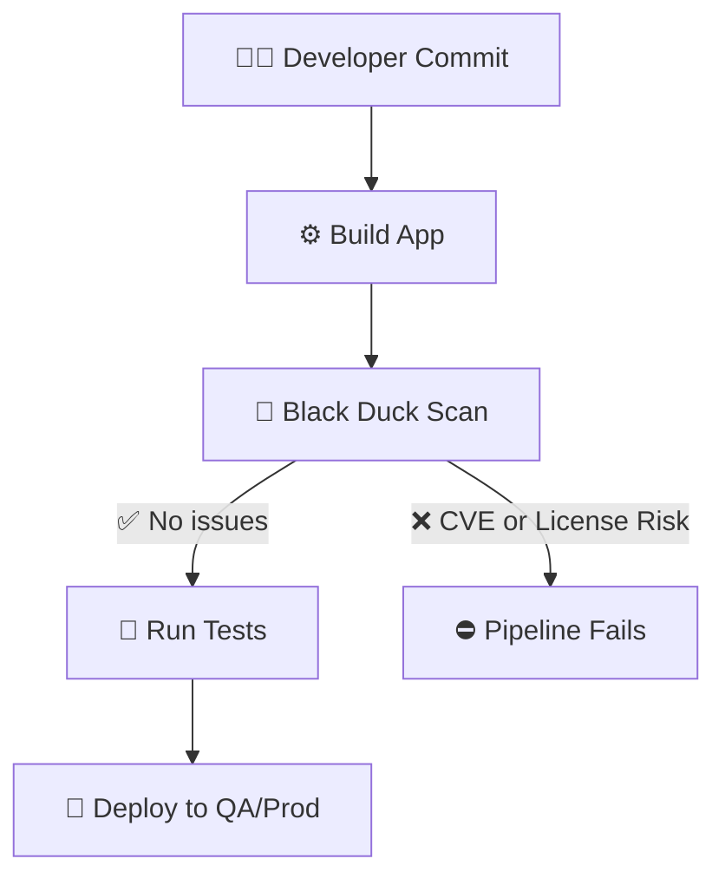

# 🦆 Black Duck in CI/CD (Azure DevOps Integration)

## 🌍 1. What is Black Duck?

- **Black Duck (by Synopsys)** = a **Software Composition Analysis (SCA)** tool.
- It scans your **dependencies, containers, and artifacts** to:

  - 🔐 Detect **security vulnerabilities (CVEs)**.
  - ⚖️ Identify **license compliance risks**.
  - 📜 Generate **SBOM (Software Bill of Materials)** for audits.
  - 🚦 Enforce **policies** (e.g., no GPL, no high-severity CVEs).

👉 **Think of it as your pipeline’s “security + legal cop.”**

---

## 🛠️ 2. Why Put it in CI/CD?

Modern apps = 70–90% **open-source dependencies** (npm, Maven, NuGet, pip, etc).

- One vulnerable package (like `log4j`) → entire system compromised.
- One wrong license (like GPL) → legal risks.

👉 **Black Duck ensures every commit/PR is safe before merging or deploying.**

---

## 🔄 3. How Black Duck Fits in the Pipeline

<div align="center">



</div>

- **Scan** produces:

  - Policy status (pass/fail).
  - Vulnerability list.
  - Risk report (PDF).
  - SBOM (CycloneDX, SPDX).

---

## 📂 4. Azure DevOps Setup

### 🔹 Step 1: Store Secrets

- In **Pipeline Variables / Library**:

  - `BLACKDUCK_URL` = `https://blackduck.myorg.com`
  - `BLACKDUCK_TOKEN` = `<API token>` (secret)

### 🔹 Step 2: Add Black Duck Scan Stage (YAML)

```yaml
stages:
  - stage: blackduck_scan
    jobs:
      - job: scan
        pool:
          vmImage: ubuntu-latest
        steps:
          - script: |
              curl -s -L https://detect.synopsys.com/detect.sh -o detect.sh
              chmod +x detect.sh

              ./detect.sh \
                --blackduck.url="$(BLACKDUCK_URL)" \
                --blackduck.api.token="$(BLACKDUCK_TOKEN)" \
                --detect.project.name="ecommerce-web" \
                --detect.project.version="$(Build.SourceBranchName)-$(Build.BuildId)" \
                --detect.policy.check=true \
                --detect.wait.for.results=true \
                --detect.risk.report.pdf=true \
                --detect.risk.report.pdf.path="bd-reports"
            displayName: 🦆 Black Duck Scan

          - task: PublishBuildArtifacts@1
            displayName: 📑 Publish Black Duck Reports
            inputs:
              PathtoPublish: bd-reports
              ArtifactName: blackduck-reports
```

✅ This will:

- Fail the build if policy violations are found.
- Upload a **risk report PDF** as pipeline artifact.

---

## 🧱 5. Scenarios

### 🐳 Container Image Scan

```yaml
./detect.sh \
--detect.docker.image="myacr.azurecr.io/web:$(Build.BuildId)" \
--detect.docker.passthrough=true \
--detect.policy.check=true
```

### 📜 SBOM Generation

```yaml
./detect.sh \
--detect.generate.sbom=true \
--detect.sbom.format=CYCLONEDX_JSON \
--detect.sbom.output.path="bd-sbom"
```

### 🛑 Block PRs with Branch Policy

1. Repos → Branches → `main` → **Branch Policies**.
2. Add **Build Validation** → select pipeline with Black Duck stage.
3. Require passing status before merge.

👉 Now **risky PRs can’t be merged**.

---

## 🧾 6. Exam / Interview Cheat Sheet

| Feature           | What it Does                          | Why in CI/CD                |
| ----------------- | ------------------------------------- | --------------------------- |
| **SCA**           | Scans open-source libs                | 70–90% of app is OSS        |
| **Policy Check**  | Blocks high CVEs / forbidden licenses | Fail fast in PR             |
| **SBOM**          | Full dependency manifest              | Compliance / audits         |
| **Branch Policy** | Requires scan before merge            | Governance                  |
| **Reports**       | PDF + JSON                            | Evidence for security teams |

⚠️ Differences from others:

- **SAST** → scans _your_ code.
- **DAST** → scans _running app_.
- **Black Duck (SCA)** → scans _dependencies_.

---

## 🎯 Real-World Example (E-commerce App)

1. Dev adds `log4j 2.14.1`.
2. PR triggers pipeline.
3. Black Duck scan finds **CVE-2021-44228 (Log4Shell)**.
4. Policy = ❌ Block critical CVEs.
5. Pipeline fails → PR blocked → team upgrades to safe version.
6. Compliance team gets risk report + SBOM artifact.

👉 Result = **No vulnerable code ever reaches prod.**

---

## ✅ Recap

- 🦆 Black Duck = **SCA tool for OSS risk management**.
- Runs in **Azure DevOps pipelines** via Synopsys Detect.
- Produces **policy checks, SBOM, reports**.
- Enforces **security + license compliance** automatically.
- Used with **branch policies** to block unsafe merges.
