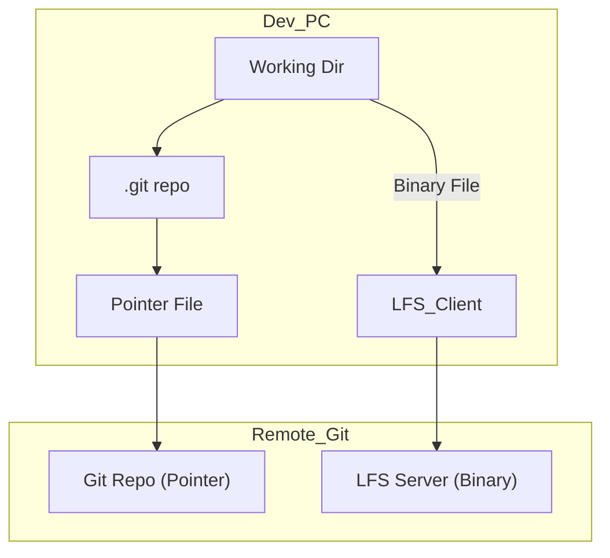

# 🧱 Git LFS – Large File Storage

> Manage binaries like videos, images, datasets, and more — without bloating your Git repo.

---

<div align="center">
  
</div>

---

## 🔥 Why Do We Need Git LFS?

Git is amazing for **code**, but struggles with:

- 🧠 **Binary files** like `.mp4`, `.zip`, `.psd`, `.iso`
- 🧨 Large files (Git snapshots every version = huge repo)
- 🐢 Slow performance (clone/pull becomes painful)

**Git LFS (Large File Storage)** fixes that by replacing **binary files with pointers**, while storing the real files in a **separate LFS server**.

---

## 🧬 How Git LFS Works

### 1. 🧑‍💻 On the Developer’s Machine (👧🏻 Jasmine )

<div align="center">
  
</div>

---

```bash
git lfs install                   # Set up Git LFS in your repo
git lfs track "*.mp4"            # Tell Git: treat all .mp4 as LFS files
git add .gitattributes           # Adds LFS config file
git add video1.mp4               # Adds pointer, not the full binary
git commit                       # Normal Git commit
git push                         # Pushes:
                                 #   🔹 Pointers to Git server
                                 #   🔹 Real binaries to LFS server
```

> - Your `.mp4` goes into LFS storage, not `.git/objects`
> - Git stores a **text pointer** in your repo
> - Keeps repo clean, small, and fast

---

### 🧑‍💻 2. On Another Developer’s Machine (🧔🏻‍♂️ Mike)

<div align="center">
  
</div>

---

```bash
git lfs install                 # Again, set up LFS on this machine
git clone <repo-url>            # Clones repo
                                #   🔸 Git pulls the repo with pointers
                                #   🔸 Git LFS fetches binaries from LFS server
```

> - Git downloads code/pointers
> - LFS automatically grabs the real binary assets in the background

---

### 🧠 What's Really Stored?

| In Git Repo                          | In LFS Server      |
| ------------------------------------ | ------------------ |
| `.gitattributes` config              | Actual binary file |
| Pointer file (e.g., `oid sha256...`) |                    |
| All other source code                |                    |

- Jasmine & Mike both interact with **Git and LFS** transparently
- You still use `git add`, `git commit`, `git push` — no new mental model needed!

---

## 🧩 Pro Tips

- Always commit `.gitattributes` to share LFS config with the team
- Set up Git LFS early — migrating later is painful 😬
- Avoid putting huge files in Git history even by mistake (hard to remove later)

---

## 💣 Common Mistakes

| Mistake                        | Why it's bad                       | Fix                               |
| ------------------------------ | ---------------------------------- | --------------------------------- |
| Adding binary directly to Git  | Bloats repo                        | Use `git lfs track "*.ext"` first |
| Forgetting `.gitattributes`    | Other devs won’t track same files  | Always commit this file           |
| Pushing large file without LFS | Might hit GitHub/Azure size limits | Use LFS upfront                   |

---

## 🧪 Git LFS in Azure DevOps

> ✅ Azure DevOps is **LFS-aware**  
> It automatically stores LFS files in an Azure-backed blob system and integrates fully with your repos.

💡 No need for extra setup — it just works after `git lfs install` and `git push`.

---

## 🧠 Final Diagram Summary

<div align="center">



</div>

---

## ✅ Summary

| 🔹  | Git LFS Benefit                    |
| --- | ---------------------------------- |
| 💾  | Stores heavy files outside Git     |
| 🚀  | Keeps repos fast and lean          |
| 🔁  | Transparently integrates with Git  |
| 🛠️  | Simple setup: just install + track |
| 🤝  | Fully supported in Azure DevOps    |
