```mermaid
graph TD
    A([👤 User / Trigger])
    B@{ shape: hex, label: "🧠 Azure Pipelines Service\n(Control Plane)" }
    C@{ shape: hex, label: "📋 Execution Plan\n(Stages • Jobs • Steps)" }

    D@{ shape: processes, label: "🤖 Agent A\n(Job 1)" }
    E@{ shape: processes, label: "🤖 Agent B\n(Job 2)" }
    F@{ shape: processes, label: "🤖 Agent C\n(Job 3)" }

    A --> B
    B --> C
    C --> D
    C --> E
    C --> F

    classDef animate stroke-dasharray: 8,4,stroke-dashoffset: 500,animation: dash 18s linear infinite;
    class A,B,C,D,E,F animate
```

# 🧠 **Azure Pipelines Architecture Internals**

> Azure Pipelines is **not a single runtime system**. It is a **distributed orchestration platform** composed of a **control plane (Pipeline Service)** and **execution workers (Agents)**.
> The Pipeline Service **parses YAML, resolves templates, schedules jobs, and enforces security**, while **Agents execute jobs in isolated environments**.
> Each **job runs on exactly one agent**, with **no shared state between jobs**. Any persistence must be **explicit** (artifacts, output variables, external storage).

---


---

<div align="center" style="background-color: #2b3436ff; border-radius: 10px; border: 2px solid">



</div>

---

## 🔴 **Problem: Why Pipelines Feel “Confusing” at First**

Most confusion comes from **assuming pipelines behave like a single process**.

Common wrong assumptions:

- Jobs share files
- Variables automatically persist
- Agents “remember” previous jobs
- YAML is executed top-down like a script

❌ None of this is true.

To understand Azure Pipelines, you must separate:

> **Orchestration** from **Execution**

---

## 🧠 **Pipeline Service vs Agent**

### 🧠 Pipeline Service (Control Plane)

The **Pipeline Service never runs your code**.

It is responsible for:

- Reading YAML
- Expanding templates
- Resolving parameters
- Evaluating compile-time expressions (`${{ }}`)
- Building an execution graph
- Scheduling jobs
- Enforcing permissions

Think of it as:

> 🧠 _The architect and scheduler_

---

### 🤖 Pipeline Agent (Execution Plane)

The **Agent only executes jobs**.

It is responsible for:

- Creating a working directory
- Checking out code
- Running scripts and tasks
- Producing logs
- Uploading artifacts

Think of it as:

> 🤖 _A disposable worker with instructions_

The agent:

- Does **not** know pipeline structure
- Does **not** know other jobs exist
- Does **not** share memory or filesystem

---

## ⚙️ **What Actually Happens When a Pipeline Runs**

### 🟦 Phase 1: Design Time (Pipeline Service)

1. YAML is parsed
2. Templates are expanded
3. Parameters are resolved
4. Stages, jobs, and steps are materialized
5. A **static execution plan** is created

⚠️ No agent exists yet  
⚠️ No scripts run  
⚠️ No runtime variables exist

---

### 🟩 Phase 2: Job Scheduling

For **each job**, the service:

- Selects an agent pool
- Applies demands
- Finds a matching agent
- Assigns **one job → one agent**

---

### 🟨 Phase 3: Runtime Execution (Agent)

The agent:

1. Starts with a clean environment
2. Executes steps sequentially
3. Streams logs to the service
4. Publishes outputs (artifacts, variables)
5. Terminates job context

After this → **everything is destroyed**.

---

## 🔥 **Job Isolation & Why State Is Lost**

### 🧱 Hard Rule (Memorize This)

> **Each job runs in total isolation.**

That isolation includes:

- Filesystem
- Environment variables
- Processes
- Installed tools (on hosted agents)

---

### ❌ Why This Fails

```yaml
jobs:
  - job: Build
    steps:
      - script: echo "hello" > version.txt

  - job: Deploy
    steps:
      - script: cat version.txt
```

**Reason**:
`Deploy` runs on a **different agent**.

---

### ✅ What Survives Job Boundaries

Only **explicit channels**:

- Pipeline artifacts
- Output variables (`isOutput=true`)
- External systems (Blob, DB, S3, etc.)

Isolation is a **feature**, not a limitation.

---

## ☁️ **Hosted vs Self-Hosted Agents**

### ☁️ Microsoft-Hosted Agents

> **Ephemeral, fully managed agents:**

**Characteristics:**

- New VM per job
- Preinstalled tools
- Auto-scaled
- Zero maintenance

**Trade-offs:**

- Cold start latency
- No persistent cache
- No private network access

Best for:

- CI pipelines
- Learning
- Standard workloads

---

### 🏠 Self-Hosted Agents

> **Persistent machines you manage:**

**Characteristics:**

- Long-lived VM or container
- Custom tooling
- Network access (on-prem, private VNet)
- Full control

**Trade-offs:**

- You patch and secure
- You scale
- You monitor

Best for:

- Terraform / IaC
- Enterprise networks
- High-performance builds
- Compliance workloads

---

## 🎯 **Agent Capabilities & Demands**

### 🧩 Agent Capabilities

Capabilities describe **what an agent can do**:

- OS
- Installed tools
- Custom labels

Examples:

```ini
Agent.OS = Linux
java = 17
docker = true
terraform = 1.6
```

---

### 🎯 Demands (Job Requirements)

Jobs can require capabilities:

```yaml
pool:
  name: SelfHostedPool
  demands:
    - docker
    - terraform
```

The Pipeline Service:

- Scans agents
- Matches capabilities
- Queues job until a match is found

If no agent matches → **job never starts**

---

## 🌐 **End-to-End Pipeline Execution Flow**

```mermaid
sequenceDiagram
    title Azure Pipeline Execution Flow 🧭

    participant User as 👤 User / Trigger
    participant Service as 🧠 Pipeline Service
    participant Agent as 🤖 Pipeline Agent
    participant Repo as 📦 Git Repo
    participant Artifact as 🗂️ Artifact Storage

    User->>Service: ▶️ Trigger pipeline
    Service->>Service: 📋 Parse YAML & templates
    Service->>Service: 🧮 Resolve parameters & expressions
    Service->>Agent: 📦 Assign job
    Agent->>Repo: 🔽 Checkout code
    Agent->>Agent: ⚙️ Run steps
    Agent->>Artifact: 📤 Publish artifacts
    Agent-->>Service: 📝 Stream logs
    Service-->>User: ✅ Pipeline result
```

<div align="center" style="background-color: #232b2dff; border-radius: 10px; border: 2px solid">



</div>

---

## 🧠 **Memorization Tips**

### 🔑 Mnemonic: **"BRAIN–HANDS–ISOLATION"**

| Concept       | Remember                         |
| ------------- | -------------------------------- |
| **BRAIN**     | Pipeline Service orchestrates    |
| **HANDS**     | Agent executes blindly           |
| **ISOLATION** | One job = one agent              |
| **NO MEMORY** | State dies after job             |
| **EXPLICIT**  | Only artifacts & outputs persist |
