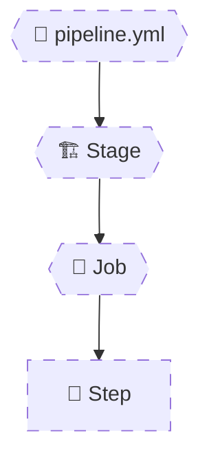
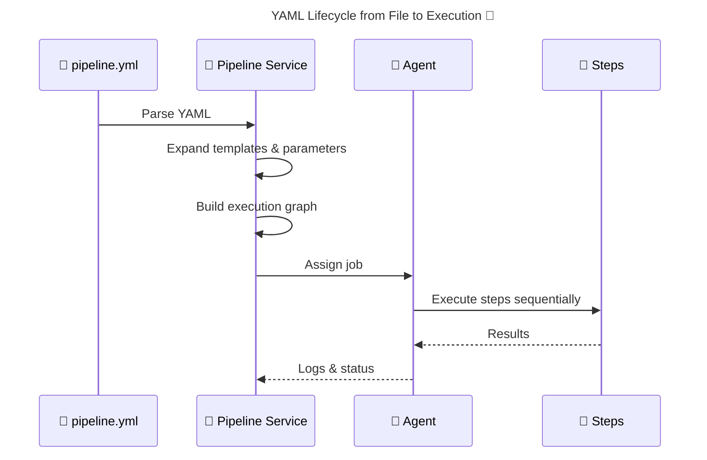

# 🧠 **Azure Pipelines YAML Anatomy**

> Azure Pipelines YAML is **not a script**.
> It is a **declarative execution graph** that the Pipeline Service **compiles into stages, jobs, and steps**.
> YAML defines **structure and intent**, while **agents execute only the final, expanded plan**.
> Understanding the **hierarchy and lifecycle** of YAML elements is mandatory for mastering variables, conditions, templates, and deployments.

---


---

<div align="center" style="background-color: #2b3436ff; border-radius: 10px; border: 2px solid">



</div>

---

## 🔴 **Problem: Treating YAML Like a Script**

Many people read YAML as if it executes **top-down like Bash**.

This leads to mistakes:

- Expecting variables to “update” instantly
- Assuming later jobs see earlier files
- Confusing `steps` with `jobs`
- Misusing conditions

❌ YAML does **not** execute  
✅ YAML **describes** what should execute

---

## 🧩 **The YAML Hierarchy (Non-Negotiable)**

### The only valid containment model

```ini
Pipeline
 └─ Stage
     └─ Job
         └─ Step
```

You **cannot**:

- Put a step outside a job
- Put a job outside a stage (unless single-stage implicit)
- Skip levels arbitrarily

---

## 🏗️ **Pipeline (Root Level)**

This is the **entry point**.

Defines:

- Triggers
- Parameters
- Global variables
- Stages
- Resources

Example:

```yaml
trigger:
  - main

variables:
  buildConfig: Release

stages:
  - stage: Build
```

📌 The pipeline itself **never runs on an agent**.

---

## 🏗️ **Stage (Logical Boundary)**

> A **Stage** is a **logical grouping of jobs**.

Used for:

- CI vs CD separation
- Environment boundaries (Dev / Test / Prod)
- Approvals & checks
- Deployment visibility

Example:

```yaml
- stage: Build
  displayName: Build Stage
```

### Key Properties

- Can run sequentially or in parallel
- Can depend on other stages
- Has its own variables and conditions

---

## 🧩 **Job (Execution Boundary)**

> A **Job is the unit of execution**.

This is where **agents are assigned**.

Key rules:

- One job → one agent
- Jobs are isolated
- Jobs may run in parallel
- Jobs define OS, pool, demands

Example:

```yaml
- job: BuildJob
  pool:
    vmImage: ubuntu-latest
```

⚠️ **If you remember only one thing**:

> **Agents are assigned at the job level**

---

## 🔹 **Steps (Action Units)**

> Steps are **instructions executed sequentially inside a job**.

Types of steps:

- Script steps
- Built-in tasks
- Checkout steps

Example:

```yaml
steps:
  - script: echo "Hello"
  - task: DotNetCoreCLI@2
```

✔ Steps share filesystem  
✔ Steps share environment variables  
✕ Steps do not survive job boundaries

---

## 🧠 **Why `checkout: self` Is a Step**

This confuses many people.

```yaml
steps:
  - checkout: self
```

Why?

- Code checkout happens **on the agent**
- The agent must execute it
- Therefore it is a **step**, not a pipeline feature

You can:

- Disable checkout
- Checkout multiple repos
- Control depth and submodules

---

## ⚙️ **Script Step vs Task Step**

### 🧾 Script Step

```yaml
- script: |
    echo "Build started"
```

Characteristics:

- Raw shell execution
- OS-dependent
- No built-in validation
- Full control

Best for:

- Custom logic
- Quick commands
- Tool chaining

---

### 🧰 Task Step

```yaml
- task: DotNetCoreCLI@2
  inputs:
    command: build
```

Characteristics:

- Prebuilt
- Validated inputs
- Opinionated behavior
- Better logging

Best for:

- Standard operations
- Consistency
- Team readability

---

## 🔁 **Execution Order (Very Important)**

Within a job:

```ini
Step 1 → Step 2 → Step 3 → ...
```

Across jobs:

- Parallel by default
- Controlled by `dependsOn`

Across stages:

- Sequential by default
- Controlled by `dependsOn`

---

## 🌐 **End-to-End YAML Execution Flow**

<div align="center" style="background-color: #232b2dff; border-radius: 10px; border: 2px solid">



</div>

---

## 🧠 **Mental Model (Lock This In)**

```ini
Pipeline = Blueprint
Stage = Phase
Job = Execution Unit
Step = Instruction
```

or even simpler:

```ini
Stages organize
Jobs execute
Steps act
```

---

## ❌ **Common YAML Anatomy Mistakes**

| Mistake                           | Why It’s Wrong       |
| --------------------------------- | -------------------- |
| Putting logic in YAML order       | YAML is declarative  |
| Expecting jobs to share files     | Isolation            |
| Overusing stages                  | Stages are heavy     |
| Forgetting agent scope            | Causes variable bugs |
| Mixing script & task expectations | Different lifecycles |

---

## 🧠 **Memorization Tips**

### 🔑 Mnemonic: **"PSJS"**

| Letter | Meaning               |
| ------ | --------------------- |
| **P**  | Pipeline (definition) |
| **S**  | Stage (logical phase) |
| **J**  | Job (agent boundary)  |
| **S**  | Step (execution unit) |
