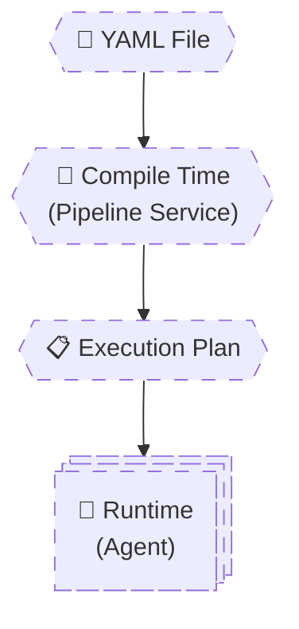
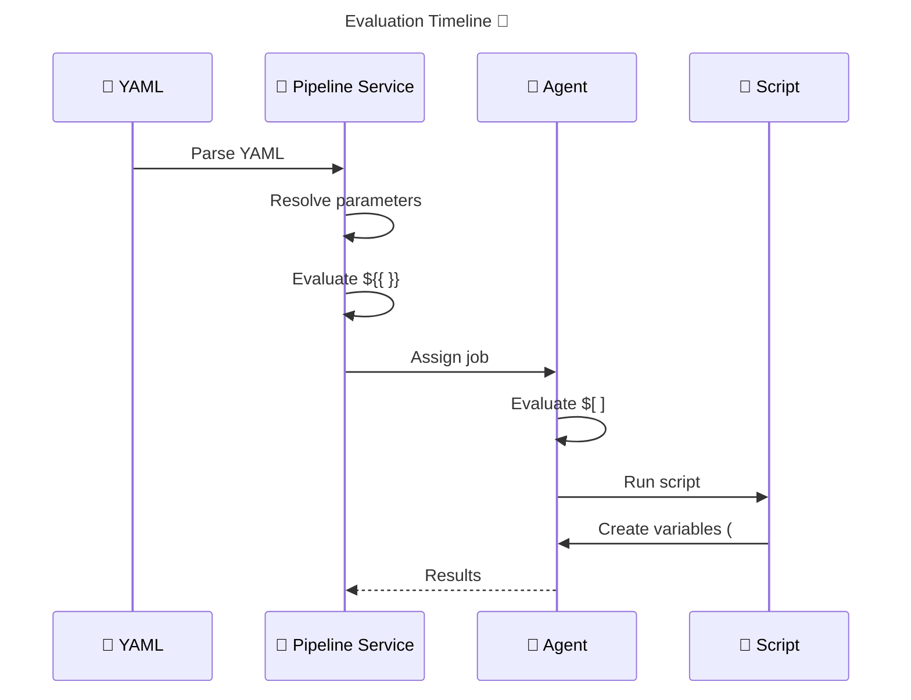

# 🧠 **Azure Pipelines Evaluation Model**

> Azure Pipelines has **two different evaluation engines** running at **two different times**.
> Most pipeline bugs happen because engineers **mix these two worlds**.
> YAML is first **compiled by the Pipeline Service**, then **executed by Agents**.
> Understanding **when something exists** is more important than understanding **how to write it**.

---


---

<div align="center" style="background-color: #2b3436ff; border-radius: 10px; border: 2px solid">



</div>

---

## 🔴 **Problem: “Why Is My Variable Empty?”**

This is the **#1 Azure Pipelines question**.

Root cause is almost always:

> Using a value **before it exists**.

To fix this forever, you must internalize:

- **Compile-time**
- **Runtime**

---

## 🧠 **Two Worlds, Two Engines**

| Phase            | Who evaluates    | What exists                 |
| ---------------- | ---------------- | --------------------------- |
| **Compile-time** | Pipeline Service | YAML, parameters, templates |
| **Runtime**      | Agent            | Variables, scripts, outputs |

---

## 🟦 **Compile-Time (Pipeline Service)**

### What Happens Here

- YAML is parsed
- Templates are expanded
- Parameters are resolved
- Stages, jobs, and steps are generated
- Static execution graph is created

### What Exists

- Parameters
- Template expressions
- `${{ }}` expressions
- YAML structure

### What Does NOT Exist

- Script output
- Runtime variables
- `##vso` variables
- Files created by scripts

---

### Compile-Time Syntax: `${{ }}`

```yaml
${{ if eq(parameters.env, 'prod') }}:
```

Use it to:

- Add/remove stages
- Add/remove jobs
- Add/remove steps
- Select variable groups

❗ Once compile-time ends, it is **too late** to change structure.

---

## 🟩 **Runtime (Agent Execution)**

### What Happens Here

- Agent starts
- Steps execute sequentially
- Scripts run
- Variables are created
- Artifacts are published

### What Exists

- `$(variable)` values
- Environment variables
- Files on disk
- `##vso` output variables

### What Does NOT Exist

- Parameters (already resolved)
- YAML structure changes
- Template logic

---

### Runtime Syntax: `$( )`

```yaml
- script: echo $(Build.BuildId)
```

This is resolved **by the agent at execution time**.

---

## 🔺 **The Third Syntax: `$[ ]` (Runtime Expressions)**

> `$[ ]` is evaluated **at runtime** but **before a job starts**.

Used for:

- Output variables
- Conditions
- Dependencies

Example:

```yaml
variables:
  version: $[ dependencies.Build.outputs['setStep.version'] ]
```

Think of `$[ ]` as:

> Runtime but **outside step execution**

---

## 🔥 **All Three Syntaxes Compared**

| Syntax   | Phase             | Purpose     |
| -------- | ----------------- | ----------- |
| `${{ }}` | Compile-time      | Structure   |
| `$[ ]`   | Runtime (pre-job) | Data flow   |
| `$( )`   | Runtime (step)    | Value usage |

---

## ❌ **Broken Example (Classic Mistake)**

```yaml
variables:
  version: $(Build.BuildId)

stages:
  - ${{ if eq(variables.version, '123') }}:
      - stage: Deploy
```

❌ Why it fails:

- `variables.version` does not exist at compile-time
- `$()` is runtime
- Compile-time cannot see runtime values

---

## ✅ **Correct Version**

```yaml
parameters:
  - name: deploy
    type: boolean
    default: true

stages:
  - ${{ if eq(parameters.deploy, true) }}:
      - stage: Deploy
```

Structure uses **parameters**, not variables.

---

## 🧩 **Variable Lifecycle Timeline**

```
YAML Read
 ├─ Parameters resolved
 ├─ Templates expanded
 ├─ ${ { } } evaluated
 └─ Execution plan created
      ↓
 Agent starts
 ├─ $[ ] evaluated
 ├─ Job begins
 ├─ Steps execute
 ├─ $( ) resolved
 ├─ ##vso variables set
 └─ Job ends (state lost)
```

---

## 🧠 **When to Use Each One (Golden Rule)**

| You want to…              | Use                      |
| ------------------------- | ------------------------ |
| Change pipeline structure | `${{ }}`                 |
| Control job execution     | `$[ ]`                   |
| Read variable in script   | `$( )`                   |
| Pass data between jobs    | `$[ ]` + `isOutput=true` |
| Use user input            | Parameters               |

---

## 🔁 **End-to-End Flow Example**

<div align="center" style="background-color: #232b2dff; border-radius: 10px; border: 2px solid">



</div>

---

## 🧠 **Memorization Tips**

### 🔑 Mnemonic: **"C-R-S"**

| Letter | Meaning                  |
| ------ | ------------------------ |
| **C**  | Compile-time (`${{ }}`)  |
| **R**  | Runtime pre-job (`$[ ]`) |
| **S**  | Step runtime (`$( )`)    |

---

## ❌ **Top Evaluation Model Mistakes**

| Mistake                           | Why           |
| --------------------------------- | ------------- |
| Using `$(var)` in `${{ }}`        | Too late      |
| Using runtime output in structure | Impossible    |
| Using parameters in scripts       | Already gone  |
| Expecting `##vso` at compile-time | Doesn’t exist |

---

## ✅ Why This Topic Is the Root of Mastery

If you truly understand this:

- Variables stop being mysterious
- Output variables feel logical
- Conditions behave predictably
- Templates become easy
- Debugging becomes trivial

This is the **core mental model of Azure Pipelines**.

---

### ▶️ Next Topic (Core Foundations)

**1.4 Variables Deep Dive (Scopes, Precedence, Internals)**
This will:

- Connect evaluation model to real variables
- Explain why overrides work
- Show why variable groups behave differently
- Prepare you for `##vso` mastery

When ready, say:

> **“Continue with 1.4 Variables Deep Dive in the same style”**

You are now officially past the **junior DevOps barrier**.
