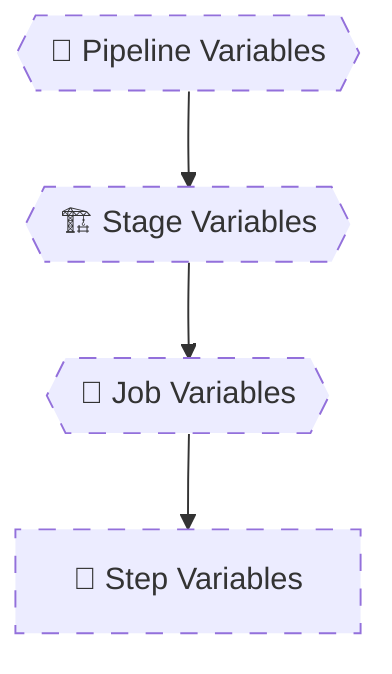

# 🧠 **Azure Pipelines Variables – Deep Internals**

> Variables in Azure Pipelines are **runtime data containers**, not compile-time constructs.
> They are **scoped**, **overridable**, and **resolved dynamically** depending on **where and when** they are accessed.
> Most variable bugs are caused by **wrong scope assumptions**, **wrong evaluation timing**, or **wrong syntax**.

---


---

<div align="center" style="background-color: #2b3436ff; border-radius: 10px; border: 2px solid">



</div>

---

## 🔴 **Problem: “Why Did My Variable Change?”**

This happens because:

> **Variables are resolved by scope, not by definition order**

The **closest scope wins**.

---

## 1️⃣ Variable Scopes & Precedence

### 🔢 Precedence Rule (Memorize This)

```ini
Step > Job > Stage > Pipeline > Variable Group
```

Let’s prove it with examples.

---

### 🟦 Pipeline-Level Variable

```yaml
variables:
  env: dev

jobs:
  - job: Demo
    steps:
      - script: echo $(env)
```

✅ Output:

```ini
dev
```

---

### 🟨 Stage-Level Override

```yaml
variables:
  env: dev

stages:
  - stage: Build
    variables:
      env: test
    jobs:
      - job: Demo
        steps:
          - script: echo $(env)
```

✅ Output:

```ini
test
```

---

### 🟧 Job-Level Override

```yaml
stages:
  - stage: Build
    variables:
      env: test
    jobs:
      - job: Demo
        variables:
          env: prod
        steps:
          - script: echo $(env)
```

✅ Output:

```ini
prod
```

---

### 🔹 Step-Level Override (Least Known, Very Important)

```yaml
steps:
  - script: echo $(env)
    env:
      env: local
```

✅ Output:

```ini
local
```

📌 Step-level `env:` **overrides everything** for that step only.

---

## 2️⃣ System Variables vs User Variables

### ⚙️ System Variables (Built-in)

Provided automatically by Azure DevOps.

Examples:

- `Build.BuildId`
- `Build.SourceBranch`
- `System.JobName`
- `Agent.OS`

```yaml
- script: |
    echo Build ID: $(Build.BuildId)
    echo Branch: $(Build.SourceBranch)
    echo OS: $(Agent.OS)
```

✔ Read-only  
✔ Always available  
✕ Cannot override safely

---

### 👤 User Variables

Defined by you.

```yaml
variables:
  appName: my-api
```

Usage:

```yaml
- script: echo $(appName)
```

✔ Mutable  
✔ Overridable  
✔ Can be set via `##vso`

---

### ❌ Dangerous Pattern (Do Not Do This)

```yaml
variables:
  Build.BuildId: 123
```

❌ This **does not override** the system variable  
❌ Creates confusion  
❌ Leads to broken pipelines

---

## 3️⃣ Environment Variables Mapping

> Every pipeline variable becomes an **OS environment variable**.

---

### Mapping Rules

| Pipeline Variable | Linux / macOS   | Windows          |
| ----------------- | --------------- | ---------------- |
| `myVar`           | `$MYVAR`        | `%MYVAR%`        |
| `build.number`    | `$BUILD_NUMBER` | `%BUILD_NUMBER%` |

---

### Example (Linux Agent)

```yaml
variables:
  appName: backend

steps:
  - script: |
      echo $(appName)
      echo $APPNAME
```

✅ Both print:

```ini
backend
```

---

### Example (Windows Agent)

```yaml
- powershell: |
    Write-Host $env:APPNAME
```

---

### 🔥 Why This Matters

This is how:

- Docker builds read variables
- Terraform reads env vars
- Bash scripts work naturally

---

## 4️⃣ Variable Templates (Enterprise Pattern)

> Variable templates allow **centralized, reusable configuration**.

---

### 📄 `variables.yml`

```yaml
variables:
  appName: api
  port: 8080
  environment: dev
```

---

### 📄 `pipeline.yml`

```yaml
variables:
  - template: variables.yml

steps:
  - script: |
      echo $(appName)
      echo $(port)
```

✔ Clean  
✔ DRY  
✔ Version-controlled

---

### 🔥 Template + Override Example

```yaml
variables:
  - template: variables.yml
  - name: environment
    value: prod
```

✅ `environment = prod`  
📌 Local override wins

---

## 5️⃣ Debugging Variable Resolution

### 🟢 Enable Debug Mode

```yaml
variables:
  system.debug: true
```

This reveals:

- Variable expansion
- Scope resolution
- Expression evaluation
- Task inputs

---

### 🧪 Debug Example

```yaml
variables:
  env: dev

steps:
  - script: |
      echo "env=$(env)"
      printenv | sort
```

Look for:

```ini
ENV=dev
```

---

### 🔍 Debugging Checklist

When a variable is wrong:

1. What scope defines it?
2. Is it overridden?
3. Is it compile-time or runtime?
4. Is syntax correct (`$( )`)?
5. Is agent OS affecting env mapping?

---

## ❌ Common Variable Bugs

### ❌ Bug 1: Variable Is Empty

```yaml
- script: echo $(myVar)
```

Cause:

- Variable never defined

Fix:

```yaml
variables:
  myVar: value
```

---

### ❌ Bug 2: Variable Not Updating

```yaml
- script: |
    echo "##vso[task.setvariable variable=ver]1.0"
- script: echo $(ver)
```

✔ Works **only in same job**

Across jobs → ❌
Fix requires `isOutput=true` (next topic).

---

### ❌ Bug 3: Using Variable in Structure

```yaml
- ${{ if eq(variables.env, 'prod') }}:
```

❌ Variables don’t exist at compile-time
✔ Use parameters instead

---

## 🧠 **Memorization Tips**

### 🔑 Mnemonic: **"SCOPES WIN"**

| Letter | Meaning                   |
| ------ | ------------------------- |
| **S**  | Step overrides all        |
| **C**  | Closest scope wins        |
| **O**  | OS maps variables         |
| **P**  | Pipeline is default       |
| **E**  | Env vars are automatic    |
| **S**  | System vars are read-only |

---

## ✅ Why This Topic Separates Seniors

Senior engineers:

- Predict variable behavior
- Debug without guessing
- Design pipelines intentionally
- Avoid scope collisions
- Use templates properly

Junior engineers:

- Trial-and-error variables
- Random overrides
- “Why is it empty?” questions

You are now firmly in **senior territory**.

---

### ▶️ Next Topic (Still Category 2)

**2.2 Parameters (Advanced Usage & Examples)**
We will cover:

- Parameters vs variables (real differences)
- Object & array parameters
- Dynamic pipelines
- Real broken vs fixed patterns

When ready, say:

> **“Continue with 2.2 Parameters in the same style, with heavy examples”**
