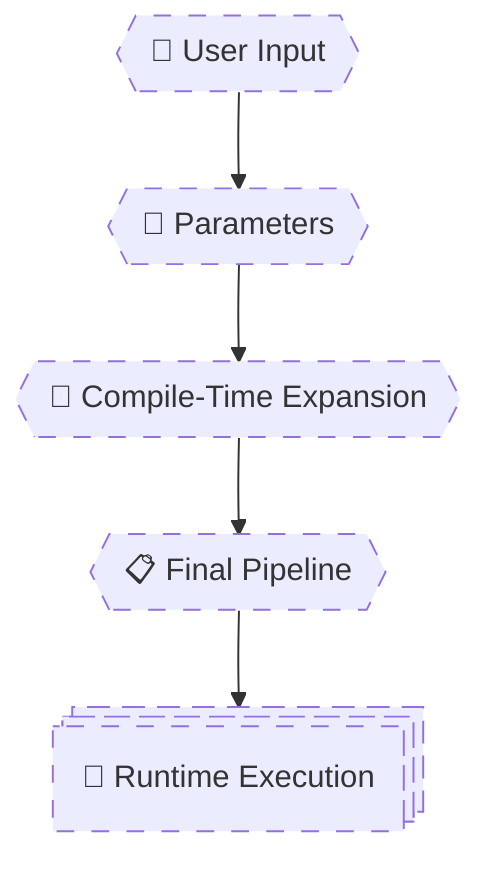

# 🧠 **Azure Pipelines Parameters**

> **Parameters are compile-time inputs.**
> They exist **only while the Pipeline Service is building the execution plan**.
> They are **immutable**, **strongly typed**, and **structural**.
> If you use parameters correctly, your pipelines become **clean, predictable, and scalable**.

---


---

<div align="center" style="background-color: #2b3436ff; border-radius: 10px; border: 2px solid">



</div>

---

## 🔴 **Problem: Using Variables for Structure**

This is the **classic junior mistake**:

```yaml
variables:
  env: prod

stages:
  - ${{ if eq(variables.env, 'prod') }}:
      - stage: Deploy
```

❌ This **will never work**

Why?

- Variables exist at runtime
- Structure is built at compile-time

---

## 🧠 **Parameters vs Variables**

| Feature            | Parameters   | Variables    |
| ------------------ | ------------ | ------------ |
| Evaluation time    | Compile-time | Runtime      |
| Can change         | ❌ No        | ✅ Yes       |
| Controls structure | ✅ Yes       | ❌ No        |
| Used in scripts    | ❌ No        | ✅ Yes       |
| User input         | ✅ Yes       | ⚠️ Sometimes |

---

## 📃 1. Defining Parameters

```yaml
parameters:
  - name: environment
    type: string
    default: dev
```

Usage:

```yaml
- script: echo "Env = ${{ parameters.environment }}"
```

📌 Notice:

- `${{ }}` syntax
- No `$()` allowed

---

## 🤹 2. Parameter Types

### 🔤 String Parameter

```yaml
parameters:
  - name: env
    type: string
    values:
      - dev
      - test
      - prod
```

```yaml
- script: echo Deploying to ${{ parameters.env }}
```

✔ Dropdown in UI  
✔ Validation enforced

---

### 🔘 Boolean Parameter

```yaml
parameters:
  - name: runTests
    type: boolean
    default: true
```

```yaml
- ${{ if eq(parameters.runTests, true) }}:
    - script: echo Running tests
```

---

### 🔢 Number Parameter

```yaml
parameters:
  - name: replicas
    type: number
    default: 3
```

```yaml
- script: echo Replicas = ${{ parameters.replicas }}
```

---

## 📝 3. Using Parameters to Control Pipeline Structure

### 🧩 Example: Conditional Stage

```yaml
parameters:
  - name: deploy
    type: boolean
    default: false

stages:
  - stage: Build

  - ${{ if eq(parameters.deploy, true) }}:
      - stage: Deploy
```

✔ Deploy stage exists only when deploy = true  
✔ Clean execution graph

---

### ❌ Broken Alternative (Do Not Use)

```yaml
condition: eq(variables.deploy, true)
```

❌ Stage still exists  
❌ Only skipped, not removed

---

## 📦 Object Parameters (Most Powerful Feature)

> Object parameters enable **dynamic pipelines**.

---

### 🧱 Object Parameter Definition

```yaml
parameters:
  - name: services
    type: object
    default:
      - name: api
        port: 8080
      - name: web
        port: 3000
```

---

### 🔁 Looping Over Objects

```yaml
stages:
  - stage: Build
    jobs:
      - ${{ each svc in parameters.services }}:
          - job: Build_${{ svc.name }}
            steps:
              - script: |
                  echo Building ${{ svc.name }}
                  echo Port ${{ svc.port }}
```

✔ Dynamic jobs  
✔ Zero duplication  
✔ Enterprise-grade design

---

## 🤹‍♀️ Array Parameters (Controlled Fan-Out)

```yaml
parameters:
  - name: regions
    type: object
    default: ["eastus", "westeurope"]
```

```yaml
- ${{ each region in parameters.regions }}:
    - script: echo Deploying to ${{ region }}
```

---

## 🫴 Passing Parameters into Templates (Real World)

### 📄 `job-template.yml`

```yaml
parameters:
  - name: appName
    type: string

jobs:
  - job: Build_${{ parameters.appName }}
    steps:
      - script: echo Building ${{ parameters.appName }}
```

---

### 📄 Main Pipeline

```yaml
jobs:
  - template: job-template.yml
    parameters:
      appName: api
```

✔ Template contract
✔ Reusability
✔ Predictable structure

---

## 🔴 Parameters vs Runtime Values (Hard Rule)

### ❌ This Is Impossible

```yaml
parameters:
  - name: version
    type: string
    default: $(Build.BuildId)
```

Why?

- Parameters are resolved **before runtime**

---

### ✅ Correct Pattern

```yaml
variables:
  version: $(Build.BuildId)
```

or

```yaml
- script: |
    echo "##vso[task.setvariable variable=version]$(Build.BuildId)"
```

---

## 🟢 Mixing Parameters & Variables (Correct Pattern)

```yaml
parameters:
  - name: env
    type: string
    default: dev

variables:
  envName: ${{ parameters.env }}

steps:
  - script: echo $(envName)
```

✔ Parameter defines structure
✔ Variable used at runtime

---

## 🧠 **Memorization Tips**

### 🔑 Mnemonic: **"PICS"**

| Letter | Meaning           |
| ------ | ----------------- |
| **P**  | Parameters = Plan |
| **I**  | Immutable         |
| **C**  | Compile-time      |
| **S**  | Structure         |

---

## ❌ Common Parameter Mistakes

| Mistake                       | Why                  |
| ----------------------------- | -------------------- |
| Using `$()` in parameters     | Runtime too late     |
| Using parameters in scripts   | Already resolved     |
| Using variables for structure | Wrong phase          |
| Overusing parameters          | Makes pipeline rigid |
