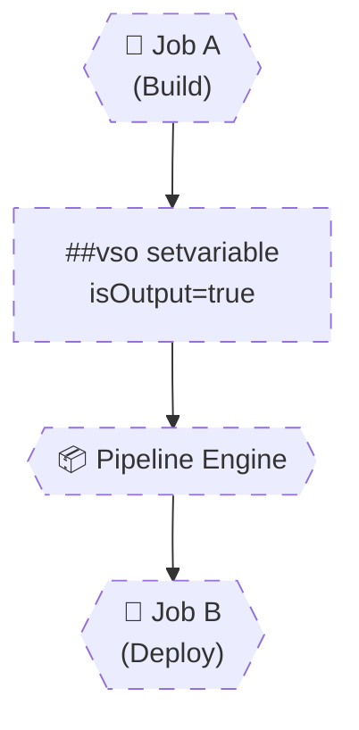

# 🧠 **Output Variables & Data Flow**

> **Jobs are isolated by design.**
> Output variables are the **only native, supported way** to move **calculated runtime data**
> across **jobs** and **stages**.
> If you don’t master output variables, you cannot build real CI/CD pipelines.

---


---

<div align="center" style="background-color: #2b3436ff; border-radius: 10px; border: 2px solid">



</div>

---

## 🔴 **Problem: “Why Is My Variable Empty in the Next Job?”**

This **always fails**:

```yaml
jobs:
  - job: Build
    steps:
      - script: |
          echo "##vso[task.setvariable variable=version]1.0.0"

  - job: Deploy
    steps:
      - script: echo $(version)
```

❌ Output:

```ini
(empty)
```

### Why?

- Jobs run on **different agents**
- Normal variables **die with the job**

---

## 🧠 **Golden Rule of Data Flow**

> **If data must survive job or stage boundaries, it MUST be an output variable.**

---

## 1️⃣ Creating an Output Variable (Correct Way)

### ✅ Minimal Correct Example

```yaml
- script: |
    echo "##vso[task.setvariable variable=version;isOutput=true]1.0.0"
  name: setVersion
```

### 🔑 Three Mandatory Rules

1. Use `##vso[task.setvariable]`
2. Set `isOutput=true`
3. The step **must have a name**

Miss any → it fails silently.

---

## 2️⃣ Consuming Output Variables (Cross-Job)

### 🧱 Full Working Example

```yaml
jobs:
  - job: Build
    steps:
      - script: |
          VERSION=1.0.$RANDOM
          echo "##vso[task.setvariable variable=version;isOutput=true]$VERSION"
        name: buildStep

  - job: Deploy
    dependsOn: Build
    variables:
      buildVersion: $[ dependencies.Build.outputs['buildStep.version'] ]
    steps:
      - script: echo Deploying version $(buildVersion)
```

### ✅ Output

```ini
Deploying version 1.0.4832
```

---

## 3️⃣ Understanding the Output Variable Path (CRITICAL)

### Format (Memorize This)

```ini
dependencies.<JOB>.outputs['<STEP>.<VARIABLE>']
```

### Real Example

```yaml
dependencies.Build.outputs['buildStep.version']
```

| Part        | Meaning       |
| ----------- | ------------- |
| `Build`     | Job name      |
| `buildStep` | Step name     |
| `version`   | Variable name |

---

## 4️⃣ `$[ ]` vs `$( )` (Where People Fail)

### ❌ Wrong

```yaml
variables:
  v: $(dependencies.Build.outputs['step.var'])
```

### ✅ Correct

```yaml
variables:
  v: $[ dependencies.Build.outputs['step.var'] ]
```

| Syntax | Why                             |
| ------ | ------------------------------- |
| `$[ ]` | Evaluated before job starts     |
| `$( )` | Evaluated during step execution |

---

## 5️⃣ Output Variables Across **Stages**

### 🧱 Cross-Stage Example (Very Common in CD)

```yaml
stages:
  - stage: Build
    jobs:
      - job: BuildJob
        steps:
          - script: |
              echo "##vso[task.setvariable variable=artifact;isOutput=true]drop"
            name: publishStep

  - stage: Deploy
    dependsOn: Build
    variables:
      artifactName: $[ stageDependencies.Build.BuildJob.outputs['publishStep.artifact'] ]
    jobs:
      - job: DeployJob
        steps:
          - script: echo Deploying $(artifactName)
```

---

### 🔑 Cross-Stage Path Format

```ini
stageDependencies.<STAGE>.<JOB>.outputs['<STEP>.<VAR>']
```

---

## 6️⃣ Real-World Pattern: Build → Test → Deploy

### 🏗️ Build Stage (Calculate Version)

```yaml
- stage: Build
  jobs:
    - job: BuildJob
      steps:
        - script: |
            VERSION=1.2.$(Build.BuildId)
            echo "##vso[task.setvariable variable=version;isOutput=true]$VERSION"
          name: calcVersion
```

---

### 🧪 Test Stage (Consume Version)

```yaml
- stage: Test
  dependsOn: Build
  variables:
    version: $[ stageDependencies.Build.BuildJob.outputs['calcVersion.version'] ]
  jobs:
    - job: TestJob
      steps:
        - script: echo Testing version $(version)
```

---

### 🚀 Deploy Stage (Reuse Version)

```yaml
- stage: Deploy
  dependsOn: Test
  variables:
    version: $[ stageDependencies.Build.BuildJob.outputs['calcVersion.version'] ]
  jobs:
    - job: DeployJob
      steps:
        - script: echo Deploying version $(version)
```

✔ Same version  
✔ Single source of truth  
✔ No recomputation

---

## 7️⃣ Output Variables vs Artifacts (Very Important)

| Use Case                         | Choose          |
| -------------------------------- | --------------- |
| Small values (id, version, flag) | Output variable |
| Files / binaries                 | Artifact        |
| Cross-platform data              | Artifact        |
| Pipeline logic                   | Output variable |

❌ Do NOT pass files via variables
❌ Do NOT pass versions via artifacts

---

## 8️⃣ Debugging Output Variables (Senior Skill)

---

### 🔍 Enable Debug

```yaml
variables:
  system.debug: true
```

---

### 🧪 Print All Variables

```yaml
- script: printenv | sort
```

---

### Common Debug Questions

1. Is `isOutput=true` set?
2. Is step named?
3. Is job name correct?
4. Using `$[ ]`, not `$()`?
5. Correct dependency path?

---

## ❌ Top Output Variable Mistakes (With Fixes)

### ❌ Missing Step Name

```yaml
- script: echo "##vso[task.setvariable variable=x;isOutput=true]1"
```

✕ Not accessible  
✔ Fix:

```yaml
- script: ...
  name: setX
```

---

### ❌ Wrong Dependency Name

```yaml
dependencies.BuildJob.outputs['step.var']
```

✕ Job name mismatch  
✔ Job name ≠ displayName

---

### ❌ Expecting Output in Same Step

```yaml
echo "##vso[task.setvariable variable=x;isOutput=true]1"
echo $(x)
```

✕ Output vars are **not** available immediately  
✔ They exist **after job completes**

---

## 🧠 **Memorization Tips**

### 🔑 Mnemonic: **"JSV-O"**

| Letter | Meaning                 |
| ------ | ----------------------- |
| **J**  | Job isolation           |
| **S**  | Step must be named      |
| **V**  | Variable must be output |
| **O**  | `$[ ]` to consume       |
