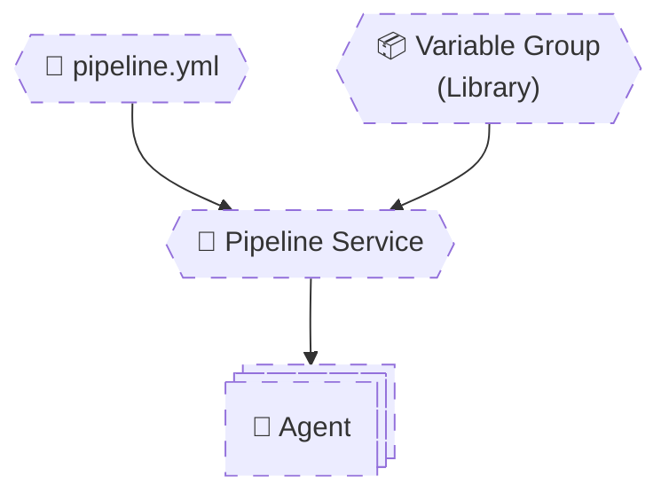

# 🧠 **Variable Groups & Secure Data Flow**

> **Variable Groups are centralized, shared, and secured variable containers** managed in **Azure DevOps Library**.
> They exist **outside YAML**, can be **linked to many pipelines**, and are the **correct place for secrets and environment configuration**.
> Senior engineers treat Variable Groups as **configuration boundaries**, not just key-value stores.

---


---

<div align="center" style="background-color: #2b3436ff; border-radius: 10px; border: 2px solid">



</div>

---

## 🔴 **Problem: Hard-Coding Configuration**

This is **how junior pipelines start**:

```yaml
variables:
  dbPassword: SuperSecret123
```

- ❌ Secret in Git
- ❌ No rotation
- ❌ No environment separation
- ❌ Security violation

---

## 🧠 **What Is a Variable Group (Really)?**

A **Variable Group** is:

- Created in **Azure DevOps → Library**
- Stored securely
- Optional secrets
- Linked to pipelines explicitly
- Governed by permissions

It is **not YAML**.  
It is **configuration infrastructure**.

---

## 1️⃣ Creating & Linking a Variable Group

### 📦 Variable Group: `common-vars`

| Name         | Value    | Secret |
| ------------ | -------- | ------ |
| `appName`    | `my-api` | ❌     |
| `dbPassword` | `*****`  | ✅     |

---

### 📄 Link in YAML

```yaml
variables:
  - group: common-vars
```

Usage:

```yaml
- script: echo App=$(appName)
```

- ✔ Values injected at runtime
- ✔ Secrets masked

---

## 2️⃣ Secret Variables

### 🧪 Example: Secret Variable

```yaml
- script: |
    echo $(dbPassword)
```

### Output

```ini
****
```

Azure DevOps:

- Masks secrets
- Blocks accidental logging
- Prevents secret leaks

---

### 🔥 Important Rule

> **Secrets are never available at compile-time**

✕ You cannot use secrets in `${{ }}`  
✔ You can use secrets in `$( )`

---

## 3️⃣ Variable Groups vs YAML Variables

| Feature                 | YAML Variables | Variable Groups |
| ----------------------- | -------------- | --------------- |
| Stored in repo          | ✅             | ❌              |
| Secure secrets          | ❌             | ✅              |
| Shared across pipelines | ⚠️             | ✅              |
| RBAC controlled         | ❌             | ✅              |
| Environment separation  | ❌             | ✅              |

---

## 4️⃣ Environment-Specific Variable Groups

### 📦 Variable Groups

| Group Name  | Purpose     |
| ----------- | ----------- |
| `dev-vars`  | Dev config  |
| `test-vars` | Test config |
| `prod-vars` | Prod config |

---

### 📄 Pipeline (Using Parameters)

```yaml
parameters:
  - name: env
    type: string
    default: dev
    values: [dev, test, prod]

variables:
  - ${{ if eq(parameters.env, 'dev') }}:
      - group: dev-vars
  - ${{ if eq(parameters.env, 'test') }}:
      - group: test-vars
  - ${{ if eq(parameters.env, 'prod') }}:
      - group: prod-vars
```

✔ Correct evaluation time  
✔ Secure  
✔ Scalable

---

## 5️⃣ Variable Groups + Templates (Enterprise Pattern)

### 📄 `variables-common.yml`

```yaml
variables:
  retryCount: 3
  timeout: 60
```

---

### 📄 Pipeline

```yaml
variables:
  - template: variables-common.yml
  - group: prod-vars
```

Precedence:

```ini
YAML > Variable Group
```

✔ Template defines defaults  
✔ Variable group defines secrets

---

## 6️⃣ Secure Runtime Injection (Best Practice)

### ❌ Bad Pattern (Inline Secrets)

```yaml
- script: az login --password $(dbPassword)
```

---

### ✅ Better Pattern (Environment Variable)

```yaml
- script: |
    az login --password $DB_PASSWORD
  env:
    DB_PASSWORD: $(dbPassword)
```

- ✔ Limits exposure
- ✔ Cleaner logs
- ✔ Industry best practice

---

## 7️⃣ Azure Key Vault Integration (Enterprise Standard)

### 🏦 Key Vault-Backed Variable Group

- Variable group linked to Key Vault
- Secrets pulled at runtime
- No secret stored in DevOps

---

### 📦 Example

| Key Vault Secret | Variable Name |
| ---------------- | ------------- |
| `DbPassword`     | `dbPassword`  |

Usage:

```yaml
- script: echo Connecting with password $(dbPassword)
```

- ✔ Central rotation
- ✔ Audit logging
- ✔ Zero pipeline changes

---

## 8️⃣ Variable Group Permissions (Often Forgotten)

Variable Groups have:

- Reader
- User
- Administrator

If a pipeline lacks permission:

- ❌ Variables resolve as empty
- ❌ No clear error

Always check:

> **Library → Variable Group → Security**

---

## 9️⃣ Debugging Variable Groups (Real-World)

### 🔍 Debug Checklist

When variable is empty:

1. Is group linked?
2. Correct environment?
3. Permission granted?
4. Secret masked?
5. Compile-time vs runtime usage?

---

### 🧪 Debug Snippet

```yaml
- script: |
    echo "App=$(appName)"
    printenv | grep APP
```

---

## ❌ Common Variable Group Mistakes

| Mistake                   | Result            |
| ------------------------- | ----------------- |
| Using secrets in `${{ }}` | Empty value       |
| Forgetting permissions    | Empty value       |
| Hard-coding secrets       | Security breach   |
| One group for all envs    | Risky deployments |
| Logging secrets           | Masked or blocked |

---

## 🧠 **Memorization Tips**

### 🔑 Mnemonic: **"GROUPS = SAFE"**

| Letter | Meaning                |
| ------ | ---------------------- |
| **G**  | Governed by RBAC       |
| **R**  | Runtime injected       |
| **O**  | Outside repo           |
| **U**  | Used across pipelines  |
| **P**  | Protected secrets      |
| **S**  | Scoped per environment |
