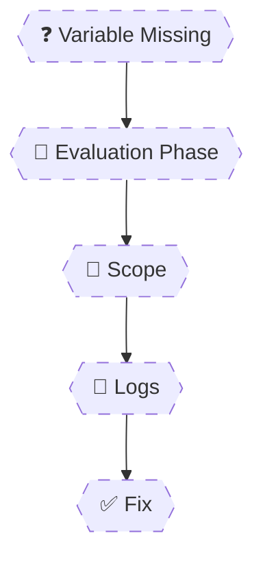

# 🧠 **Debugging Variable Resolution in Azure Pipelines**

> Debugging Azure Pipelines variables is **not guesswork**.
> Variables fail for **deterministic reasons**: wrong scope, wrong phase, wrong syntax, or wrong path.
> Senior engineers debug by **observing evaluation**, not by trial and error.

---


---

<div align="center" style="background-color: #2b3436ff; border-radius: 10px; border: 2px solid">



</div>

---

## 🔴 **Problem Pattern: “Variable Is Empty / Wrong / Inconsistent”**

Every real failure falls into **one of these buckets**:

1. Wrong evaluation phase
2. Wrong scope
3. Wrong syntax
4. Wrong dependency path
5. Permissions or secrets masking

We will debug **each with real pipelines**.

---

## 1️⃣ Enable Full Debug Mode (First Step Always)

### ✅ Mandatory Debug Flag

```yaml
variables:
  system.debug: true
```

What this unlocks:

- Variable expansion logs
- Expression evaluation
- Task input resolution
- Agent diagnostics

⚠️ Seniors **never debug without this**.

---

## 2️⃣ Debug Case #1 — Variable Exists, But Is Empty

### ❌ Broken Pipeline

```yaml
steps:
  - script: echo $(env)
```

Output:

```ini
(empty)
```

---

### 🔍 Debug Process

Add:

```yaml
- script: printenv | sort
```

---

### 🧠 Diagnosis

- Variable not defined anywhere
- No pipeline / stage / job variable
- No variable group

---

### ✅ Fix

```yaml
variables:
  env: dev
```

---

## 3️⃣ Debug Case #2 — Variable Works in One Job, Not Another

### ❌ Broken Pipeline

```yaml
jobs:
  - job: Build
    steps:
      - script: |
          echo "##vso[task.setvariable variable=ver]1.0"

  - job: Deploy
    steps:
      - script: echo $(ver)
```

---

### 🔍 Debug Logs Reveal

- `ver` created
- Job ends
- New agent starts
- Variable gone

---

### 🧠 Diagnosis

- Job isolation
- Missing `isOutput=true`

---

### ✅ Fix (Output Variable)

```yaml
- script: |
    echo "##vso[task.setvariable variable=ver;isOutput=true]1.0"
  name: setVer
```

Consume via:

```yaml
$[ dependencies.Build.outputs['setVer.ver'] ]
```

---

## 4️⃣ Debug Case #3 — Output Variable Path Is Wrong

### ❌ Broken Reference

```yaml
dependencies.Build.outputs['setVar.version']
```

---

### 🔍 Debug Strategy

Enable debug and search logs for:

```ini
##vso[task.setvariable]
```

You will see:

```ini
Step name: setVersion
Variable name: version
```

---

### 🧠 Diagnosis

- Step name mismatch
- Case-sensitive
- Job name ≠ displayName

---

### ✅ Fix

```yaml
dependencies.Build.outputs['setVersion.version']
```

---

## 5️⃣ Debug Case #4 — Variable Works in Script, Fails in Condition

### ❌ Broken Condition

```yaml
condition: eq($(env), 'prod')
```

---

### 🧠 Diagnosis

- `$(env)` resolves at step runtime
- Conditions evaluated before step execution

---

### ✅ Fix

```yaml
condition: eq(variables['env'], 'prod')
```

---

## 6️⃣ Debug Case #5 — Variable Group Value Is Empty

### ❌ Broken Usage

```yaml
variables:
  - group: prod-vars

steps:
  - script: echo $(dbPassword)
```

Output:

```ini
(empty)
```

---

### 🔍 Debug Checklist

1. Is group linked?
2. Permission granted?
3. Secret masked?
4. Correct environment?
5. Key Vault access?

---

### 🧠 Most Common Cause

❌ Pipeline has **no permission** on variable group

---

### ✅ Fix

Azure DevOps UI →
Library → Variable Group → Security → Grant pipeline access

---

## 7️⃣ Debug Case #6 — Secret Looks Empty (But Isn’t)

### ❌ Misleading Output

```yaml
- script: echo $(dbPassword)
```

Output:

```ini
***
```

---

### 🧠 Diagnosis

- Secret is masked
- Value exists

---

### ✅ Correct Verification

```yaml
- script: |
    if [ -n "$DB_PASSWORD" ]; then echo "Secret exists"; fi
  env:
    DB_PASSWORD: $(dbPassword)
```

---

## 8️⃣ Debug Case #7 — Parameter Used Like Variable

### ❌ Broken Code

```yaml
parameters:
  - name: env
    type: string
    default: dev

steps:
  - script: echo $(env)
```

---

### 🧠 Diagnosis

- Parameters do not exist at runtime

---

### ✅ Fix

```yaml
variables:
  envVar: ${{ parameters.env }}

steps:
  - script: echo $(envVar)
```

---

## 9️⃣ Debug Case #8 — Variable Overridden Unexpectedly

### ❌ Confusing Pipeline

```yaml
variables:
  env: dev

jobs:
  - job: Test
    variables:
      env: prod
    steps:
      - script: echo $(env)
```

Output:

```ini
prod
```

---

### 🧠 Diagnosis

- Closest scope wins

---

### 🔍 Debug Tip

Log all scopes:

```yaml
- script: |
    echo Pipeline=$(ENV)
    printenv | grep ENV
```

---

## 🔎 Senior Debugging Workflow (Memorize This)

### 🧭 The “5 Why” Variable Debug Flow

1. **When** should this exist? (compile vs runtime)
2. **Where** is it defined? (scope)
3. **How** is it accessed? (`${{ }}`, `$[ ]`, `$( )`)
4. **Who** owns it? (pipeline, job, group)
5. **Why** could it be masked or blocked?

---

## 🧠 **Memorization Tips**

### 🔑 Mnemonic: **"P-S-S-D-P"**

| Letter | Meaning         |
| ------ | --------------- |
| **P**  | Phase           |
| **S**  | Scope           |
| **S**  | Syntax          |
| **D**  | Dependency path |
| **P**  | Permissions     |
