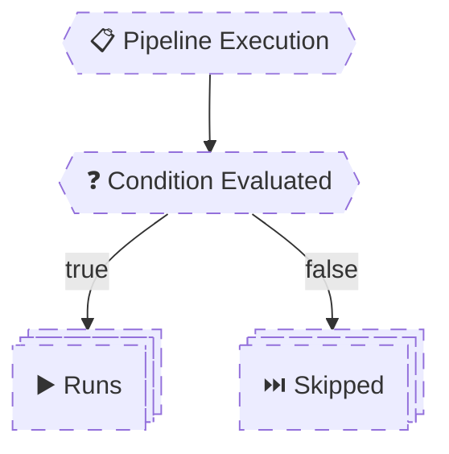

# 🧠 **Conditions, Expressions & Control Flow**

## **Conditions – How Pipelines Decide What Runs**

> A **condition** answers one question:
> **“Should this thing run or be skipped?”**
> Conditions are evaluated **at runtime**, **before execution**, and **per stage / job / step**.
> If you understand conditions deeply, you control **flow**, **gates**, and **safety** in production.

---


---

<div align="center" style="background-color: #2b3436ff; border-radius: 10px; border: 2px solid">



</div>

---

## 🔴 **Problem: “Why Did This Run / Skip?”**

Most failures come from:

- Not knowing the **default condition**
- Mixing runtime vs compile-time logic
- Using wrong variable syntax
- Assuming conditions behave like `if` in code

Let’s fix that permanently.

---

## 1️⃣ Default Conditions (What Runs If You Do Nothing)

### 🧠 Default Rule (Memorize This)

> **Every stage, job, and step runs only if all previous dependencies succeeded.**

Equivalent to:

```yaml
condition: succeeded()
```

---

### 🧪 Example: Implicit Default

```yaml
steps:
  - script: echo Build
  - script: exit 1
  - script: echo Deploy
```

❌ Output:

- Build → runs
- exit 1 → fails
- Deploy → **skipped**

Why?  
Because `Deploy` has an **implicit `succeeded()` condition**.

---

## 2️⃣ Overriding Default Conditions (Very Common)

### ✅ Run Even If Previous Step Failed

```yaml
- script: echo Always runs
  condition: always()
```

---

### ✅ Run Only If Previous Failed

```yaml
- script: echo Runs on failure
  condition: failed()
```

---

### ✅ Run If Previous Was Skipped or Failed

```yaml
condition: succeededOrFailed()
```

---

### 🔥 Production Example: Cleanup Step

```yaml
- script: rm -rf temp
  condition: always()
```

✔ Cleanup must **always** run  
✔ Even on failure

---

## 3️⃣ Custom Runtime Conditions (Core Skill)

Conditions are written using **runtime expressions**.

### Basic Syntax

```yaml
condition: <expression>
```

---

### 🧪 Example: Environment-Based Condition

```yaml
variables:
  env: prod

steps:
  - script: echo Deploying to PROD
    condition: eq(variables['env'], 'prod')
```

✔ Step runs only in prod

---

## 4️⃣ Expression Functions (With Real Examples)

These are **not YAML functions** — they are **Azure Pipelines expressions**.

---

### 🔹 `eq(a, b)` – Equals

```yaml
condition: eq(variables['env'], 'prod')
```

Runs when `env == prod`

---

### 🔹 `and(a, b)` – Logical AND

```yaml
condition: and(
  eq(variables['env'], 'prod'),
  succeeded()
)
```

✔ Must be prod
✔ And pipeline must be healthy

---

### 🔹 `or(a, b)` – Logical OR

```yaml
condition: or(
  eq(variables['env'], 'test'),
  eq(variables['env'], 'prod')
)
```

✔ Runs in test **or** prod

---

### 🔹 `startsWith(a, b)` – Branch Logic (Very Common)

```yaml
condition: startsWith(variables['Build.SourceBranch'], 'refs/heads/release/')
```

✔ Only release branches

---

### 🔹 Real CI Example: Main or Release Branch

```yaml
condition: or(
  eq(variables['Build.SourceBranch'], 'refs/heads/main'),
  startsWith(variables['Build.SourceBranch'], 'refs/heads/release/')
)
```

---

## 5️⃣ Conditions at Different Levels (Critical Distinction)

### 🧱 Step-Level Condition

```yaml
- script: echo Step
  condition: eq(variables['env'], 'prod')
```

✔ Only step is skipped/run

---

### 🧩 Job-Level Condition

```yaml
jobs:
  - job: Deploy
    condition: eq(variables['env'], 'prod')
```

✔ Entire job skipped/run

---

### 🏗️ Stage-Level Condition

```yaml
stages:
  - stage: Deploy
    condition: eq(variables['env'], 'prod')
```

✔ Entire stage skipped/run
✔ Still **exists** in pipeline graph

---

## 6️⃣ Short-Circuit Behavior (Very Important)

> Azure Pipelines expressions are **short-circuited**.

Meaning:

- `and(a, b)` → if `a` is false, `b` is **not evaluated**
- `or(a, b)` → if `a` is true, `b` is **not evaluated**

---

### 🧪 Safe Example (Avoids Null Errors)

```yaml
condition: and(
  ne(variables['tag'], ''),
  startsWith(variables['tag'], 'v')
)
```

✔ If `tag` is empty → second check skipped  
✔ No runtime error

---

### ❌ Dangerous Example (Wrong Order)

```yaml
condition: and(
  startsWith(variables['tag'], 'v'),
  ne(variables['tag'], '')
)
```

❌ `startsWith` evaluated first  
❌ May fail if tag is empty

---

## 7️⃣ Broken vs Fixed Condition Examples (Very Important)

### ❌ Broken: Using `$()` in Condition

```yaml
condition: eq($(env), 'prod')
```

❌ `$()` resolves in scripts, not conditions

---

### ✅ Fixed

```yaml
condition: eq(variables['env'], 'prod')
```

---

### ❌ Broken: Using Parameters at Runtime

```yaml
condition: eq(parameters.env, 'prod')
```

❌ Parameters don’t exist at runtime

---

### ✅ Fixed Pattern

```yaml
variables:
  envVar: ${{ parameters.env }}

condition: eq(variables['envVar'], 'prod')
```

---

## 8️⃣ Real-World Production Pattern

### 🛑 Safe Production Deployment Gate

```yaml
condition: and(
  succeeded(),
  eq(variables['env'], 'prod'),
  eq(variables['Build.SourceBranch'], 'refs/heads/main')
)
```

✔ Only deploys:

- If build succeeded
- If environment is prod
- If branch is main

This single condition prevents **90% of accidents**.

---

## 🧠 Mental Model (Lock This In)

```ini
Default = succeeded()
Condition = runtime decision
Variables = variables['x']
No $()
No parameters
```

---

## 🧠 Memorization Tips

### 🔑 Mnemonic: **"S-L-E-A-S"**

| Letter | Meaning              |
| ------ | -------------------- |
| **S**  | succeeded() default  |
| **L**  | Logical operators    |
| **E**  | Expression functions |
| **A**  | and/or short-circuit |
| **S**  | Scope matters        |
