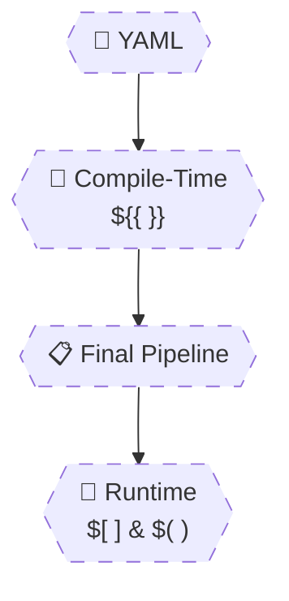

# 🧠 **Expressions Deep Dive**

## **Runtime vs Compile-Time Expressions (Heavy Examples)**

> Azure Pipelines has **two different expression engines** running at **two different times**.
> Expressions don’t just “evaluate” — they **shape the pipeline** or **control execution** depending on _when_ they run.
> If you mix these engines, pipelines fail silently.

---


---

<div align="center" style="background-color: #2b3436ff; border-radius: 10px; border: 2px solid">



</div>

---

## 🔴 **Problem: “Expression Works Here but Not There”**

This happens when:

- You use the **right expression in the wrong phase**
- You reference a value **before it exists**
- You mix syntaxes

Let’s destroy these problems.

---

## 1️⃣ Compile-Time Expressions – `${{ }}`

> `${{ }}` runs **before the pipeline starts**.
> It **changes the shape** of the pipeline.

---

### ✅ What `${{ }}` Can Do

- ✔ Add/remove stages
- ✔ Add/remove jobs
- ✔ Add/remove steps
- ✔ Select templates
- ✔ Select variable groups

---

### ❌ What `${{ }}` Cannot Do

- ❌ Read runtime variables
- ❌ Read script output
- ❌ Read secrets
- ❌ Read artifacts

---

### 🧪 Example: Conditional Stage Creation

```yaml
parameters:
  - name: deploy
    type: boolean
    default: false

stages:
  - stage: Build

  - ${{ if eq(parameters.deploy, true) }}:
      - stage: Deploy
```

✔ Deploy stage **exists only if deploy=true**

---

### ❌ Broken Example: Using Variables at Compile-Time

```yaml
variables:
  env: prod

- ${{ if eq(variables.env, 'prod') }}:
```

❌ Variables do not exist yet

---

### ✅ Fixed Pattern

```yaml
parameters:
  - name: env
    type: string
    default: prod

  - ${{ if eq(parameters.env, 'prod') }}:
```

---

## 2️⃣ Runtime Expressions – `$[ ]`

> `$[ ]` runs **after compile-time**, **before a job starts**.
> It is used for **data wiring**, not structure.

---

### ✅ What `$[ ]` Is Used For

- ✔ Output variables
- ✔ Dependency resolution
- ✔ Runtime conditions
- ✔ Cross-job data flow

---

### 🧪 Example: Output Variable Consumption

```yaml
variables:
  version: $[ dependencies.Build.outputs['setVer.version'] ]
```

✔ Evaluated once per job  
✔ Value fixed for job duration

---

### ❌ Broken Example: Using `$()` Instead of `$[ ]`

```yaml
variables:
  version: $(dependencies.Build.outputs['setVer.version'])
```

❌ `$()` only works in steps
❌ Variable resolves to empty

---

## 3️⃣ Step Runtime Expressions – `$( )`

> `$( )` is resolved **inside scripts and tasks**, line by line.

---

### 🧪 Example

```yaml
steps:
  - script: echo Version is $(version)
```

✔ Works only during step execution

---

### ❌ Using `$( )` Outside Steps

```yaml
condition: eq($(env), 'prod')
```

❌ Invalid
✔ Use `variables['env']`

---

## 4️⃣ Variable Dereferencing Pitfalls (Very Common)

---

### ❌ Pitfall #1 – Dot Notation in Expressions

```yaml
condition: eq(variables.env, 'prod')
```

❌ This fails silently in many cases

---

### ✅ Correct Access Pattern

```yaml
condition: eq(variables['env'], 'prod')
```

✔ Always safe  
✔ Recommended

---

### ❌ Pitfall #2 – Undefined Variables

```yaml
condition: startsWith(variables['tag'], 'v')
```

❌ Fails if `tag` is empty

---

### ✅ Safe Pattern (Short-Circuit)

```yaml
condition: and(
  ne(variables['tag'], ''),
  startsWith(variables['tag'], 'v')
)
```

---

## 5️⃣ Expression Evaluation Order (Critical Insight)

### 🧠 Actual Order (Memorize This)

```ini
1. YAML parsed
2. Templates expanded
3. ${{ }} evaluated
4. Execution graph built
5. Job queued
6. $[ ] evaluated
7. Step starts
8. $( ) evaluated
```

---

### 🧪 Example That Explains Everything

```yaml
parameters:
  - name: env
    type: string
    default: prod

variables:
  envVar: ${{ parameters.env }}

steps:
  - script: echo $(envVar)
```

✔ Works because:

- Parameter → compile-time
- Variable created → runtime
- Used in step → runtime

---

## 6️⃣ Broken vs Fixed – Real Production Scenarios

---

### ❌ Broken: Condition Using Output Variable Too Early

```yaml
condition: eq(variables['version'], '1.0')
```

❌ `version` created by previous job

---

### ✅ Fixed

```yaml
variables:
  version: $[ dependencies.Build.outputs['setVer.version'] ]

condition: eq(variables['version'], '1.0')
```

---

## 7️⃣ Complex Expression Example (Senior-Level)

### 🛑 Safe Prod Deployment Gate

```yaml
condition: and(
  succeeded(),
  eq(variables['env'], 'prod'),
  or(
    eq(variables['Build.SourceBranch'], 'refs/heads/main'),
    startsWith(variables['Build.SourceBranch'], 'refs/heads/release/')
  )
)
```

✔ Prevents accidental prod deploys  
✔ Clear intent  
✔ Auditable

---

## 🧠 Mental Model (Tattoo This)

```ini
${{ }} = Build pipeline
$[ ]   = Wire data
$( )   = Use values
```

---

## 🧠 Memorization Tips

### 🔑 Mnemonic: **"B-W-U"**

| Letter | Meaning                 |
| ------ | ----------------------- |
| **B**  | Build pipeline (${{ }}) |
| **W**  | Wire data ($[ ])        |
| **U**  | Use values ($( ))       |

---

## ❌ Top Expression Mistakes (With Reasons)

| Mistake                     | Why            |
| --------------------------- | -------------- |
| Using variables in `${{ }}` | Too early      |
| Using `$()` in conditions   | Too late       |
| Using parameters at runtime | Already gone   |
| Dot notation                | Unsafe         |
| Wrong evaluation order      | Silent failure |
